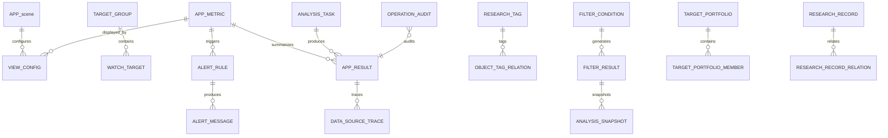

# 数据应用与分析数据库设计说明

## 文档信息

| 项目 | 内容 |
|---|---|
| 项目名称 | 数据应用与分析 |
| 文档名称 | 数据应用与分析数据库设计说明 |
| 文档版本 | V1.0-draft |
| 文档状态 | 草案 |
| 编制日期 | 2026-06-02 |

## 修订记录

| 版本 | 日期 | 修订内容 | 修订原因 |
|---|---|---|---|
| V1.0-draft | 2026-06-02 | 形成数据应用与分析数据库设计初稿，完成数据架构、实体关系、表结构、枚举、索引、一致性、归档、安全审计、跨文档映射和验收口径 | 根据数据应用与分析概要设计和接口设计编制 |

---

## 修订摘要

本版本以数据应用与分析概要设计和接口设计为依据，形成应用域数据库设计：

1. 应用配置管理类表覆盖应用场景、关注标的、应用指标、视图配置、提醒规则和研究标签；
2. 应用分析展示类表覆盖筛选条件、筛选结果、标的组合、研究记录、应用结果和内部分析任务；
3. 应用查询与追溯类表覆盖分析快照、数据来源追溯、提醒消息处理闭环和操作审计；
4. 排行结果和对比结果统一收敛到 `app_result`，通过 `result_type` 区分结果类型；
5. 提醒触发和提醒处理统一收敛到 `alert_message`，不单独设计提醒记录表；
6. 标签关系统一收敛到 `object_tag_relation`，通过 `object_type` 和 `object_id` 支撑多对象标签关联；
7. 研究记录的多对象引用统一收敛到 `research_record_relation`；
8. 视图字段配置、筛选条件、快照内容、来源说明等低频明细采用 JSON 保存，减少数据库表中的冗余字段和低频明细表。

---

## 1. 文档说明

### 1.1 编写目的

本文档基于《数据应用与分析概要设计说明》和《数据应用与分析接口设计说明》明确应用域数据库设计方案，作为数据库建模、表结构落地、后端开发、接口联调、测试验证和来源追溯实现依据。

### 1.2 设计范围

数据应用与分析数据库设计覆盖以下内容：

1. 应用配置管理相关数据模型；
2. 应用分析展示相关数据模型；
3. 应用查询与追溯相关数据模型；
4. 内部分析计算相关数据模型；
5. 关键字段、约束、索引、审计与数据保留口径；
6. 应用场景、关注标的、应用指标、视图配置、提醒规则、研究标签、筛选结果、组合、研究记录、分析快照、应用结果和数据来源追溯的表结构设计。

---

## 2. 数据库设计目标

1. 直接支撑应用配置管理子系统、应用分析展示子系统、应用查询与追溯子系统；
2. 支撑“应用配置—市场观察—标的查看—筛选对比—提醒处理—研究记录—快照保存—结果查询—来源追溯”主链路；
3. 支撑应用场景、关注标的、应用指标、视图配置、提醒规则、研究标签、筛选条件、筛选结果、组合、研究记录、分析快照、应用结果和来源信息之间的关联；
4. 保持配置类表、结果类表、记录类表和审计类表边界清晰；
5. 形成最小可追溯、可审计、可维护的数据模型；
6. 通过 JSON 字段承载低频明细和快照内容，减少关系表数量；
7. 通过通用关系表承载标签关系和研究记录关联关系，减少对象专用关系表；
8. 通过 `app_result` 统一承载排行、对比和展示结果摘要，减少派生结果表；
9. 通过 `alert_message` 同时承载提醒触发和处理结果，减少提醒记录冗余表。

---

## 3. 数据架构设计

### 3.1 数据分类

#### 3.1.1 业务管理类表

主要承载：

- 应用场景管理；
- 关注标的管理；
- 标的分组管理；
- 应用指标配置；
- 视图配置管理；
- 提醒规则配置；
- 研究标签管理。

#### 3.1.2 结果类表

主要承载：

- 筛选结果；
- 应用结果；
- 分析快照；
- 数据来源追溯；
- 内部分析任务结果定位。

#### 3.1.3 记录类表

主要承载：

- 提醒触发消息；
- 提醒处理结果；
- 研究记录；
- 研究记录关联对象；
- 标签关联对象；
- 标的组合成员关系。

#### 3.1.4 审计类表

主要承载：

- 配置变更留痕；
- 提醒处理留痕；
- 快照保存留痕；
- 导出和来源查看留痕；
- 内部分析任务状态留痕。

### 3.2 数据边界原则

1. 业务管理类表与结果类表分离；
2. 结果类表与记录类表分离；
3. 应用配置主档只保存稳定配置，不保存页面展示结果；
4. 页面展示结果沉淀到 `app_result` 或 `analysis_snapshot`；
5. 应用指标表保存指标定义和口径，不保存指标明细数据；
6. 视图字段、筛选条件、快照状态和来源说明采用 JSON 保存；
7. 标签关系采用 `object_tag_relation` 统一建模；
8. 研究记录关系采用 `research_record_relation` 统一建模；
9. 提醒触发与处理采用 `alert_message` 一表闭环；
10. 排行结果、对比结果和页面结果摘要采用 `app_result` 统一承载；
11. 操作审计只保存关键操作摘要，不保存完整业务对象快照；
12. 分析任务只保存任务状态、输入摘要、结果定位和统计摘要，不保存大体量计算明细。

### 3.3 本次精简修订原则

本次数据库设计以减少冗余字段和冗余表为核心：

1. 可通过关联查询获得的名称、分类、描述类字段不在结果表重复保存；
2. 低频明细字段采用 JSON 保存；
3. 多对象通用关系采用 object_type、object_id 统一表达；
4. 派生结果通过类型字段区分，不为排行、对比单独建表；
5. 提醒消息和提醒记录合并保存；
6. 操作审计保存摘要和对象编号，不保存完整请求体；
7. 来源追溯保存来源编码、数据版本、时间和定位信息，不重复保存应用结果内容；
8. 分析任务保存结果定位，不保存计算明细。

---

## 4. 实体关系设计

### 4.1 核心关系说明

1. 一个应用场景可对应多个视图配置；
2. 一个标的分组可对应多个关注标的；
3. 一个应用指标可被视图配置、筛选条件、提醒规则和应用结果引用；
4. 一个提醒规则可产生多条提醒消息；
5. 一条提醒消息保存触发信息和处理结果；
6. 一个研究标签可通过对象标签关系关联多个业务对象；
7. 一个筛选条件可产生多条筛选结果；
8. 一个筛选结果可形成应用结果或分析快照；
9. 一个标的组合可包含多个组合成员；
10. 一条研究记录可通过关系表关联多个业务对象；
11. 一个分析快照可关联一个业务对象；
12. 一个应用结果可关联一条或多条数据来源追溯记录；
13. 一个内部分析任务可产生一个结果定位；
14. 操作审计可关联任意核心业务对象。

### 4.2 实体关系图

### 4.3 来源追溯关键关联主线

| 主线对象 | 关键字段 | 说明 |
|---|---|---|
| 应用结果 | result_id | 应用结果主键 |
| 数据来源追溯 | result_id / trace_id | 对应应用结果的来源说明 |
| 数据版本 | data_version_id | 来源数据版本标识 |
| 分析快照 | snapshot_id / related_object_id | 保存展示状态和来源数据时间 |
| 筛选结果 | filter_result_id / source_data_time | 保存筛选执行时的数据时间 |
| 提醒消息 | message_id / source_data_time | 保存提醒触发时的数据时间 |
| 研究记录 | record_id | 保存用户研究上下文 |
| 操作审计 | object_type / object_id | 保存关键操作留痕 |

---

## 5. 表设计总览

| 表编号 | 表名 | 中文名 | 用途 | 所属业务子系统 |
|---|---|---|---|---|
| T-01 | app_scene | 应用场景表 | 保存应用场景分类、场景目录和入口排序 | 应用配置管理 |
| T-02 | target_group | 标的分组表 | 保存关注标的分组和排序 | 应用配置管理 |
| T-03 | watch_target | 关注标的表 | 保存用户关注标的、分组、重点标记和观察状态 | 应用配置管理 |
| T-04 | app_metric | 应用指标表 | 保存应用指标、展示格式、适用场景和口径说明 | 应用配置管理 |
| T-05 | view_config | 视图配置表 | 保存看板、列表、详情页和默认展示配置 | 应用配置管理 |
| T-06 | alert_rule | 提醒规则表 | 保存价格、指标、公告类提醒规则 | 应用配置管理 |
| T-07 | alert_message | 提醒消息表 | 保存提醒触发消息、命中原因和处理结果 | 应用分析展示 / 应用查询与追溯 |
| T-08 | research_tag | 研究标签表 | 保存研究标签、标签分类和使用状态 | 应用配置管理 |
| T-09 | object_tag_relation | 对象标签关系表 | 保存标签与标的、记录、筛选结果、快照等对象关系 | 应用配置管理 / 应用查询与追溯 |
| T-10 | filter_condition | 筛选条件表 | 保存可复用筛选条件和排序规则 | 应用分析展示 |
| T-11 | filter_result | 筛选结果表 | 保存筛选结果摘要、命中列表和来源数据时间 | 应用分析展示 / 应用查询与追溯 |
| T-12 | target_portfolio | 标的组合表 | 保存标的组合基础信息 | 应用分析展示 |
| T-13 | target_portfolio_member | 标的组合成员表 | 保存组合与标的成员关系 | 应用分析展示 |
| T-14 | research_record | 研究记录表 | 保存研究笔记、观察记录和判断依据 | 应用分析展示 / 应用查询与追溯 |
| T-15 | research_record_relation | 研究记录关系表 | 保存研究记录与业务对象的关联关系 | 应用分析展示 / 应用查询与追溯 |
| T-16 | analysis_snapshot | 分析快照表 | 保存看板、标的、筛选或对比的展示状态和关键摘要 | 应用查询与追溯 |
| T-17 | app_result | 应用结果表 | 保存市场概览、详情、排行、对比等应用结果摘要 | 应用分析展示 / 应用查询与追溯 |
| T-18 | data_source_trace | 数据来源追溯表 | 保存应用结果关联的来源数据、数据版本和更新时间 | 应用查询与追溯 |
| T-19 | operation_audit | 操作审计表 | 保存关键配置、处理、导出和追溯操作留痕 | 通用支撑 |
| T-20 | analysis_task | 分析任务表 | 保存内部筛选、排行、对比和指标计算任务状态 | 内部分析计算 |

---

## 6. 命名规范与统一口径

### 6.1 表名规范

1. 表名统一采用小写英文和下划线；
2. 业务对象表采用对象英文名；
3. 关系类表以 `_relation` 或 `_member` 结尾；
4. 快照类表以 `_snapshot` 结尾；
5. 任务类表以 `_task` 结尾；
6. 审计类表以 `_audit` 结尾。

### 6.2 时间字段命名

- 创建时间统一使用 `created_at`；
- 更新时间统一使用 `updated_at`；
- 业务开始/结束时间使用 `start_time`、`end_time`；
- 来源数据时间使用 `source_data_time`；
- 触发时间使用 `trigger_time`；
- 处理时间使用 `processed_at`。

### 6.3 审计字段规范

核心可变业务表包含：

- `created_at`
- `updated_at`
- `created_by`
- `updated_by`

不可变记录表保留：

- `created_at`
- `created_by`

日志、来源、关系类表按最小留痕口径保留创建字段。

### 6.4 状态字段规范

枚举及状态类字段在数据库中统一使用 `tinyint` 存储，英文枚举值作为接口、代码和文档说明值保留。`tinyint` 与英文枚举值的对应关系以第 8 章为准，并按照各枚举表格顺序从 0 开始递增。

- 通用启停状态统一使用 `status`；
- 观察状态统一使用 `watch_status`；
- 规则类型统一使用 `rule_type`；
- 提醒处理状态统一使用 `process_status`；
- 筛选结果状态统一使用 `result_status`；
- 快照状态统一使用 `snapshot_status`；
- 研究记录状态统一使用 `record_status`；
- 应用结果类型统一使用 `result_type`；
- 追溯状态统一使用 `trace_status`；
- 分析任务状态统一使用 `task_status`。

---

## 7. 表结构详细设计

### 7.1 T-01 app_scene

应用场景表承载应用入口和场景目录，可通过scene_type进行分类筛选。

| 字段名 | 类型 | 说明 |
|---|---|---|
| id | bigint | 主键 |
| scene_code | varchar(64) | 应用场景编码，唯一 |
| scene_name | varchar(128) | 应用场景名称 |
| scene_type | varchar(32) | 场景类型 |
| sort_no | int | 排序号 |
| status | tinyint | 状态，使用 status 枚举：0=DRAFT（草稿）、1=ENABLED（已启用）、2=DISABLED（已停用）、3=DELETED（已删除）、4=EXPIRED（已失效） |
| description | varchar(500) | 说明 |
| created_at | datetime | 创建时间 |
| updated_at | datetime | 更新时间 |
| created_by | varchar(64) | 创建人 |
| updated_by | varchar(64) | 更新人 |

### 7.2 T-02 target_group

标的分组表保存分组主档。分组下标的数量由 watch_target 统计获得。

| 字段名 | 类型 | 说明 |
|---|---|---|
| id | bigint | 主键 |
| group_code | varchar(64) | 分组编码，唯一 |
| group_name | varchar(128) | 分组名称 |
| sort_no | int | 排序号 |
| status | tinyint | 状态，使用 status 枚举：0=DRAFT（草稿）、1=ENABLED（已启用）、2=DISABLED（已停用）、3=DELETED（已删除）、4=EXPIRED（已失效） |
| description | varchar(500) | 说明 |
| created_at | datetime | 创建时间 |
| updated_at | datetime | 更新时间 |
| created_by | varchar(64) | 创建人 |
| updated_by | varchar(64) | 更新人 |

### 7.3 T-03 watch_target

关注标的表保存用户持续观察对象。标的基础扩展属性从基础数据资源读取，本表仅保存应用域关注信息。

| 字段名 | 类型 | 说明 |
|---|---|---|
| id | bigint | 主键 |
| target_code | varchar(64) | 标的编码 |
| target_name | varchar(128) | 标的名称 |
| target_type | varchar(32) | 标的类型 |
| market_code | varchar(32) | 市场编码 |
| group_code | varchar(64) | 分组编码 |
| important_flag | tinyint(1) | 重点标记 |
| watch_status | tinyint | 观察状态，使用 watch_status 枚举：0=WATCHING（观察中）、1=FOCUS（重点关注）、2=PAUSED（暂停观察）、3=CLOSED（结束观察） |
| watch_reason | varchar(500) | 关注理由 |
| created_at | datetime | 创建时间 |
| updated_at | datetime | 更新时间 |
| created_by | varchar(64) | 创建人 |
| updated_by | varchar(64) | 更新人 |

### 7.4 T-04 app_metric

应用指标表保存指标主档和展示口径。指标适用场景采用 JSON 集合保存，避免增加低频关系表。

| 字段名 | 类型 | 说明 |
|---|---|---|
| id | bigint | 主键 |
| metric_code | varchar(64) | 指标编码，唯一 |
| metric_name | varchar(128) | 指标名称 |
| metric_category | varchar(64) | 指标分类 |
| unit | varchar(32) | 单位 |
| display_format | varchar(32) | 展示格式 |
| data_source_code | varchar(64) | 来源数据编码 |
| calc_period | varchar(32) | 计算周期 |
| scene_codes_json | json | 适用场景编码集合 |
| status | tinyint | 状态，使用 status 枚举：0=DRAFT（草稿）、1=ENABLED（已启用）、2=DISABLED（已停用）、3=DELETED（已删除）、4=EXPIRED（已失效） |
| caliber_desc | varchar(1000) | 口径说明 |
| created_at | datetime | 创建时间 |
| updated_at | datetime | 更新时间 |
| created_by | varchar(64) | 创建人 |
| updated_by | varchar(64) | 更新人 |

### 7.5 T-05 view_config

视图配置表将字段、排序和筛选入口统一保存在 JSON 字段，减少视图字段明细表。

| 字段名 | 类型 | 说明 |
|---|---|---|
| id | bigint | 主键 |
| view_code | varchar(64) | 视图编码，唯一 |
| view_name | varchar(128) | 视图名称 |
| scene_code | varchar(64) | 应用场景编码 |
| view_type | varchar(32) | 视图类型 |
| default_flag | tinyint(1) | 默认视图标识 |
| field_config_json | json | 字段配置 |
| sort_config_json | json | 排序配置 |
| filter_config_json | json | 筛选入口配置 |
| status | tinyint | 状态，使用 status 枚举：0=DRAFT（草稿）、1=ENABLED（已启用）、2=DISABLED（已停用）、3=DELETED（已删除）、4=EXPIRED（已失效） |
| created_at | datetime | 创建时间 |
| updated_at | datetime | 更新时间 |
| created_by | varchar(64) | 创建人 |
| updated_by | varchar(64) | 更新人 |

### 7.6 T-06 alert_rule

提醒规则表保存规则配置。价格、指标和公告类规则共用 condition_json 表达触发口径。

| 字段名 | 类型 | 说明 |
|---|---|---|
| id | bigint | 主键 |
| rule_code | varchar(64) | 提醒规则编码，唯一 |
| rule_name | varchar(128) | 规则名称 |
| rule_type | tinyint | 规则类型，使用 rule_type 枚举：0=PRICE（价格提醒）、1=METRIC（指标提醒）、2=ANNOUNCEMENT（公告提醒） |
| target_code | varchar(64) | 适用标的编码 |
| group_code | varchar(64) | 适用分组编码 |
| metric_code | varchar(64) | 指标编码 |
| condition_json | json | 触发条件 |
| notice_channels_json | json | 通知渠道 |
| effective_start_time | datetime | 有效开始时间 |
| effective_end_time | datetime | 有效结束时间 |
| status | tinyint | 状态，使用 status 枚举：0=DRAFT（草稿）、1=ENABLED（已启用）、2=DISABLED（已停用）、3=DELETED（已删除）、4=EXPIRED（已失效） |
| description | varchar(500) | 说明 |
| created_at | datetime | 创建时间 |
| updated_at | datetime | 更新时间 |
| created_by | varchar(64) | 创建人 |
| updated_by | varchar(64) | 更新人 |

### 7.7 T-07 alert_message

提醒消息表同时承载提醒触发记录和处理结果，减少单独提醒记录表。

| 字段名 | 类型 | 说明 |
|---|---|---|
| id | bigint | 主键 |
| message_id | varchar(64) | 提醒消息编号，唯一 |
| rule_code | varchar(64) | 提醒规则编码 |
| target_code | varchar(64) | 触发标的编码 |
| trigger_time | datetime | 触发时间 |
| trigger_value | varchar(128) | 触发值 |
| hit_reason | varchar(1000) | 命中原因 |
| rule_snapshot_json | json | 触发时规则快照 |
| source_data_time | datetime | 来源数据时间 |
| process_status | tinyint | 处理状态，使用 process_status 枚举：0=UNREAD（未读）、1=READ（已读）、2=PROCESSING（处理中）、3=DONE（已处理）、4=IGNORED（已忽略）、5=ARCHIVED（已归档） |
| process_remark | varchar(1000) | 处理说明 |
| processed_at | datetime | 处理时间 |
| created_at | datetime | 创建时间 |
| updated_at | datetime | 更新时间 |

### 7.8 T-08 research_tag

研究标签表保存标签主档。使用次数由对象标签关系表统计获得。

| 字段名 | 类型 | 说明 |
|---|---|---|
| id | bigint | 主键 |
| tag_code | varchar(64) | 标签编码，唯一 |
| tag_name | varchar(128) | 标签名称 |
| tag_category | varchar(64) | 标签分类 |
| status | tinyint | 状态，使用 status 枚举：0=DRAFT（草稿）、1=ENABLED（已启用）、2=DISABLED（已停用）、3=DELETED（已删除）、4=EXPIRED（已失效） |
| description | varchar(500) | 说明 |
| created_at | datetime | 创建时间 |
| updated_at | datetime | 更新时间 |
| created_by | varchar(64) | 创建人 |
| updated_by | varchar(64) | 更新人 |

### 7.9 T-09 object_tag_relation

对象标签关系表使用 object_type 和 object_id 统一承载标签关系，避免为不同对象分别建表。

| 字段名 | 类型 | 说明 |
|---|---|---|
| id | bigint | 主键 |
| tag_code | varchar(64) | 标签编码 |
| object_type | varchar(64) | 对象类型 |
| object_id | varchar(64) | 对象编号 |
| created_at | datetime | 创建时间 |
| created_by | varchar(64) | 创建人 |

### 7.10 T-10 filter_condition

筛选条件表保存可复用筛选配置。条件明细、范围和排序规则采用 JSON 保存。

| 字段名 | 类型 | 说明 |
|---|---|---|
| id | bigint | 主键 |
| condition_code | varchar(64) | 筛选条件编码，唯一 |
| condition_name | varchar(128) | 筛选条件名称 |
| target_scope_json | json | 筛选范围 |
| condition_json | json | 筛选条件 |
| sort_rule_json | json | 排序规则 |
| status | tinyint | 状态，使用 status 枚举：0=DRAFT（草稿）、1=ENABLED（已启用）、2=DISABLED（已停用）、3=DELETED（已删除）、4=EXPIRED（已失效） |
| description | varchar(500) | 说明 |
| created_at | datetime | 创建时间 |
| updated_at | datetime | 更新时间 |
| created_by | varchar(64) | 创建人 |
| updated_by | varchar(64) | 更新人 |

### 7.11 T-11 filter_result

筛选结果表保存结果摘要和命中集合。结果明细采用 JSON 保存，避免为筛选命中标的建立低频明细表。

| 字段名 | 类型 | 说明 |
|---|---|---|
| id | bigint | 主键 |
| filter_result_id | varchar(64) | 筛选结果编号，唯一 |
| condition_code | varchar(64) | 筛选条件编码 |
| condition_snapshot_json | json | 执行时筛选条件快照 |
| hit_count | int | 命中数量 |
| result_json | json | 命中结果集合 |
| source_data_time | datetime | 来源数据时间 |
| result_status | tinyint | 结果状态，使用 result_status 枚举：0=TEMPORARY（临时结果）、1=SAVED（已保存）、2=EXPORTED（已导出）、3=INVALID（已失效） |
| created_at | datetime | 创建时间 |
| created_by | varchar(64) | 创建人 |

### 7.12 T-12 target_portfolio

标的组合表保存组合主档。组合行情概览为查询结果，不在本表落库。

| 字段名 | 类型 | 说明 |
|---|---|---|
| id | bigint | 主键 |
| portfolio_code | varchar(64) | 组合编码，唯一 |
| portfolio_name | varchar(128) | 组合名称 |
| status | tinyint | 状态，使用 status 枚举：0=DRAFT（草稿）、1=ENABLED（已启用）、2=DISABLED（已停用）、3=DELETED（已删除）、4=EXPIRED（已失效） |
| description | varchar(500) | 说明 |
| created_at | datetime | 创建时间 |
| updated_at | datetime | 更新时间 |
| created_by | varchar(64) | 创建人 |
| updated_by | varchar(64) | 更新人 |

### 7.13 T-13 target_portfolio_member

标的组合成员表仅保存组合与标的关系。标的名称、市场等信息由 watch_target 或基础数据资源获得。

| 字段名 | 类型 | 说明 |
|---|---|---|
| id | bigint | 主键 |
| portfolio_code | varchar(64) | 组合编码 |
| target_code | varchar(64) | 标的编码 |
| sort_no | int | 排序号 |
| created_at | datetime | 创建时间 |
| created_by | varchar(64) | 创建人 |

### 7.14 T-14 research_record

研究记录表保存正文和主关联标的。多对象引用进入 research_record_relation。

| 字段名 | 类型 | 说明 |
|---|---|---|
| id | bigint | 主键 |
| record_id | varchar(64) | 研究记录编号，唯一 |
| record_title | varchar(256) | 记录标题 |
| record_type | varchar(32) | 记录类型 |
| target_code | varchar(64) | 主关联标的编码 |
| content | text | 正文内容 |
| link_json | json | 附件或链接 |
| record_status | tinyint | 研究记录状态，使用 record_status 枚举：0=DRAFT（草稿）、1=PUBLISHED（已保存）、2=ARCHIVED（已归档）、3=DELETED（已删除） |
| created_at | datetime | 创建时间 |
| updated_at | datetime | 更新时间 |
| created_by | varchar(64) | 创建人 |
| updated_by | varchar(64) | 更新人 |

### 7.15 T-15 research_record_relation

研究记录关系表统一保存研究记录与公告、筛选结果、提醒消息、快照等对象的关联关系。

| 字段名 | 类型 | 说明 |
|---|---|---|
| id | bigint | 主键 |
| record_id | varchar(64) | 研究记录编号 |
| object_type | varchar(64) | 关联对象类型 |
| object_id | varchar(64) | 关联对象编号 |
| created_at | datetime | 创建时间 |

### 7.16 T-16 analysis_snapshot

分析快照表使用 snapshot_json 保存字段、视图、条件和结果摘要，避免快照字段明细表。

| 字段名 | 类型 | 说明 |
|---|---|---|
| id | bigint | 主键 |
| snapshot_id | varchar(64) | 快照编号，唯一 |
| snapshot_type | varchar(32) | 快照类型 |
| related_object_type | varchar(64) | 关联对象类型 |
| related_object_id | varchar(64) | 关联对象编号 |
| snapshot_title | varchar(256) | 快照标题 |
| view_code | varchar(64) | 视图编码 |
| snapshot_json | json | 展示状态和关键数据 |
| source_data_time | datetime | 来源数据时间 |
| snapshot_status | tinyint | 快照状态，使用 snapshot_status 枚举：0=SAVED（已保存）、1=COMPARED（已参与对比）、2=ARCHIVED（已归档）、3=DELETED（已删除） |
| created_at | datetime | 创建时间 |
| created_by | varchar(64) | 创建人 |

### 7.17 T-17 app_result

应用结果表统一承载市场概览、标的详情、排行和对比等结果摘要。排行结果和对比结果通过 result_type 区分，不单独建表。

| 字段名 | 类型 | 说明 |
|---|---|---|
| id | bigint | 主键 |
| result_id | varchar(64) | 应用结果编号，唯一 |
| result_type | tinyint | 结果类型，使用 result_type 枚举：0=MARKET_OVERVIEW（市场概览）、1=TARGET_DETAIL（标的详情）、2=FINANCIAL_SUMMARY（财务摘要）、3=RANKING（指标排行）、4=COMPARISON（标的对比）、5=ALERT（提醒结果） |
| scene_code | varchar(64) | 应用场景编码 |
| target_code | varchar(64) | 标的编码 |
| metric_code | varchar(64) | 主指标编码 |
| related_object_type | varchar(64) | 关联对象类型 |
| related_object_id | varchar(64) | 关联对象编号 |
| result_summary_json | json | 结果摘要 |
| source_data_time | datetime | 来源数据时间 |
| created_at | datetime | 创建时间 |

### 7.18 T-18 data_source_trace

数据来源追溯表保存应用结果与来源数据之间的最小关联。来源明细统一放入 trace_json。

| 字段名 | 类型 | 说明 |
|---|---|---|
| id | bigint | 主键 |
| trace_id | varchar(64) | 追溯编号，唯一 |
| result_id | varchar(64) | 应用结果编号 |
| result_type | tinyint | 结果类型，使用 result_type 枚举：0=MARKET_OVERVIEW（市场概览）、1=TARGET_DETAIL（标的详情）、2=FINANCIAL_SUMMARY（财务摘要）、3=RANKING（指标排行）、4=COMPARISON（标的对比）、5=ALERT（提醒结果） |
| source_data_code | varchar(64) | 来源数据编码 |
| data_version_id | varchar(64) | 数据版本标识 |
| source_data_time | datetime | 来源数据时间 |
| trace_json | json | 来源说明和定位信息 |
| trace_status | tinyint | 追溯状态，使用 trace_status 枚举：0=AVAILABLE（可追溯）、1=PARTIAL（部分可追溯）、2=MISSING（来源缺失）、3=ERROR（追溯异常） |
| created_at | datetime | 创建时间 |

### 7.19 T-19 operation_audit

操作审计表保存关键操作最小留痕，不保存完整业务对象快照。

| 字段名 | 类型 | 说明 |
|---|---|---|
| id | bigint | 主键 |
| audit_id | varchar(64) | 审计编号，唯一 |
| operation_type | varchar(64) | 操作类型 |
| object_type | varchar(64) | 对象类型 |
| object_id | varchar(64) | 对象编号 |
| operation_summary | varchar(1000) | 操作摘要 |
| request_id | varchar(64) | 请求编号 |
| trace_id | varchar(64) | 链路编号 |
| created_at | datetime | 创建时间 |
| created_by | varchar(64) | 操作人 |

### 7.20 T-20 analysis_task

分析任务表保存内部计算任务状态和结果定位。计算明细不在本表展开。

| 字段名 | 类型 | 说明 |
|---|---|---|
| id | bigint | 主键 |
| analysis_task_id | varchar(64) | 分析任务编号，唯一 |
| request_id | varchar(64) | 幂等请求号，唯一 |
| task_type | varchar(32) | 任务类型 |
| task_status | tinyint | 任务状态，使用 task_status 枚举：0=CREATED（已创建）、1=RUNNING（运行中）、2=SUCCESS（成功）、3=FAILED（失败） |
| input_json | json | 输入参数 |
| result_location | varchar(500) | 结果定位 |
| summary_json | json | 计算摘要 |
| fail_reason | varchar(1000) | 失败原因 |
| created_at | datetime | 创建时间 |
| updated_at | datetime | 更新时间 |

---

## 8. 枚举与状态设计

### 8.1 status 枚举

| 枚举值 | 值 | 含义 |
|---|---|---|
| 0 | DRAFT | 草稿 |
| 1 | ENABLED | 已启用 |
| 2 | DISABLED | 已停用 |
| 3 | DELETED | 已删除 |
| 4 | EXPIRED | 已失效 |

### 8.2 watch_status 枚举

| 枚举值 | 值 | 含义 |
|---|---|---|
| 0 | WATCHING | 观察中 |
| 1 | FOCUS | 重点关注 |
| 2 | PAUSED | 暂停观察 |
| 3 | CLOSED | 结束观察 |

### 8.3 rule_type 枚举

| 枚举值 | 值 | 含义 |
|---|---|---|
| 0 | PRICE | 价格提醒 |
| 1 | METRIC | 指标提醒 |
| 2 | ANNOUNCEMENT | 公告提醒 |

### 8.4 process_status 枚举

| 枚举值 | 值 | 含义 |
|---|---|---|
| 0 | UNREAD | 未读 |
| 1 | READ | 已读 |
| 2 | PROCESSING | 处理中 |
| 3 | DONE | 已处理 |
| 4 | IGNORED | 已忽略 |
| 5 | ARCHIVED | 已归档 |

### 8.5 result_status 枚举

| 枚举值 | 值 | 含义 |
|---|---|---|
| 0 | TEMPORARY | 临时结果 |
| 1 | SAVED | 已保存 |
| 2 | EXPORTED | 已导出 |
| 3 | INVALID | 已失效 |

### 8.6 snapshot_status 枚举

| 枚举值 | 值 | 含义 |
|---|---|---|
| 0 | SAVED | 已保存 |
| 1 | COMPARED | 已参与对比 |
| 2 | ARCHIVED | 已归档 |
| 3 | DELETED | 已删除 |

### 8.7 record_status 枚举

| 枚举值 | 值 | 含义 |
|---|---|---|
| 0 | DRAFT | 草稿 |
| 1 | PUBLISHED | 已保存 |
| 2 | ARCHIVED | 已归档 |
| 3 | DELETED | 已删除 |

### 8.8 result_type 枚举

| 枚举值 | 值 | 含义 |
|---|---|---|
| 0 | MARKET_OVERVIEW | 市场概览 |
| 1 | TARGET_DETAIL | 标的详情 |
| 2 | FINANCIAL_SUMMARY | 财务摘要 |
| 3 | RANKING | 指标排行 |
| 4 | COMPARISON | 标的对比 |
| 5 | ALERT | 提醒结果 |

### 8.9 trace_status 枚举

| 枚举值 | 值 | 含义 |
|---|---|---|
| 0 | AVAILABLE | 可追溯 |
| 1 | PARTIAL | 部分可追溯 |
| 2 | MISSING | 来源缺失 |
| 3 | ERROR | 追溯异常 |

### 8.10 task_status 枚举

| 枚举值 | 值 | 含义 |
|---|---|---|
| 0 | CREATED | 已创建 |
| 1 | RUNNING | 运行中 |
| 2 | SUCCESS | 成功 |
| 3 | FAILED | 失败 |

---

## 9. 主键、约束与索引设计

### 9.1 主键与唯一键

| 表名 | 主键 | 唯一键 / 唯一索引 |
|---|---|---|
| app_scene | id | uk_app_scene_code(scene_code) |
| target_group | id | uk_target_group_code(group_code) |
| watch_target | id | uk_watch_target_code(market_code, target_code) |
| app_metric | id | uk_app_metric_code(metric_code) |
| view_config | id | uk_view_config_code(view_code) |
| alert_rule | id | uk_alert_rule_code(rule_code) |
| alert_message | id | uk_alert_message_id(message_id) |
| research_tag | id | uk_research_tag_code(tag_code) |
| object_tag_relation | id | uk_object_tag(tag_code, object_type, object_id) |
| filter_condition | id | uk_filter_condition_code(condition_code) |
| filter_result | id | uk_filter_result_id(filter_result_id) |
| target_portfolio | id | uk_portfolio_code(portfolio_code) |
| target_portfolio_member | id | uk_portfolio_member(portfolio_code, target_code) |
| research_record | id | uk_research_record_id(record_id) |
| research_record_relation | id | 无 |
| analysis_snapshot | id | uk_snapshot_id(snapshot_id) |
| app_result | id | uk_app_result_id(result_id) |
| data_source_trace | id | uk_trace_id(trace_id) |
| operation_audit | id | uk_audit_id(audit_id) |
| analysis_task | id | uk_analysis_task_id(analysis_task_id)，uk_analysis_request_id(request_id) |

### 9.2 逻辑关系约束

1. `view_config.scene_code` 引用 `app_scene.scene_code`；
2. `watch_target.group_code` 引用 `target_group.group_code`；
3. `alert_rule.metric_code` 引用 `app_metric.metric_code`；
4. `alert_message.rule_code` 引用 `alert_rule.rule_code`；
5. `object_tag_relation.tag_code` 引用 `research_tag.tag_code`；
6. `filter_result.condition_code` 引用 `filter_condition.condition_code`；
7. `target_portfolio_member.portfolio_code` 引用 `target_portfolio.portfolio_code`；
8. `research_record_relation.record_id` 引用 `research_record.record_id`；
9. `analysis_snapshot.related_object_id` 关联对应业务对象；
10. `data_source_trace.result_id` 引用 `app_result.result_id`；
11. `operation_audit.object_type + object_id` 关联对应业务对象；
12. `analysis_task.request_id` 控制内部分析计算幂等。

### 9.3 索引设计

| 表名 | 索引名 | 索引类型 | 索引字段 | 用途 |
|---|---|---|---|---|
| app_scene | uk_app_scene_code | 唯一索引 | scene_code | 场景编码唯一性控制 |
| target_group | uk_target_group_code | 唯一索引 | group_code | 分组编码唯一性控制 |
| watch_target | uk_watch_target_code | 唯一索引 | market_code, target_code | 关注标的唯一性控制 |
| watch_target | idx_watch_target_group | 普通索引 | group_code, watch_status | 自选观察列表查询 |
| app_metric | uk_app_metric_code | 唯一索引 | metric_code | 指标编码唯一性控制 |
| app_metric | idx_app_metric_category | 普通索引 | metric_category, status | 指标配置查询 |
| view_config | uk_view_config_code | 唯一索引 | view_code | 视图编码唯一性控制 |
| view_config | idx_view_scene | 普通索引 | scene_code, view_type, default_flag | 场景视图查询 |
| alert_rule | uk_alert_rule_code | 唯一索引 | rule_code | 提醒规则唯一性控制 |
| alert_rule | idx_alert_rule_target | 普通索引 | target_code, rule_type, status | 标的提醒规则查询 |
| alert_message | uk_alert_message_id | 唯一索引 | message_id | 提醒消息唯一性控制 |
| alert_message | idx_alert_msg_target_time | 普通索引 | target_code, trigger_time | 标的提醒历史查询 |
| alert_message | idx_alert_msg_status | 普通索引 | process_status, trigger_time | 提醒处理列表查询 |
| research_tag | uk_research_tag_code | 唯一索引 | tag_code | 标签编码唯一性控制 |
| object_tag_relation | uk_object_tag | 唯一索引 | tag_code, object_type, object_id | 标签关系去重 |
| object_tag_relation | idx_tag_object | 普通索引 | object_type, object_id | 对象标签查询 |
| filter_condition | uk_filter_condition_code | 唯一索引 | condition_code | 筛选条件唯一性控制 |
| filter_result | uk_filter_result_id | 唯一索引 | filter_result_id | 筛选结果唯一性控制 |
| filter_result | idx_filter_condition_time | 普通索引 | condition_code, created_at | 筛选历史查询 |
| target_portfolio | uk_portfolio_code | 唯一索引 | portfolio_code | 组合编码唯一性控制 |
| target_portfolio_member | uk_portfolio_member | 唯一索引 | portfolio_code, target_code | 组合成员去重 |
| research_record | uk_research_record_id | 唯一索引 | record_id | 研究记录唯一性控制 |
| research_record | idx_research_target_time | 普通索引 | target_code, created_at | 标的研究记录查询 |
| research_record_relation | idx_record_relation | 普通索引 | object_type, object_id | 业务对象关联研究记录查询 |
| analysis_snapshot | uk_snapshot_id | 唯一索引 | snapshot_id | 快照编号唯一性控制 |
| analysis_snapshot | idx_snapshot_related | 普通索引 | related_object_type, related_object_id | 关联对象快照查询 |
| app_result | uk_app_result_id | 唯一索引 | result_id | 应用结果唯一性控制 |
| app_result | idx_result_target_time | 普通索引 | target_code, result_type, created_at | 标的应用结果查询 |
| data_source_trace | uk_trace_id | 唯一索引 | trace_id | 追溯编号唯一性控制 |
| data_source_trace | idx_trace_result | 普通索引 | result_id, result_type | 应用结果来源查询 |
| operation_audit | uk_audit_id | 唯一索引 | audit_id | 审计编号唯一性控制 |
| operation_audit | idx_audit_object | 普通索引 | object_type, object_id, created_at | 对象操作留痕查询 |
| analysis_task | uk_analysis_task_id | 唯一索引 | analysis_task_id | 分析任务唯一性控制 |
| analysis_task | uk_analysis_request_id | 唯一索引 | request_id | 分析请求幂等控制 |

### 9.4 查询场景—索引映射

| 查询场景 | 主要表 | 主要索引 |
|---|---|---|
| 应用场景目录查询 | app_scene | idx_app_scen |
| 自选观察列表查询 | watch_target、target_group | idx_watch_target_group |
| 应用指标配置查询 | app_metric | idx_app_metric_category |
| 场景视图查询 | view_config | idx_view_scene |
| 标的提醒规则查询 | alert_rule | idx_alert_rule_target |
| 提醒消息查询 | alert_message | idx_alert_msg_target_time、idx_alert_msg_status |
| 标签对象查询 | object_tag_relation | uk_object_tag、idx_tag_object |
| 筛选历史查询 | filter_result | idx_filter_condition_time |
| 标的研究记录查询 | research_record | idx_research_target_time |
| 关联对象研究记录查询 | research_record_relation | idx_record_relation |
| 快照查询 | analysis_snapshot | idx_snapshot_related |
| 应用结果查询 | app_result | idx_result_target_time |
| 来源追溯查询 | data_source_trace | idx_trace_result |
| 操作审计查询 | operation_audit | idx_audit_object |
| 内部分析任务查询 | analysis_task | uk_analysis_request_id |

---

## 10. 数据一致性与补偿设计

### 10.1 事务边界

重点事务边界包括：

1. 应用场景保存与审计记录保存；
2. 关注标的保存与标签关系保存；
3. 视图配置保存与默认视图唯一性控制；
4. 提醒规则保存与状态变更留痕；
5. 条件筛选执行与筛选结果保存；
6. 提醒消息处理与处理状态更新；
7. 研究记录保存与关联关系保存；
8. 快照保存与来源信息保存；
9. 应用结果保存与来源追溯保存；
10. 分析任务状态更新与结果定位保存。

### 10.2 关键一致性场景

- 应用配置保存成功但审计保存失败；
- 默认视图并发保存导致多个默认视图；
- 关注标的保存成功但标签关系保存失败；
- 筛选结果生成成功但结果保存失败；
- 分析任务成功但应用结果未归集；
- 提醒消息触发成功但处理状态更新失败；
- 快照保存成功但来源追溯保存失败；
- 研究记录保存成功但关联关系保存失败。

### 10.3 幂等落库

1. 配置保存类操作按业务编码控制幂等；
2. 关注标的按 `market_code + target_code` 控制幂等；
3. 筛选执行、快照保存和分析任务按 `request_id` 控制幂等；
4. 提醒消息按 `message_id` 控制幂等；
5. 应用结果按 `result_id` 控制幂等；
6. 来源追溯按 `trace_id` 控制幂等；
7. 操作审计按 `audit_id` 控制唯一性。

### 10.4 补偿处理

1. 配置保存成功但审计保存失败时，保留业务主记录并补写审计；
2. 筛选计算成功但筛选结果保存失败时，按 request_id 重新归集；
3. 内部分析任务成功但应用结果未生成时，按 analysis_task_id 二次归集；
4. 提醒消息处理失败时，保持原处理状态并记录失败原因；
5. 快照保存成功但来源追溯缺失时，按 snapshot_id 补写来源信息；
6. 研究记录关系保存失败时，保留研究记录并补写关联关系。

---

## 11. 性能、容量、归档与保留周期

### 11.1 数据量预估

| 表名 | 日增量预估 | 说明 |
|---|---:|---|
| app_scene | 低 | 场景目录，长期稳定 |
| target_group | 低 | 分组数量有限 |
| watch_target | 低/中 | 随用户关注范围增长 |
| app_metric | 低/中 | 指标体系随功能扩展增长 |
| view_config | 低/中 | 视图配置数量有限 |
| alert_rule | 中 | 随提醒规则数量增长 |
| alert_message | 中/高 | 随提醒触发次数增长 |
| research_tag | 低 | 标签数量有限 |
| object_tag_relation | 中 | 随标签使用增长 |
| filter_condition | 低/中 | 可复用筛选条件增长有限 |
| filter_result | 中/高 | 每次保存筛选结果产生 |
| target_portfolio | 低 | 组合数量有限 |
| target_portfolio_member | 中 | 随组合成员增长 |
| research_record | 中 | 研究记录持续增长 |
| research_record_relation | 中 | 随研究记录关联对象增长 |
| analysis_snapshot | 中 | 快照保存时产生 |
| app_result | 中/高 | 应用展示和分析结果沉淀 |
| data_source_trace | 中/高 | 随应用结果产生 |
| operation_audit | 中/高 | 关键操作持续产生 |
| analysis_task | 中 | 内部计算任务产生 |

### 11.2 归档原则

1. 应用场景、指标、视图、标签等配置类数据长期保留；
2. 关注标的、组合和研究记录按用户使用周期保留；
3. 提醒消息、筛选结果、分析快照和应用结果按业务查询周期归档；
4. 操作审计按审计周期归档；
5. 来源追溯归档保持与应用结果的关联；
6. 分析任务结果定位按计算任务保留周期归档。

### 11.3 保留周期

| 数据类别 | 保留口径 |
|---|---|
| 应用场景、应用指标、视图配置、提醒规则、研究标签 | 长期保留 |
| 关注标的、标的组合、研究记录 | 按用户使用周期保留 |
| 筛选结果、应用结果、分析快照 | 按业务查询周期保留 |
| 提醒消息 | 按提醒处理和回看周期保留 |
| 数据来源追溯 | 与应用结果一致 |
| 操作审计 | 按审计周期保留 |
| 分析任务 | 按内部计算任务周期保留 |

---

## 12. 安全与审计设计

### 12.1 敏感信息处理

1. 研究记录正文、附件链接和操作审计中的敏感信息进行脱敏展示；
2. 分析任务输入参数中的敏感字段加密或脱敏保存；
3. 异常摘要和失败原因不保存认证信息、密钥或内部栈详情；
4. 页面查询接口不返回内部分析服务路径和运行环境细节。

### 12.2 审计留痕

以下操作保留审计字段或审计记录：

1. 应用场景维护；
2. 关注标的维护；
3. 应用指标维护；
4. 视图配置维护；
5. 提醒规则维护和状态变更；
6. 筛选结果保存；
7. 提醒消息处理；
8. 研究记录维护；
9. 分析快照保存；
10. 数据来源查看；
11. 结果导出。

### 12.3 软删除口径

1. 配置类、标签类和组合类数据采用逻辑删除；
2. 已被结果、快照、提醒消息或研究记录引用的数据保留历史引用；
3. 历史快照和来源追溯不因当前对象删除而改变；
4. 操作审计记录不参与业务删除流程。

---

## 13. 跨文档映射

### 13.1 概要设计对象—数据库表映射

| 概要设计对象 | 数据库表 |
|---|---|
| ApplicationScene | app_scene |
| WatchTarget | watch_target |
| TargetGroup | target_group |
| ApplicationMetric | app_metric |
| ViewConfig | view_config |
| AlertRule | alert_rule |
| AlertMessage | alert_message |
| ResearchTag | research_tag、object_tag_relation |
| FilterCondition | filter_condition |
| FilterResult | filter_result |
| RankingResult | app_result |
| CompareResult | app_result |
| TargetPortfolio | target_portfolio、target_portfolio_member |
| ResearchRecord | research_record、research_record_relation |
| AnalysisSnapshot | analysis_snapshot |
| ApplicationResult | app_result |
| DataSourceTrace | data_source_trace |
| OperationAudit | operation_audit |
| AnalysisTask | analysis_task |

### 13.2 接口设计—数据库表映射

| 接口能力 | 主要数据库表 |
|---|---|
| 应用场景管理 | app_scene |
| 关注标的管理 | watch_target、target_group |
| 应用指标配置 | app_metric |
| 视图配置管理 | view_config |
| 提醒规则配置 | alert_rule |
| 提醒通知与提醒记录 | alert_message |
| 研究标签管理 | research_tag、object_tag_relation |
| 条件筛选 | filter_condition、filter_result、analysis_task |
| 排行与对比 | app_result、analysis_task |
| 标的组合 | target_portfolio、target_portfolio_member |
| 研究记录 | research_record、research_record_relation |
| 分析快照 | analysis_snapshot |
| 应用结果查询 | app_result |
| 数据来源追溯 | data_source_trace |
| 内部分析计算 | analysis_task |

---

## 14. 验收与校验口径

### 14.1 表结构校验

1. 表名、字段名、类型与本文档保持一致；
2. 主键、唯一键、索引满足设计口径；
3. 状态和枚举类字段以 `tinyint` 存储，字段说明和接口设计中的英文枚举值与第 8 章映射保持一致；
4. 核心关联字段满足应用结果、快照、提醒、研究记录和来源追溯链路；
5. JSON 字段可保存接口定义中的结构化内容。

### 14.2 主链路数据校验

1. 应用场景、关注标的、应用指标、视图、提醒规则和研究标签可完成配置落库；
2. 市场概览、标的详情、排行和对比结果可进入 app_result；
3. 条件筛选可保存筛选条件和筛选结果；
4. 提醒触发和提醒处理可通过 alert_message 完成闭环；
5. 研究记录可保存正文、标签和关联对象；
6. 分析快照可保存展示状态、关键数据和来源数据时间；
7. 应用结果可通过 data_source_trace 查询来源数据、数据版本和更新时间；
8. 内部分析任务可保存任务状态、输入参数、结果定位和失败原因。

### 14.3 查询校验

1. 应用场景可按目录和状态查询；
2. 关注标的可按分组、市场、类型和观察状态查询；
3. 应用指标可按分类、场景和状态查询；
4. 提醒消息可按标的、规则、处理状态和触发时间查询；
5. 筛选记录可按筛选条件和时间查询；
6. 研究记录可按标的、标签、关键字和时间查询；
7. 快照可按快照类型和关联对象查询；
8. 应用结果可按标的、场景、指标、结果类型和时间查询；
9. 来源追溯可按应用结果查询；
10. 操作审计可按对象和时间查询。

---

## 15. 结论

本数据库设计围绕数据应用与分析的应用配置管理、应用分析展示、应用查询与追溯三类业务子系统展开，形成应用场景、关注标的、标的分组、应用指标、视图配置、提醒规则、提醒消息、研究标签、筛选条件、筛选结果、标的组合、研究记录、分析快照、应用结果、数据来源追溯、操作审计和分析任务等核心表结构。

数据库模型通过通用关系表、JSON 快照字段、统一应用结果表和提醒消息一表闭环减少冗余字段和冗余表；通过业务编码、tinyint 状态枚举、来源时间和操作审计支撑配置维护、分析展示、历史查询和来源追溯。
