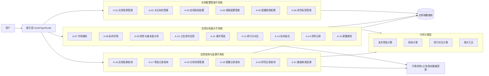
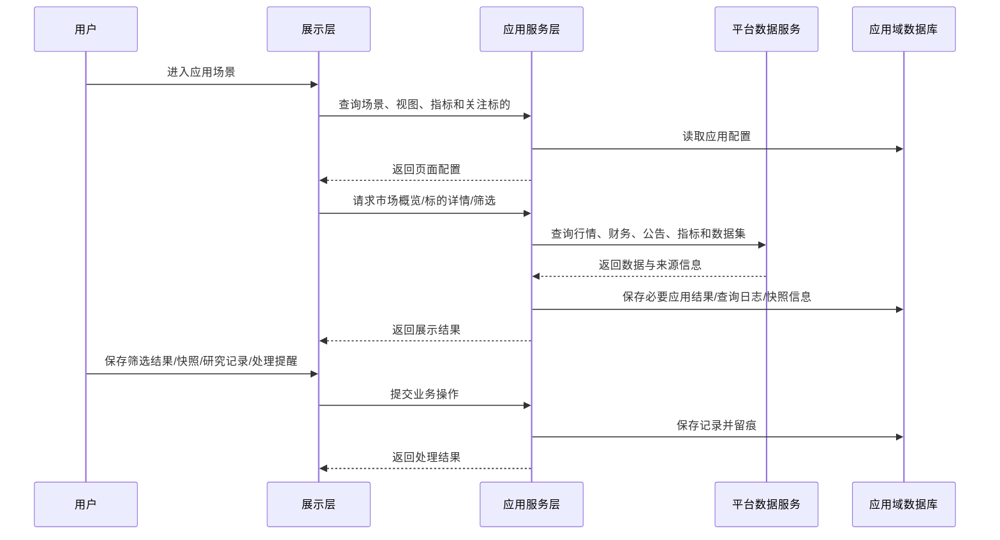
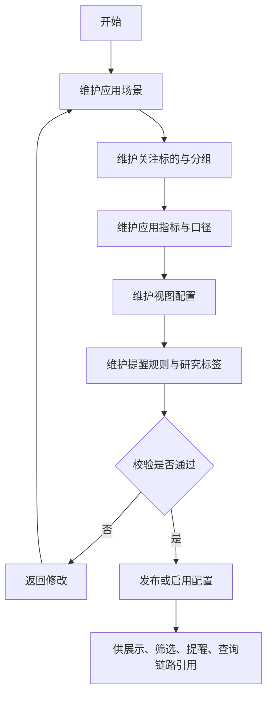
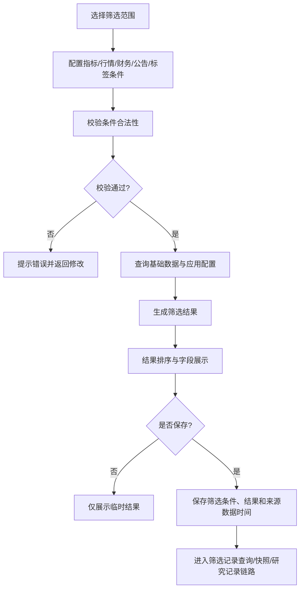
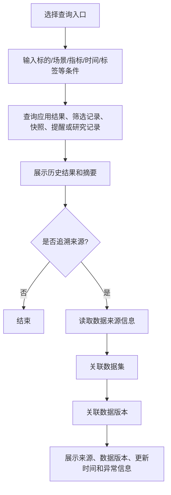
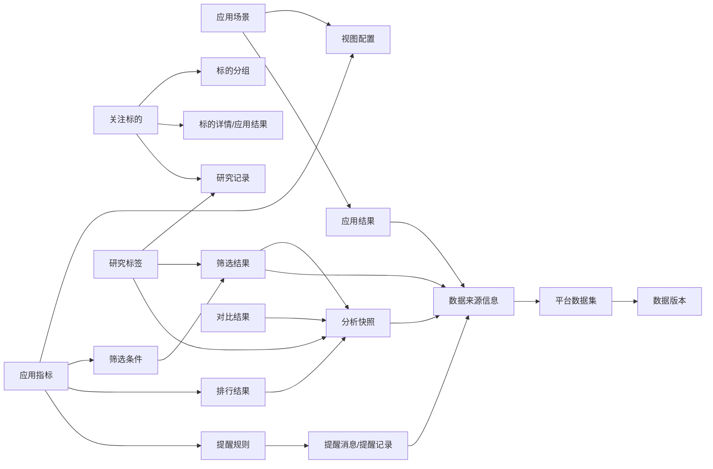

# 个人辅助交易平台数据应用与分析概要设计说明

## 文档信息

| 项目 | 内容 |
|---|---|
| 项目名称 | 数据应用与分析 |
| 文档名称 | 数据应用与分析概要设计说明 |
| 文档版本 | V1.0-draft |
| 文档状态 | 草案 |
| 编制日期 | 2026-06-02 |
| 输入文档 | 《数据应用与分析需求规格说明书_V1.0-draft》 |

---

## 修订记录

| 版本 | 日期 | 修订内容 | 修订原因 |
|---|---|---|---|
| V1.0-draft | 2026-06-02 | 形成数据应用与分析概要设计初稿，完成范围边界、总体架构、模块设计、核心流程、核心对象、状态设计、页面概要、非功能要求、风险和验收追踪矩阵 | 根据数据应用与分析需求规格说明书编制 |

---

## 目录

- [1. 文档说明](#1-文档说明)
- [2. 建设范围与非范围](#2-建设范围与非范围)
- [3. 设计原则、约束与关键假设](#3-设计原则约束与关键假设)
- [4. 总体架构、系统边界与基础环境](#4-总体架构系统边界与基础环境)
- [5. 业务子系统与模块设计](#5-业务子系统与模块设计)
- [6. 核心业务流程设计](#6-核心业务流程设计)
- [7. 核心对象与数据边界](#7-核心对象与数据边界)
- [8. 详细设计分册引用说明](#8-详细设计分册引用说明)
- [9. 状态设计](#9-状态设计)
- [10. 页面与交互概要设计](#10-页面与交互概要设计)
- [11. 非功能、安全与运维要求](#11-非功能安全与运维要求)
- [12. 依赖、风险与开放问题](#12-依赖风险与开放问题)
- [13. 验收范围与追踪矩阵](#13-验收范围与追踪矩阵)
- [14. 角色职责（RACI简版）](#14-角色职责raci简版)
- [15. 结论](#15-结论)

---

## 1. 文档说明

### 1.1 编写目的

本文档在《数据应用与分析需求规格说明书》基础上，形成个人辅助交易平台应用域的概要设计方案，重点明确：

1. 数据应用与分析的建设范围、非范围与边界；
2. 应用域内部技术分层、系统边界和数据存储关系；
3. 应用配置管理、应用分析展示、应用查询与追溯三类子系统的模块边界；
4. 关注标的、应用指标、视图配置、提醒规则、研究标签、筛选结果、分析快照、研究记录和数据来源追溯等核心对象设计口径；
5. 主业务流程、状态枚举、页面概要、接口和数据库设计输入；
6. 研发、联调、测试和验收所需的追踪矩阵与控制信息。

### 1.2 适用范围

本文档适用于：

1. 数据应用与分析总体方案评审；
2. 应用域建设范围确认与边界控制；
3. 技术分层、工程目录、环境配置和部署依赖确认；
4. 业务子系统、模块职责和功能边界确认；
5. 接口设计、数据库设计和前端页面设计输入；
6. 开发联调、测试准备、上线验收和后续迭代规划。

### 1.3 关联文档

- 《数据应用与分析需求规格说明书_V1.0-draft》
- 后续待编制：《数据应用与分析接口设计说明》
- 后续待编制：《数据应用与分析数据库设计说明》
- 后续待编制：《数据应用与分析测试用例说明》

---

## 2. 建设范围与非范围

### 2.1 本期建设范围

本期建设围绕“配置—观察—筛选—对比—提醒—记录—查询—追溯”的应用闭环展开，纳入以下能力：

1. 应用场景、关注标的、应用指标、视图配置、提醒规则和研究标签的统一配置；
2. 市场概览、标的详情、财务与基本面分析、公告资讯、条件筛选、排行对比、标的组合、研究记录和提醒通知；
3. 应用结果、筛选记录、分析快照、提醒记录、研究记录和数据来源追溯查询；
4. 应用结果与平台数据集、数据版本、数据更新时间和来源说明之间的关联；
5. 关键业务配置、筛选保存、快照保存、提醒处理、研究记录和导出行为的最小留痕；
6. 应用域页面入口、查询条件、状态枚举、接口和数据库对象的概要设计。

### 2.2 本期非范围

本期明确不纳入或仅预留扩展点，不作为交付承诺：

1. 自动交易执行；
2. 交易指令生成和下单闭环；
3. 策略历史验证、收益模拟、参数寻优和模型训练；
4. 复杂组合绩效归因；
5. 面向多人协作的完整权限体系和审批流；
6. 面向外部系统的完整开放服务体系；
7. 移动端专项体验建设；
8. 大规模实时行情推送和低延迟交易通道；
9. 完整投研知识库和自动报告生成体系；
10. 自动投资或决策推荐能力。

### 2.3 后续扩展候选

1. 更完整的指标服务、指标版本和指标血缘能力；
2. 数据质量提示、异常行情提示和来源可信度标记；
3. 更细粒度权限、共享视图、协作笔记和审批流程；
4. 研究报告自动生成和投研知识库；
5. 策略回测、组合绩效分析和多维归因；
6. 外部通知渠道扩展，如邮件、企业微信、短信等；
7. 移动端应用体验和桌面通知能力；
8. 与治理域、数据服务域和辅助决策域的深度联动。

### 2.4 范围内待完善

1. 应用指标的数据来源、更新时间、口径版本和异常提示在接口与数据库详细设计中进一步固化；
2. 分析快照保存粒度、快照字段范围、快照保留周期在数据库设计中明确；
3. 提醒规则的触发调度机制、去重规则和通知渠道在后续详细设计中展开；
4. 应用结果与平台数据集之间的关联方式与平台数据集模型保持一致；
5. 结果导出范围、导出字段、导出权限和审计留痕在测试前确认。

---

## 3. 设计原则、约束与关键假设

### 3.1 设计原则

1. **业务分层清晰**：应用域聚焦用户侧使用、展示、筛选、提醒、记录和追溯，不替代基础数据资源、治理域和交易执行能力。
2. **子系统—模块—功能口径一致**：概要设计沿用需求规格说明书中的三级业务分解口径。
3. **统一入口、统一视图、统一查询**：配置、展示、查询和追溯入口保持一致，减少用户在多个页面之间切换的成本。
4. **指标口径统一**：展示、筛选、排行、对比和提醒使用同一套应用指标配置。
5. **过程可回看**：筛选、提醒、研究记录和分析快照均需保留历史记录。
6. **来源可解释**：应用结果需能够追溯到数据集、数据版本、数据更新时间和来源说明。
7. **渐进演进**：本期优先完成个人交易研究高频链路，后续扩展治理、指标服务、报告和辅助分析能力。

### 3.2 业务约束

1. 应用场景用于组织业务入口、页面导航和目录；
2. 关注标的是标的详情、自选观察、提醒规则、研究记录和应用结果查询的核心对象；
3. 应用指标用于展示、筛选、排行、对比和提醒，指标编码应作为系统内稳定标识；
4. 视图配置决定看板、列表和详情页的字段、排序、筛选入口和默认展示方式；
5. 提醒规则启用前完成触发条件、适用对象、阈值和有效期校验；
6. 筛选结果、排行结果和对比结果记录来源数据时间；
7. 分析快照固化保存时的展示状态、关键字段、筛选条件、视图配置和来源数据时间；
8. 研究记录可关联标的、公告资讯、筛选结果、提醒记录和分析快照；
9. 应用结果追溯以来源数据、数据集和数据版本为主要线索；
10. 本期不对用户形成自动交易，不触发交易执行链路。

### 3.3 技术约束

本期技术基础参考既有概要设计，并结合应用域特点进行扩展：

- 展示层采用 Vue3、TypeScript；
- 应用服务层采用 Spring Boot V2.7.18、JDK 17；
- 数据与处理相关能力沿用 Python3.11 分析处理层；
- 一期接口采用 HTTP/JSON；
- 时间统一采用 ISO 8601 格式；
- 枚举字段统一使用英文大写值；
- 关键业务对象统一保留创建时间、更新时间、创建人、更新人等审计字段；
- 应用域不直接绕过应用服务层访问数据更新能力和物理结果表；
- 敏感配置、认证信息和内部错误栈不在前端明文展示。

### 3.4 关键假设

1. 基础数据资源已能稳定生成或登记行情、财务、公告资讯、指标数据和数据集；
2. 基础数据版本、结果摘要、数据集和更新时间可供应用域查询或引用；
3. 应用服务层可作为应用域统一业务编排入口；
4. 用户以个人交易研究者为主，本期不要求完整多人协作和审批流；
5. 本期优先保证页面可用、链路闭环和历史可追溯，复杂模型和自动分析后续扩展；
6. 应用域接口、数据库和页面详细字段可在后续详细设计分册中进一步展开。

---

## 4. 总体架构、系统边界与基础环境

### 4.1 总体设计思路

系统采用“展示层 + 应用服务层 + 分析计算层 + 数据存储层”的分层架构。

其中：

- 展示层负责应用域页面入口、配置页面、分析展示、查询检索和追溯入口呈现；
- 应用服务层负责承接请求、组织业务子系统能力、维护状态、聚合数据并统一输出；
- 分析计算层负责复杂筛选、排行对比、指标计算、统计汇总和批量分析；
- 数据存储层负责保存应用域配置数据、应用结果、筛选记录、快照、提醒消息、研究记录、来源信息和审计记录。

### 4.2 系统边界说明

**系统内能力**

- 应用场景、关注标的、应用指标、视图配置、提醒规则和研究标签管理；
- 市场概览、标的详情、财务分析、公告资讯、筛选、排行、对比、组合、研究记录和提醒通知；
- 应用结果、筛选记录、分析快照、提醒记录、研究记录和数据来源追溯；
- 关键配置和关键业务操作的审计留痕；
- 应用域接口、页面和数据库对象的统一管理。

**系统外依赖**

- 部署环境、数据库、缓存、对象存储和基础设施；
- 行情、财务、公告资讯等基础数据资源；
- 后续数据治理、数据服务和辅助分析能力。

### 4.3 技术分层设计

#### 4.3.1 展示层

展示层采用 Vue3、TypeScript 实现，负责应用域页面呈现和用户交互。展示层统一访问 Spring Boot 应用服务层接口，不直接访问分析计算层或底层数据库。

展示层职责包括：

1. 呈现应用场景目录、关注标的、指标配置、视图配置、提醒规则、研究标签等配置入口；
2. 呈现市场概览、标的详情、财务分析、公告资讯、条件筛选、排行对比、标的组合、研究记录和提醒通知页面；
3. 呈现应用结果查询、筛选记录查询、分析快照、提醒记录查询、研究记录查询和数据来源追溯页面；
4. 组织用户输入、查询条件、页面跳转和操作确认；
5. 接收 Spring Boot 返回的页面 DTO、状态码、错误信息和来源信息，并完成页面展示。

#### 4.3.2 应用服务层

应用服务层采用 Spring Boot V2.7.18、JDK 17 实现，是前端页面唯一业务 API 出口。页面所需数据由应用服务层统一返回，应用服务层负责业务编排、数据聚合、状态维护、权限控制、审计留痕和异常处理。

应用服务层职责包括：

1. 承接展示层全部应用域请求；
2. 组织应用配置管理、应用分析展示、应用查询与追溯三类子系统能力；
3. 维护应用场景、关注标的、应用指标、视图配置、提醒规则、研究标签、筛选结果、分析快照、提醒记录和研究记录等核心对象；
4. 聚合应用域数据库、行情数据、财务数据、公告资讯、指标数据和数据来源信息；
5. 调用内部 FastAPI 分析服务完成复杂筛选、排行对比、指标计算或批量分析任务；
6. 生成并返回页面展示所需的统一 DTO；
7. 保存配置变更、筛选保存、快照保存、提醒处理、研究记录编辑、导出和追溯查看等操作留痕；
8. 屏蔽分析服务和存储结构差异，保持前端接口稳定。

#### 4.3.3 分析计算层

分析计算层采用 FastAPI/Python3.11 实现，作为应用服务层内部调用的分析计算服务。分析计算层不直接向前端页面暴露业务接口。

分析计算层职责包括：

1. 执行复杂指标计算、批量筛选、排行计算、对比计算和统计汇总；
2. 利用 Python 数据处理能力完成行情、财务、公告和指标数据加工；
3. 接收应用服务层传入的分析参数、数据范围和计算上下文；
4. 返回计算结果、任务状态、异常摘要和必要定位信息；
5. 为长耗时分析任务提供异步执行和结果查询能力；
6. 为应用分析展示和应用查询提供计算支撑。

#### 4.3.4 数据存储层

数据存储层保存应用域配置数据、应用结果、筛选记录、分析快照、提醒消息、研究记录、数据来源追溯信息和审计记录。

数据存储层职责包括：

1. 保存应用场景、关注标的、标的分组、应用指标、视图配置、提醒规则和研究标签；
2. 保存筛选条件、筛选结果、排行结果、对比结果、标的组合、研究记录、提醒消息和提醒记录；
3. 保存分析快照、应用结果摘要和数据来源追溯信息；
4. 保存操作审计、导出记录和必要异常信息；
5. 维护应用域核心对象之间的关联关系。

### 4.5 环境配置

| 分类 | 配置项 | 配置值/说明 |
|---|---|---|
| 前端运行环境 | Node.js | 支持 Vue3 与 TypeScript |
| 前端框架 | Vue3、TypeScript | 展示层技术栈 |
| 后端运行环境 | JDK | JDK 17 |
| 后端框架 | Spring Boot | V2.7.18 |
| 分析处理环境 | Python | Python3.11 |
| 分析服务框架 | FastAPI | 内部分析计算服务 |
| 接口协议 | HTTP/JSON | 请求、响应和错误结构保持统一 |

### 4.6 总体架构图

---

## 5. 业务子系统与模块设计

### 5.1 业务划分总览

| 模块编号 | 子系统 | 模块 | 功能 |
|---|---|---|---|
| A-01 | 应用配置管理子系统 | 应用场景管理模块 | 应用场景分类管理、应用场景目录 |
| A-02 | 应用配置管理子系统 | 关注标的管理模块 | 关注标的维护、标的分组管理 |
| A-03 | 应用配置管理子系统 | 应用指标配置模块 | 指标项选择、指标分组、展示字段配置、指标口径说明 |
| A-04 | 应用配置管理子系统 | 视图配置管理模块 | 看板配置、列表视图配置、详情页视图配置、默认展示配置 |
| A-05 | 应用配置管理子系统 | 提醒规则配置模块 | 价格提醒规则、指标提醒规则、公告提醒规则、提醒启停管理 |
| A-06 | 应用配置管理子系统 | 研究标签管理模块 | 标签分类管理、标签维护、标签与标的关联、标签使用统计 |
| A-07 | 应用分析展示子系统 | 市场概览模块 | 市场行情概览、指数概览、板块概览、涨跌分布展示 |
| A-08 | 应用分析展示子系统 | 标的详情模块 | 标的基础信息查看、行情走势查看、关键指标查看、历史数据查看 |
| A-09 | 应用分析展示子系统 | 财务与基本面分析模块 | 财务摘要查看、核心财务指标展示、财务趋势分析、同行对比 |
| A-10 | 应用分析展示子系统 | 公告资讯应用模块 | 公告列表查看、公告详情查看、资讯分类查看、重要事件标记 |
| A-11 | 应用分析展示子系统 | 条件筛选模块 | 筛选条件配置、筛选结果生成、筛选结果排序、筛选结果保存 |
| A-12 | 应用分析展示子系统 | 排行与对比模块 | 指标排行、区间表现排行、标的横向对比、指标差异展示 |
| A-13 | 应用分析展示子系统 | 标的组合模块 | 标的组合维护、组合成分查看、组合行情概览、组合风险提示 |
| A-14 | 应用分析展示子系统 | 研究记录模块 | 标的研究笔记、观察记录、判断依据记录、附件或链接引用 |
| A-15 | 应用分析展示子系统 | 提醒通知模块 | 提醒触发展示、提醒消息列表、提醒处理状态、提醒历史查看 |
| A-16 | 应用查询与追溯子系统 | 应用结果查询模块 | 按标的查询、按场景查询、按指标查询、按时间范围查询 |
| A-17 | 应用查询与追溯子系统 | 筛选记录查询模块 | 历史筛选记录查看、筛选条件回看、筛选结果回看、结果导出 |
| A-18 | 应用查询与追溯子系统 | 分析快照管理模块 | 标的快照保存、看板快照保存、筛选快照保存、快照对比 |
| A-19 | 应用查询与追溯子系统 | 提醒记录查询模块 | 提醒触发记录、提醒处理记录、提醒命中原因、提醒规则回看 |
| A-20 | 应用查询与追溯子系统 | 研究记录查询模块 | 笔记检索、标签筛选、标的关联查询、历史观点回看 |
| A-21 | 应用查询与追溯子系统 | 数据来源追溯模块 | 应用数据来源查看、关联数据集查看、数据版本关联、数据更新时间查看 |

### 5.2 模块依赖关系

1. 应用配置管理子系统为应用分析展示子系统提供场景、标的、指标、视图、提醒规则和研究标签等配置基础；
2. 应用分析展示子系统基于指标数据、行情数据、财务数据、公告资讯和历史结果形成展示、筛选、对比、提醒和记录能力；
3. 提醒规则配置模块为提醒通知模块和提醒记录查询模块提供规则来源；
4. 关注标的管理模块为自选观察、标的详情、提醒规则、研究记录和应用结果查询提供标的基础；
5. 应用指标配置模块为市场概览、标的详情、财务分析、条件筛选、排行对比和提醒规则提供指标口径；
6. 研究标签管理模块为研究记录、筛选记录、标的查询和历史观点回看提供标签基础；
7. 应用查询与追溯子系统基于应用分析展示子系统产生的筛选记录、快照、提醒记录和研究记录开展查询回看；
8. 数据来源追溯模块通过来源数据、数据版本和更新时间解释应用结果；
9. 分析快照管理模块可承接市场概览、标的详情、筛选结果、排行结果和对比结果的保存请求；
10. 操作审计能力横向支撑关键配置变更、提醒处理、研究记录编辑、快照保存和导出行为。

### 5.3 模块详细说明

#### 5.3.1 A-01 应用场景管理模块

应用场景管理模块负责应用场景分类管理和应用场景目录，维护平台应用域的场景分类、场景目录、入口顺序和启停状态，为市场观察、标的研究、财务分析、公告查看、筛选对比、提醒处理、研究记录和追溯查询提供统一导航。场景停用后不再出现在默认入口中，但历史记录仍保留原场景信息。

##### 5.3.1.1 应用场景分类管理

系统提供应用场景分类维护能力，用户能够按业务用途建立市场观察、标的分析、筛选对比、提醒处理、研究记录和追溯查询等分类，并维护排序、状态和说明。分类结果用于组织场景目录和页面入口，停用后的分类不再出现在默认入口中，历史记录仍保留原分类信息。

##### 5.3.1.2 应用场景目录

系统提供应用场景目录维护能力，用户能够维护场景名称、场景编码、所属分类、顺序、启停状态、说明。场景目录用于把分散功能组织成可访问的业务入口，用户进入场景后能够跳转至对应的看板、列表、详情、筛选、记录或追溯页面。

#### 5.3.2 A-02 关注标的管理模块

关注标的管理模块负责关注标的维护和标的分组管理，维护用户持续观察的标的清单、分组、重点标记、观察状态和关注依据。该模块为自选观察、标的详情、提醒规则、研究记录、筛选结果保存和历史查询提供基础对象。

##### 5.3.2.1 关注标的维护

系统提供关注标的维护能力，用户能够将股票、指数、板块、基金等对象加入关注范围，并维护标的类型、所属市场、重点标记、关注理由、观察状态、创建时间和更新时间。系统按照标的编码和市场识别唯一对象，避免同一标的在同一关注范围内重复维护。

##### 5.3.2.2 标的分组管理

系统提供标的分组管理能力，用户能够按行业、主题、观察阶段、个人研究逻辑等方式建立分组，并维护分组名称、说明、排序和状态。用户能够在分组之间移动标的，系统在分组列表中展示标的数量和重点标的数量，已被历史记录引用的分组保留回看信息。

#### 5.3.3 A-03 应用指标配置模块

应用指标配置模块负责指标项选择、指标分组、展示字段配置和指标口径说明，维护可展示、可筛选、可排行、可对比和可提醒的指标范围。指标配置包含指标编码、名称、分类、单位、展示格式、适用场景、数据来源、更新时间和口径说明，确保不同页面和不同链路使用统一指标口径。

##### 5.3.3.1 指标项选择

系统提供指标项选择能力，用户能够从采集域沉淀的数据字段、结果摘要和已定义指标中选择进入应用域的指标项，并配置指标适用的场景、模块和使用方式。指标项可被标记为展示、筛选、排行、对比或提醒用途，未启用的指标不出现在新增配置入口中。

##### 5.3.3.2 指标分组

系统提供指标分组能力，用户能够按行情、估值、财务、成长、公告事件、风险提示等维度组织指标，并维护分组排序和分组说明。指标分组用于详情页分区、筛选条件分类、排行入口组织和指标检索，帮助用户快速定位指标。

##### 5.3.3.3 展示字段配置

系统提供展示字段配置能力，用户能够为看板、列表、详情页、筛选结果和对比结果配置字段名称、展示顺序、单位、精度、默认排序、空值展示和是否固定展示。配置结果控制不同视图中的字段呈现方式，保证同一指标在不同入口中保持可理解的展示口径。

##### 5.3.3.4 指标口径说明

系统提供指标口径说明维护能力，用户能够记录指标含义、计算口径、数据来源、统计周期、更新时间、适用范围和注意事项。用户在查看指标、配置筛选条件、设置提醒或回看结果时，能够打开口径说明核验指标含义和来源依据。

#### 5.3.4 A-04 视图配置管理模块

视图配置管理模块负责看板配置、列表视图配置、详情页视图配置和默认展示配置，维护看板、列表、详情页和默认展示方式，包括字段清单、排序规则、筛选入口、默认分组、展示顺序和状态。视图配置优先支持系统默认视图和个人常用视图，后续可扩展共享视图与多角色视图。

##### 5.3.4.1 看板配置

系统提供看板配置能力，用户能够配置看板名称、适用场景、卡片布局、展示指标、数据范围、刷新时间、排序方式和跳转入口。看板配置用于市场概览、组合概览和重点标的观察等场景，用户能够通过看板快速进入详情、筛选、记录或追溯功能。

##### 5.3.4.2 列表视图配置

系统提供列表视图配置能力，用户能够配置列表字段、字段顺序、默认排序、筛选入口、分组方式、固定列和批量操作入口。列表视图用于自选标的、筛选结果、公告资讯、提醒消息和查询结果等页面，不同场景可使用不同的默认字段集合。

##### 5.3.4.3 详情页视图配置

系统提供详情页视图配置能力，用户能够配置标的详情页中的基础信息、行情走势、关键指标、财务摘要、公告资讯、研究记录和来源追溯等区块顺序。详情页视图以标的为中心组织信息，用户能够在同一页面完成查看、记录、标记和追溯。

##### 5.3.4.4 默认展示配置

系统提供默认展示配置能力，用户能够为不同场景配置默认进入页面、默认标的分组、默认指标集合、默认时间范围和默认排序规则。默认展示配置降低重复设置成本，用户仍可在页面中临时调整视图和筛选条件。

#### 5.3.5 A-05 提醒规则配置模块

提醒规则配置模块负责价格提醒规则、指标提醒规则、公告提醒规则和提醒启停管理，维护价格、指标和公告类提醒规则，管理触发条件、适用对象、阈值、比较方式、通知方式、有效时间和启停状态。规则启用前完成条件合法性校验，规则触发后形成提醒消息与提醒记录。

##### 5.3.5.1 价格提醒规则

系统提供价格提醒规则维护能力，用户能够按标的、分组或指数配置价格上穿、下穿、涨跌幅达到阈值、成交额变化等触发条件。规则内容包含比较方式、阈值、有效时间、重复触发控制和触发说明，触发后形成提醒消息和提醒记录。

##### 5.3.5.2 指标提醒规则

系统提供指标提醒规则维护能力，用户能够围绕估值、财务、行情、排行、公告事件等指标配置阈值、区间、排名变化或数据异常等触发条件。系统在指标数据更新后按规则进行匹配，并记录命中指标、触发值、对比值和数据时间。

##### 5.3.5.3 公告提醒规则

系统提供公告提醒规则维护能力，用户能够按标的、公告类型、关键词、事件标签和重要程度配置提醒条件。公告数据进入应用域后，系统根据规则匹配公告标题、摘要、分类和关联标的，形成公告类提醒消息。

##### 5.3.5.4 提醒启停管理

系统提供提醒启停管理能力，用户能够启用、停用、暂停或恢复单条规则，也能够按标的、分组、规则类型进行批量处理。启停状态变化保留操作时间和说明，历史提醒记录仍按照触发时的规则状态进行回看。

#### 5.3.6 A-06 研究标签管理模块

研究标签管理模块负责标签分类管理、标签维护、标签与标的关联和标签使用统计，维护标签分类、标签主档、标签状态、标签与对象的关联关系和标签使用统计。标签可关联标的、研究记录、筛选结果、提醒记录和分析快照，用于检索、复盘和历史观点回看。

##### 5.3.6.1 标签分类管理

系统提供标签分类管理能力，用户能够维护标签分类名称、分类说明、排序和启停状态。标签分类用于区分行业主题、观察阶段、事件类型、研究结论和风险特征等标签集合，便于后续检索和统计。

##### 5.3.6.2 标签维护

系统提供标签维护能力，用户能够新增、修改、停用和查询标签，并维护标签名称、所属分类、说明、颜色标识、状态和使用范围。标签名称在同一分类下保持唯一，停用标签不再用于新增关联，历史关联继续保留。

##### 5.3.6.3 标签与标的关联

系统提供标签与标的关联能力，用户能够在标的详情、筛选结果、研究记录和提醒记录中为对象添加或移除标签。关联关系保留创建时间和来源入口，用户后续能够按标签快速找回相关标的和研究内容。

##### 5.3.6.4 标签使用统计

系统提供标签使用统计能力，系统按标签分类、关联对象类型、标的数量、记录数量和最近使用时间统计标签使用情况。统计结果用于识别高频标签、空置标签和需要整理的标签分类。

### 10.2 应用分析展示子系统

应用分析展示子系统承接采集域沉淀的数据和应用配置，向用户提供市场观察、标的查看、财务分析、公告资讯、条件筛选、排行对比、标的组合、研究记录和提醒通知等能力。

#### 5.3.7 A-07 市场概览模块

市场概览模块负责市场行情概览、指数概览、板块概览和涨跌分布展示，展示市场整体表现、指数概览、板块概览和涨跌分布，提供用户进入平台后的高频观察入口。展示内容基于应用指标配置和视图配置组织，支持跳转至指数、板块或标的详情。

##### 5.3.7.1 市场行情概览

系统提供市场行情概览能力，页面展示交易日期、市场状态、主要指数涨跌、成交概况、上涨下跌数量、热点板块和数据更新时间。用户能够从概览入口进入指数、板块、标的详情或筛选页面，继续查看具体对象。

##### 5.3.7.2 指数概览

系统提供指数概览能力，用户能够查看主要指数的最新点位、涨跌幅、成交额、振幅、区间表现和走势入口。指数列表按照市场、指数类型或关注状态组织，用户能够选择指数进入历史走势和关联成分观察。

##### 5.3.7.3 板块概览

系统提供板块概览能力，用户能够查看板块涨跌幅、成交额、上涨下跌家数、领涨标的、领跌标的和板块热度变化。板块数据可按行业、概念或自定义分类展示，用户能够进入板块内标的列表开展进一步筛选和对比。

##### 5.3.7.4 涨跌分布展示

系统提供涨跌分布展示能力，按照涨跌幅区间统计标的数量和占比，并展示涨停、跌停、平盘、上涨和下跌等分布信息。用户能够按市场、板块、标的范围和时间点切换分布视角，用于判断市场强弱和分化程度。

#### 5.3.8 A-08 标的详情模块

标的详情模块负责标的基础信息查看、行情走势查看、关键指标查看和历史数据查看。标的详情模块围绕单个标的组织基础信息、行情走势、关键指标、历史数据、财务摘要、公告资讯、研究记录和数据来源入口。标的详情页是关注标的、提醒规则、研究记录和来源追溯的核心汇聚页面。

##### 5.3.8.1 标的基础信息查看

系统提供标的基础信息查看能力，页面展示标的编码、名称、类型、所属市场、行业板块、上市时间、状态、关注分组和标签信息。用户能够在详情页完成关注、取消关注、重点标记、添加标签和进入相关记录。

##### 5.3.8.2 行情走势查看

系统提供行情走势查看能力，用户能够按日内、日线、周线、月线等周期查看价格、成交量、涨跌幅和关键节点。走势区域展示数据时间和来源入口，用户能够结合指标、公告和研究记录查看变化背景。

##### 5.3.8.3 关键指标查看

系统提供关键指标查看能力，按照行情、估值、财务、成长、风险和公告事件等分组展示核心指标。用户能够查看指标当前值、历史变化、更新时间和口径说明，并将指标加入筛选、对比或提醒配置。

##### 5.3.8.4 历史数据查看

系统提供历史数据查看能力，用户能够按时间范围查询标的历史行情、历史指标、公告事件和关键变化记录。历史数据以列表和趋势形式展示，用户能够查看数据时间、字段说明和来源追溯入口。

#### 5.3.9 A-09 财务与基本面分析模块

财务与基本面分析模块负责财务摘要查看、核心财务指标展示、财务趋势分析和同行对比，展示财务摘要、核心财务指标、趋势变化和同行对比结果，辅助用户理解标的经营状况和估值水平。该模块不承担复杂估值模型、预测模型和自动投资职责。

##### 5.3.9.1 财务摘要查看

系统提供财务摘要查看能力，用户能够查看最新报告期的营业收入、净利润、现金流、资产负债、每股指标和报告披露时间。摘要信息按报告期组织，并展示同比、环比和数据来源。

##### 5.3.9.2 核心财务指标展示

系统提供核心财务指标展示能力，按照盈利能力、成长能力、偿债能力、营运能力、现金流质量和估值水平展示指标。用户能够查看指标值、单位、报告期、排名信息和口径说明，快速识别关键财务特征。

##### 5.3.9.3 财务趋势分析

系统提供财务趋势分析能力，用户能够按年度、季度或报告期查看核心财务指标的连续变化。趋势展示包含增长率、变化方向、异常波动和最近披露时间，便于用户观察标的基本面的持续性。

##### 5.3.9.4 同行对比

系统提供同行对比能力，用户能够按行业、板块或自定义对比范围查看多个标的的财务指标和估值指标差异。对比结果展示排名、分位、指标差距和更新时间，帮助用户识别同类标的之间的相对位置。

#### 5.3.10 A-10 公告资讯应用模块

公告资讯应用模块负责公告列表查看、公告详情查看、资讯分类查看和重要事件标记，公告列表、公告详情、资讯分类和重要事件标记，支持从标的详情、提醒通知和研究记录中引用公告资讯。公告类提醒能够回看触发时关联的公告或事件信息。

##### 5.3.10.1 公告列表查看

系统提供公告列表查看能力，用户能够按标的、公告类型、发布时间、关键词、重要程度和是否已读筛选公告。列表展示标题、关联标的、公告类型、发布时间、摘要和标记状态，用户能够进入详情或关联研究记录。

##### 5.3.10.2 公告详情查看

系统提供公告详情查看能力，用户能够查看公告标题、来源、发布时间、正文摘要、原文链接、关联标的和系统解析的事件标签。详情页提供重要事件标记、标签关联、研究记录引用和来源追溯入口。

##### 5.3.10.3 资讯分类查看

系统提供资讯分类查看能力，用户能够按照市场资讯、板块资讯、标的资讯、政策事件、财报事件和风险事件等分类浏览信息。分类结果用于公告资讯列表、提醒规则配置和研究记录引用。

##### 5.3.10.4 重要事件标记

系统提供重要事件标记能力，用户能够对公告或资讯设置事件类型、重要程度、影响方向、处理状态和备注。被标记的事件能够出现在标的详情、提醒记录、研究记录和历史查询中，形成持续跟踪线索。

#### 5.3.11 A-11 条件筛选模块

条件筛选模块负责筛选条件配置、筛选结果生成、筛选结果排序和筛选结果保存。条件筛选模块支持用户基于行情、财务、估值、公告、标签、观察状态等条件生成候选标的集合，并保存筛选条件、筛选结果、排序规则和来源数据时间。筛选结果保存后进入历史筛选查询和分析快照链路。

##### 5.3.11.1 筛选条件配置

系统提供筛选条件配置能力，用户能够选择标的范围、指标字段、比较方式、取值区间、公告事件、标签和观察状态，并配置条件之间的逻辑关系。筛选条件可命名、保存和复用，系统记录条件使用的数据时间和指标口径。

##### 5.3.11.2 筛选结果生成

系统提供筛选结果生成能力，根据用户配置的条件生成命中标的列表，并展示命中数量、关键字段、生成时间、数据更新时间和条件摘要。用户能够从结果列表进入标的详情、横向对比、标签标记、研究记录和结果保存。

##### 5.3.11.3 筛选结果排序

系统提供筛选结果排序能力，用户能够按单个指标或多个指标组合设置升序、降序、置顶和分组排序。排序结果展示排名变化和关键指标值，帮助用户在候选集合中快速识别优先观察对象。

##### 5.3.11.4 筛选结果保存

系统提供筛选结果保存能力，用户能够保存筛选条件、命中结果、排序方式、展示字段、生成时间和来源数据时间。保存后的结果进入筛选记录查询和分析快照，后续可用于回看、对比和研究记录引用。

#### 5.3.12 A-12 排行与对比模块

排行与对比模块负责指标排行、区间表现排行、标的横向对比和指标差异展示。排行与对比模块提供指标排行、区间表现排行和多标的横向对比能力，帮助用户识别相对表现和关键差异。对比结果可保存为分析快照，并可关联研究记录。

##### 5.3.12.1 指标排行

系统提供指标排行能力，用户能够选择指标、统计范围、排序方向和时间点，生成标的排名列表。排行结果展示排名、指标值、更新时间、所属板块和关注状态，用户能够把排行对象加入关注或进入横向对比。

##### 5.3.12.2 区间表现排行

系统提供区间表现排行能力，用户能够按起止日期查看标的在区间内的涨跌幅、成交额变化、换手变化和波动情况。区间排行支持市场、板块、关注分组和筛选结果等范围，便于用户观察阶段性表现。

##### 5.3.12.3 标的横向对比

系统提供标的横向对比能力，用户能够选择多个标的和一组指标进行并列表格或趋势图对比。对比内容包括行情、估值、财务、公告事件、标签和研究记录摘要，用户能够保存对比结果为分析快照。

##### 5.3.12.4 指标差异展示

系统提供指标差异展示能力，系统根据用户选定的对比对象展示指标差距、排名位置、变化方向和异常差异。差异结果用于辅助用户识别相对优势、明显短板和需要进一步核验的数据点。

#### 5.3.13 A-13 标的组合模块

标的组合模块负责标的组合维护、组合成分查看、组合行情概览和组合风险提示。标的组合模块支持用户按主题、方向或个人观察逻辑组织多个标的，并查看组合层面的行情概览、关键指标汇总和风险提示。组合仅作为研究观察对象，不作为自动交易组合或资产绩效归因对象。

##### 5.3.13.1 标的组合维护

系统提供标的组合维护能力，用户能够创建组合、维护组合名称、说明、主题标签、排序、状态和成分标的。组合用于观察对象组织，不承载交易下单、收益计算或自动调仓逻辑。

##### 5.3.13.2 组合成分查看

系统提供组合成分查看能力，用户能够查看组合内标的清单、所属市场、分组、重点标记、关键指标、最近提醒和最近研究记录。用户能够从成分列表进入标的详情、对比页面或研究记录。

##### 5.3.13.3 组合行情概览

系统提供组合行情概览能力，系统汇总展示组合内标的上涨下跌数量、区间表现分布、成交变化、重点标的状态和数据更新时间。该能力用于观察组合内对象的整体状态，不计算真实持仓收益。

##### 5.3.13.4 组合风险提示

系统提供组合风险提示能力，系统根据组合内标的异常波动、公告事件、数据缺失、集中分布和提醒触发情况形成提示。用户能够查看提示来源、涉及标的、触发原因和后续处理入口。

#### 5.3.14 A-14 研究记录模块

研究记录模块负责标的研究笔记、观察记录、判断依据记录和附件或链接引用，沉淀用户研究过程，支持标的研究笔记、观察记录、判断依据、附件或链接引用。研究记录可关联标的、标签、公告资讯、筛选结果、提醒记录和分析快照。

##### 5.3.14.1 标的研究笔记

系统提供标的研究笔记能力，用户能够围绕单个标的创建标题、正文、标签、记录类型、关联指标、关联公告和记录时间。笔记与标的详情关联展示，后续可通过标的、标签、关键字和时间范围检索。

##### 5.3.14.2 观察记录

系统提供观察记录能力，用户能够记录观察事项、触发背景、后续关注点、观察状态和更新时间。观察记录用于跟踪某个标的、组合或筛选结果的持续变化，便于后续回看研究过程。

##### 5.3.14.3 判断依据记录

系统提供判断依据记录能力，用户能够把行情指标、财务指标、公告事件、筛选结果、排行结果、对比结果和分析快照作为依据关联到研究记录。依据保留当时的数据时间和来源入口，保证历史观点具备回看基础。

##### 5.3.14.4 附件或链接引用

系统提供附件或链接引用能力，用户能够在研究记录中维护外部链接、文件说明、公告原文链接或其他参考资料。引用信息包含名称、类型、地址、说明和关联记录，方便用户集中管理研究材料。

#### 5.3.15 A-15 提醒通知模块

提醒通知模块负责提醒触发展示、提醒消息列表、提醒处理状态和提醒历史查看，展示提醒触发结果、提醒消息列表、命中原因和处理状态，形成从规则触发到用户查看、处理、归档的闭环。提醒处理结果需沉淀为提醒记录，供后续查询和追溯。

##### 5.3.15.1 提醒触发展示

系统提供提醒触发展示能力，用户能够查看提醒触发时间、触发规则、关联标的、命中条件、触发值、阈值、数据时间和提醒类型。触发详情提供进入标的详情、规则回看、处理状态更新和研究记录引用的入口。

##### 5.3.15.2 提醒消息列表

系统提供提醒消息列表能力，用户能够按提醒类型、标的、分组、处理状态、触发时间和关键词筛选消息。列表展示提醒摘要、重要程度、是否已读、处理状态和命中原因，便于用户集中处理提醒。

##### 5.3.15.3 提醒处理状态

系统提供提醒处理状态维护能力，用户能够将提醒标记为未处理、已查看、已处理、忽略或继续观察，并填写处理说明。处理状态变化形成记录，后续可在提醒历史和研究记录中回看。

##### 5.3.15.4 提醒历史查看

系统提供提醒历史查看能力，用户能够按规则、标的、提醒类型和时间范围查看历史触发情况。历史结果展示触发次数、最近触发时间、处理状态、命中原因和关联研究记录，帮助用户判断提醒规则是否有效。

### 10.3 应用查询与追溯子系统

应用查询与追溯子系统用于回看应用结果、筛选记录、分析快照、提醒记录、研究记录和数据来源，保证用户能够还原结果生成过程和数据来源。

#### 5.3.16 A-16 应用结果查询模块

应用结果查询模块负责按标的查询、按场景查询、按指标查询和按时间范围查询。应用结果查询模块按标的、场景、指标和时间范围查询应用展示结果，支持用户回看关键数据变化、入口展示结果和历史应用上下文。查询结果能够进入数据来源追溯链路。

##### 5.3.16.1 按标的查询

系统提供按标的查询能力，用户输入或选择标的后，能够集中查看该标的关联的行情数据、关键指标、财务摘要、公告资讯、提醒记录、研究记录、筛选命中记录和分析快照。查询结果按时间线和对象类型组织，便于恢复标的研究上下文。

##### 5.3.16.2 按场景查询

系统提供按场景查询能力，用户能够选择市场概览、标的详情、条件筛选、排行对比、提醒通知、研究记录和来源追溯等场景查看历史结果。系统展示场景名称、生成时间、关联对象、结果摘要和来源入口。

##### 5.3.16.3 按指标查询

系统提供按指标查询能力，用户能够选择指标后查看该指标在不同标的、时间范围和应用场景中的使用记录。查询结果展示指标值、统计周期、来源数据时间、关联筛选条件、排行记录和提醒规则。

##### 5.3.16.4 按时间范围查询

系统提供按时间范围查询能力，用户能够按起止日期检索应用结果、筛选记录、提醒记录、研究记录和分析快照。查询结果按照日期分组展示，并保留进入详情、导出和来源追溯的入口。

#### 5.3.17 A-17 筛选记录查询模块

筛选记录查询模块负责历史筛选记录查看、筛选条件回看、筛选结果回看和结果导出，查看历史筛选记录、筛选条件、筛选结果、排序口径、来源数据时间和导出记录，支持筛选复用、历史核验和候选标的回看。

##### 5.3.17.1 历史筛选记录查看

系统提供历史筛选记录查看能力，用户能够查看筛选名称、执行时间、筛选范围、命中数量、保存状态、创建来源和最近引用情况。用户能够进入筛选详情回看条件、结果和来源数据时间。

##### 5.3.17.2 筛选条件回看

系统提供筛选条件回看能力，用户能够查看历史筛选在执行时使用的指标、阈值、逻辑关系、标的范围、标签条件、排序规则和指标口径。条件回看不受当前配置变更影响，便于解释历史筛选结果。

##### 5.3.17.3 筛选结果回看

系统提供筛选结果回看能力，用户能够查看历史筛选命中的标的清单、排序结果、关键字段、生成时间和来源数据时间。用户能够把历史结果重新进入对比、记录或快照查看流程。

##### 5.3.17.4 结果导出

系统提供结果导出能力，用户能够按照当前查询条件导出筛选结果、关键字段、条件摘要、生成时间和来源说明。导出文件用于离线查看和归档，导出动作记录操作时间和导出范围。

#### 5.3.18 A-18 分析快照管理模块

分析快照管理模块负责标的快照保存、看板快照保存、筛选快照保存和快照对比。分析快照管理模块保存某一时点的标的、看板、筛选或对比展示状态，并支持快照对比和快照引用。快照应保存关键字段、视图配置、筛选条件、结果摘要和来源数据时间。

##### 5.3.18.1 标的快照保存

系统提供标的快照保存能力，用户能够在标的详情页保存基础信息、关键指标、行情状态、公告事件、研究标签和来源数据时间。快照保留当时的展示字段和数据值，用于后续对照查看。

##### 5.3.18.2 看板快照保存

系统提供看板快照保存能力，用户能够保存市场概览、组合概览或自定义看板在某一时点的展示内容。快照包含看板配置、指标卡片、数据范围、展示顺序、关键结果和保存时间。

##### 5.3.18.3 筛选快照保存

系统提供筛选快照保存能力，用户能够把筛选条件、筛选结果、排序方式、展示字段和来源数据时间固化为快照。筛选快照用于保留某一时点的候选集合，后续可与新的筛选结果进行对照。

##### 5.3.18.4 快照对比

系统提供快照对比能力，用户能够选择两个或多个快照，比较标的清单、指标值、排序、状态、标签和关键说明的变化。对比结果突出新增、减少、上升、下降和字段差异，便于用户观察变化过程。

#### 5.3.19 A-19 提醒记录查询模块

提醒记录查询模块负责提醒触发记录、提醒处理记录、提醒命中原因和提醒规则回看，查询提醒触发记录、处理记录、命中原因、触发值和触发时规则内容，支撑提醒结果解释和历史处理复盘。

##### 5.3.19.1 提醒触发记录

系统提供提醒触发记录查询能力，用户能够按规则、标的、提醒类型、触发时间和处理状态查看历史触发记录。记录展示触发值、阈值、数据时间、命中条件和消息状态。

##### 5.3.19.2 提醒处理记录

系统提供提醒处理记录查询能力，用户能够查看提醒从生成、查看、处理、忽略到继续观察的状态变化。处理记录包含操作时间、处理状态、处理说明和关联研究记录。

##### 5.3.19.3 提醒命中原因

系统提供提醒命中原因查看能力，用户能够查看提醒触发时的规则条件、实际值、比较方式、命中字段、数据来源和数据更新时间。命中原因用于解释为什么生成该提醒，并辅助用户判断处理动作。

##### 5.3.19.4 提醒规则回看

系统提供提醒规则回看能力，用户能够查看提醒触发时使用的规则内容，包括规则类型、适用对象、阈值、有效期、启停状态和通知方式。规则回看保留触发时口径，不被后续规则修改覆盖。

#### 5.3.20 A-20 研究记录查询模块

研究记录查询模块负责笔记检索、标签筛选、标的关联查询和历史观点回看，按关键字、标的、标签、时间范围和记录类型检索研究笔记、观察记录和历史观点，帮助用户恢复研究上下文。

##### 5.3.20.1 笔记检索

系统提供笔记检索能力，用户能够按标题、正文关键字、记录类型、创建时间、更新时间和关联对象查询研究笔记。检索结果展示摘要、关联标的、标签、引用依据和最近更新时间。

##### 5.3.20.2 标签筛选

系统提供标签筛选能力，用户能够按一个或多个标签查询标的、研究记录、筛选结果、提醒记录和分析快照。筛选结果展示标签来源、关联对象类型和记录时间，帮助用户按研究主题聚合内容。

##### 5.3.20.3 标的关联查询

系统提供标的关联查询能力，用户能够查看某个标的关联的研究笔记、观察记录、判断依据、公告引用、提醒记录和快照。查询结果按时间倒序或对象类型组织，形成标的研究档案。

##### 5.3.20.4 历史观点回看

系统提供历史观点回看能力，用户能够按时间线查看曾经记录的观察结论、判断依据、后续事项和状态变化。历史观点保留当时引用的数据和快照入口，帮助用户回看观点变化过程。

#### 5.3.21 A-21 数据来源追溯模块

数据来源追溯模块负责应用数据来源查看、关联数据集查看、采集执行记录关联和数据更新时间查看，把应用展示结果、筛选结果、排行对比结果、提醒命中结果和分析快照关联到来源数据、数据版本、更新时间和来源说明。追溯链路以应用结果为入口，以来源数据、数据版本和更新时间为主要核验对象。 ---

##### 5.3.21.1 应用数据来源查看

系统提供应用数据来源查看能力，用户能够在指标、筛选结果、排行结果、提醒记录和快照中查看字段来源、数据来源类型、来源说明和更新时间。来源信息用于解释应用页面中每个关键数据的出处。

##### 5.3.21.2 关联数据集查看

系统提供关联数据集查看能力，用户能够查看应用结果所依赖的数据集名称、数据类型版本、数据范围、生成时间、数据集状态和结果定位信息。用户能够从数据集进入对应的采集结果或历史记录。

##### 5.3.21.3 采集执行记录关联

系统提供采集执行记录关联能力，用户能够从应用结果追溯到产生数据的采集执行记录，查看任务名称、执行时间、执行状态、结果摘要和异常情况。该关联用于解释数据何时产生、由哪个任务产生以及执行是否正常。

##### 5.3.21.4 数据更新时间查看

系统提供数据更新时间查看能力，用户能够查看页面级、字段级或结果级的数据更新时间、采集时间、入库时间和展示刷新时间。系统在数据存在延迟、缺失或来源不一致时展示状态说明，帮助用户判断当前结果的时效性。

## 6. 核心业务流程设计

### 6.1 主流程

数据应用与分析主流程按“基础配置—数据展示—筛选对比—提醒处理—研究记录—查询追溯”组织：

1. 配置维护者维护应用场景、关注标的、应用指标、视图配置、提醒规则和研究标签；
2. 用户进入市场概览、自选观察或标的详情查看数据；
3. 用户基于行情、财务、估值、公告、标签等条件执行筛选，生成候选标的；
4. 用户对筛选结果或关注标的执行排行、横向对比或组合观察；
5. 用户按设置提醒规则，系统在条件命中后生成提醒消息；
6. 用户处理提醒、记录研究观点或保存分析快照；
7. 用户按标的、场景、指标、时间、标签等维度查询历史应用结果；
8. 用户从应用结果进入数据来源追溯，查看来源数据、数据版本和更新时间。

### 6.2 主流程时序图

### 6.3 配置管理流程

### 6.4 关注标的维护流程

1. 用户从标的详情、筛选结果、排行结果或手工入口发起关注；
2. 系统校验标的编码、市场、类型和重复关注情况；
3. 用户维护分组、重点标记、关注理由和观察状态；
4. 系统保存关注标的并建立分组关系；
5. 关注标的进入自选观察、提醒规则、研究记录和查询链路。

### 6.5 条件筛选流程

### 6.6 提醒触发与处理流程

1. 用户维护价格、指标或公告提醒规则；
2. 系统校验提醒对象、阈值、比较方式、有效时间和通知方式；
3. 规则启用后进入提醒判断范围；
4. 系统基于最新数据或公告事件判断是否命中；
5. 命中后生成提醒消息，记录触发规则、触发标的、触发值、命中原因和来源数据时间；
6. 用户查看提醒消息并更新处理状态；
7. 提醒记录进入提醒历史查询和数据来源追溯链路。

### 6.7 研究记录流程

1. 用户从标的详情、公告详情、筛选结果、提醒记录或分析快照进入记录入口；
2. 用户填写记录标题、正文、判断依据、附件或链接，并选择关联标签；
3. 系统保存研究记录与关联对象；
4. 研究记录可按标的、标签、关键字、时间范围和记录类型查询；
5. 研究记录可回看关联公告、筛选结果、提醒记录和分析快照。

### 6.8 查询与追溯流程

### 6.9 异常处理流程

1. 配置异常：提示字段缺失、编码重复、状态不可用、引用冲突等业务原因；
2. 数据缺失：展示“暂无数据”或“来源数据未更新”，并提供来源追溯入口；
3. 筛选无结果：展示条件摘要，支持用户调整条件或保存空结果说明；
4. 提醒重复命中：按规则配置和去重策略控制消息生成；
5. 基础数据资源调用异常：展示可理解的业务提示，不暴露内部错误栈；
6. 导出异常：保留导出请求、失败原因和重试提示；
7. 关键异常进入日志和审计记录，支持后续排查。

---

## 7. 核心对象与数据边界

### 7.1 核心对象清单

| 对象编号 | 英文对象名 | 中文对象名 | 说明 | 表名 |
|---|---|---|---|---|
| O-01 | ApplicationScene | 应用场景 | 组织应用入口、场景分类、页面入口和业务导航。 | app_scene |
| O-02 | WatchTarget | 关注标的 | 表示用户持续观察的股票、指数、板块、基金等对象。 | watch_target |
| O-03 | TargetGroup | 标的分组 | 对关注标的进行分组、排序和状态维护。 | target_group |
| O-04 | ApplicationMetric | 应用指标 | 用于展示、筛选、排行、对比和提醒的指标定义。 | app_metric |
| O-05 | ViewConfig | 视图配置 | 保存看板、列表、详情页和默认展示配置。 | view_config |
| O-06 | AlertRule | 提醒规则 | 保存价格、指标、公告等提醒触发条件和通知方式。 | alert_rule |
| O-07 | AlertMessage | 提醒消息 | 提醒规则触发后形成的待查看和待处理消息。 | alert_message |
| O-08 | ResearchTag | 研究标签 | 用于标的、笔记、筛选结果、提醒记录和快照的标记。 | research_tag |
| O-09 | FilterCondition | 筛选条件 | 保存用户配置的指标、行情、财务、公告、标签等筛选逻辑。 | filter_condition |
| O-10 | FilterResult | 筛选结果 | 保存筛选命中的标的集合、排序结果和来源数据时间。 | filter_result |
| O-11 | RankingResult | 排行结果 | 保存指标排行和区间表现排行的结果摘要。 | ranking_result |
| O-12 | CompareResult | 对比结果 | 保存多标的、多指标横向对比结果。 | compare_result |
| O-13 | TargetPortfolio | 标的组合 | 表示用户按主题或观察逻辑组织的一组标的。 | target_portfolio |
| O-14 | ResearchRecord | 研究记录 | 保存研究笔记、观察记录、判断依据和附件链接。 | research_record |
| O-15 | AnalysisSnapshot | 分析快照 | 保存某时点看板、标的、筛选或对比结果的展示状态。 | analysis_snapshot |
| O-16 | ApplicationResult | 应用结果 | 抽象表示市场概览、详情、筛选、排行、提醒等功能生成的业务结果。 | app_result |
| O-17 | DataSourceTrace | 数据来源信息 | 保存应用结果关联的来源数据、数据版本、更新时间和来源说明。 | data_source_trace |
| O-18 | OperationAudit | 操作审计 | 保存关键配置、提醒处理、快照保存、导出等操作留痕。 | operation_audit |

### 7.2 核心对象说明

#### 7.2.1 应用场景（ApplicationScene）

应用场景用于组织平台中的业务入口和功能目录，包含场景编码、场景名称、场景分类、排序、状态、说明等信息。场景编码为稳定标识，名称调整不变更编码。

#### 7.2.2 关注标的（WatchTarget）

关注标的表示用户持续观察的对象，包含标的编码、标的名称、标的类型、所属市场、关注分组、重点标记、观察状态、关注理由、创建时间和更新时间等内容。同一用户范围内，同一市场和同一标的编码保持唯一。

#### 7.2.3 标的分组（TargetGroup）

标的分组用于对关注标的进行分类组织，包含分组名称、分组说明、排序、状态和分组下标的关系。已被关注标的引用的分组限制物理删除。

#### 7.2.4 应用指标（ApplicationMetric）

应用指标用于展示、筛选、排行、对比和提醒，包含指标编码、指标名称、指标分类、指标口径、数据来源、计算周期、适用场景、展示格式、单位和状态等内容。

#### 7.2.5 视图配置（ViewConfig）

视图配置表示用户或系统对看板、列表、详情页和默认展示的配置结果，包含视图名称、适用场景、字段清单、排序方式、筛选入口、默认分组、展示顺序和状态等信息。

#### 7.2.6 提醒规则（AlertRule）

提醒规则表示用户维护的触发条件，包含规则名称、规则类型、适用标的或分组、触发条件、触发阈值、比较方式、通知方式、启停状态、有效时间和规则说明等内容。

#### 7.2.7 提醒消息（AlertMessage）

提醒消息表示提醒规则触发后形成的待查看信息，包含触发时间、触发规则、触发标的、命中原因、触发值、处理状态和处理说明等内容。

#### 7.2.8 研究标签（ResearchTag）

研究标签用于对标的、笔记、筛选结果、提醒记录或分析快照进行分类标记，包含标签名称、标签分类、标签说明、状态、使用次数和关联对象等内容。

#### 7.2.9 筛选条件（FilterCondition）

筛选条件表示用户配置的筛选逻辑，包含条件名称、适用范围、指标条件、行情条件、财务条件、公告条件、标签条件、排序规则和保存状态等内容。

#### 7.2.10 筛选结果（FilterResult）

筛选结果表示根据筛选条件生成的标的集合，包含筛选时间、筛选条件、命中标的、排序结果、关键指标、结果说明、保存状态和来源数据时间。

#### 7.2.11 排行结果（RankingResult）

排行结果表示按某一指标或区间表现生成的排序数据，包含排行指标、排行范围、统计区间、标的清单、指标值、排序位次、更新时间和数据来源。

#### 7.2.12 对比结果（CompareResult）

对比结果表示多个标的在一组指标下的横向比较结果，包含对比标的、对比指标、指标差异、趋势差异、更新时间和来源说明。

#### 7.2.13 标的组合（TargetPortfolio）

标的组合表示用户按主题、方向或个人观察逻辑组织的一组标的，包含组合名称、组合说明、组合成分、排序、状态、组合行情概览和风险提示信息。

#### 7.2.14 研究记录（ResearchRecord）

研究记录表示用户在交易研究过程中形成的笔记和判断依据，包含记录标题、记录类型、关联标的、关联标签、正文内容、附件或链接、记录时间和更新时间等内容。

#### 7.2.15 分析快照（AnalysisSnapshot）

分析快照表示用户在某一时点保存的展示状态和关键数据，包含快照类型、关联对象、保存时间、关键字段、展示配置、筛选条件、结果摘要和来源数据时间等内容。

#### 7.2.16 应用结果（ApplicationResult）

应用结果表示用户通过市场概览、标的详情、财务分析、筛选、排行、对比、提醒和研究记录等功能看到或生成的业务结果，包含结果类型、关联对象、生成时间、关键内容和来源信息。

#### 7.2.17 数据来源信息（DataSourceTrace）

数据来源信息表示应用结果所使用的数据来源、数据集、数据版本和更新时间，用于应用结果核验、展示解释和异常定位。

#### 7.2.18 操作审计（OperationAudit）

操作审计用于保存关键业务动作的最小留痕，包括配置变更、筛选保存、快照保存、提醒处理、研究记录编辑、导出和追溯查看等操作。

### 7.3 对象关系说明

1. 应用场景组织应用入口、展示内容；
2. 关注标的是标的详情、自选观察、提醒规则、研究记录和结果查询的核心对象；
3. 标的分组用于组织关注标的，并影响自选观察和提醒规则适用范围；
4. 应用指标用于市场概览、标的详情、财务分析、筛选、排行、对比和提醒；
5. 视图配置决定看板、列表和详情页的展示方式；
6. 提醒规则触发后形成提醒消息和提醒记录；
7. 研究标签可关联标的、研究记录、筛选结果、提醒记录和分析快照；
8. 筛选条件生成筛选结果，筛选结果可保存并进入历史查询；
9. 排行结果和对比结果可形成分析快照；
10. 研究记录可关联标的、公告资讯、筛选结果、提醒记录和分析快照；
11. 应用结果可追溯到数据来源、数据集、数据版本和更新时间；
12. 操作审计横向关联关键业务对象和关键操作。

### 7.4 对象关系图

### 7.5 数据边界原则

1. 应用域保存面向用户使用过程的配置、记录、快照、提醒和查询结果，不替代基础数据资源原始数据存储；
2. 应用结果中可保存必要摘要、定位信息和来源信息，避免重复沉淀大规模明细数据；
3. 应用指标配置保存指标口径和展示用途，不作为复杂指标计算引擎；
4. 分析快照保存用户保存时的展示状态和关键数据摘要，完整明细仍通过来源数据追溯；
5. 提醒消息保存触发时的命中原因、触发值和规则快照，避免因规则后续修改导致历史解释失真；
6. 研究记录保存用户主观记录和关联对象，不自动生成投资；
7. 数据来源追溯保存应用结果与平台数据集、数据版本、更新时间之间的关系；
8. 审计数据仅保存关键操作最小留痕，不替代完整安全审计平台。

---

## 8. 详细设计分册引用说明

### 8.1 接口设计引用

应用域接口按模块分组编号。概要阶段仅明确接口分册责任边界，具体 URI、请求参数、响应字段、错误码和权限控制在《数据应用与分析接口设计说明》中展开。

| 模块 | 接口编号 | 说明 |
|---|---|---|
| A-01 | I-A0101~I-A0199 | 应用场景管理模块相关接口，具体字段、请求参数、响应结构在接口设计说明中展开 |
| A-02 | I-A0201~I-A0299 | 关注标的管理模块相关接口，具体字段、请求参数、响应结构在接口设计说明中展开 |
| A-03 | I-A0301~I-A0399 | 应用指标配置模块相关接口，具体字段、请求参数、响应结构在接口设计说明中展开 |
| A-04 | I-A0401~I-A0499 | 视图配置管理模块相关接口，具体字段、请求参数、响应结构在接口设计说明中展开 |
| A-05 | I-A0501~I-A0599 | 提醒规则配置模块相关接口，具体字段、请求参数、响应结构在接口设计说明中展开 |
| A-06 | I-A0601~I-A0699 | 研究标签管理模块相关接口，具体字段、请求参数、响应结构在接口设计说明中展开 |
| A-07 | I-A0701~I-A0799 | 市场概览模块相关接口，具体字段、请求参数、响应结构在接口设计说明中展开 |
| A-08 | I-A0801~I-A0899 | 标的详情模块相关接口，具体字段、请求参数、响应结构在接口设计说明中展开 |
| A-09 | I-A0901~I-A0999 | 财务与基本面分析模块相关接口，具体字段、请求参数、响应结构在接口设计说明中展开 |
| A-10 | I-A1001~I-A1099 | 公告资讯应用模块相关接口，具体字段、请求参数、响应结构在接口设计说明中展开 |
| A-11 | I-A1101~I-A1199 | 条件筛选模块相关接口，具体字段、请求参数、响应结构在接口设计说明中展开 |
| A-12 | I-A1201~I-A1299 | 排行与对比模块相关接口，具体字段、请求参数、响应结构在接口设计说明中展开 |
| A-13 | I-A1301~I-A1399 | 标的组合模块相关接口，具体字段、请求参数、响应结构在接口设计说明中展开 |
| A-14 | I-A1401~I-A1499 | 研究记录模块相关接口，具体字段、请求参数、响应结构在接口设计说明中展开 |
| A-15 | I-A1501~I-A1599 | 提醒通知模块相关接口，具体字段、请求参数、响应结构在接口设计说明中展开 |
| A-16 | I-A1601~I-A1699 | 应用结果查询模块相关接口，具体字段、请求参数、响应结构在接口设计说明中展开 |
| A-17 | I-A1701~I-A1799 | 筛选记录查询模块相关接口，具体字段、请求参数、响应结构在接口设计说明中展开 |
| A-18 | I-A1801~I-A1899 | 分析快照管理模块相关接口，具体字段、请求参数、响应结构在接口设计说明中展开 |
| A-19 | I-A1901~I-A1999 | 提醒记录查询模块相关接口，具体字段、请求参数、响应结构在接口设计说明中展开 |
| A-20 | I-A2001~I-A2099 | 研究记录查询模块相关接口，具体字段、请求参数、响应结构在接口设计说明中展开 |
| A-21 | I-A2101~I-A2199 | 数据来源追溯模块相关接口，具体字段、请求参数、响应结构在接口设计说明中展开 |

### 8.2 数据库设计引用

| 对象 | 表名 | 说明 |
|---|---|---|
| O-01 ApplicationScene | app_scene | 应用场景 |
| O-02 WatchTarget | watch_target | 关注标的 |
| O-03 TargetGroup | target_group | 标的分组 |
| O-04 ApplicationMetric | app_metric | 应用指标 |
| O-05 ViewConfig | view_config | 视图配置 |
| O-06 AlertRule | alert_rule | 提醒规则 |
| O-07 AlertMessage | alert_message | 提醒消息 |
| O-08 ResearchTag | research_tag | 研究标签 |
| O-09 FilterCondition | filter_condition | 筛选条件 |
| O-10 FilterResult | filter_result | 筛选结果 |
| O-11 RankingResult | ranking_result | 排行结果 |
| O-12 CompareResult | compare_result | 对比结果 |
| O-13 TargetPortfolio | target_portfolio | 标的组合 |
| O-14 ResearchRecord | research_record | 研究记录 |
| O-15 AnalysisSnapshot | analysis_snapshot | 分析快照 |
| O-16 ApplicationResult | app_result | 应用结果 |
| O-17 DataSourceTrace | data_source_trace | 数据来源信息 |
| O-18 OperationAudit | operation_audit | 操作审计 |

### 8.3 与基础数据对象引用关系

| 应用域对象 | 引用对象 | 引用目的 |
|---|---|---|
| ApplicationMetric | Dataset、DataVersion | 明确指标来源、口径和更新时间 |
| ApplicationResult | Dataset、ResultSummary | 支撑应用结果来源说明 |
| FilterResult | Dataset、DataVersion | 保存筛选结果来源数据时间和数据版本 |
| AnalysisSnapshot | Dataset、ViewConfig | 固化快照展示状态和来源口径 |
| AlertMessage | AlertRule、Dataset | 解释提醒命中原因和触发时数据来源 |
| DataSourceTrace | Dataset、DataVersion、ExceptionInfo | 关联来源数据、数据版本、异常和日志 |

---

## 9. 状态设计

### 9.1 通用状态枚举

- DRAFT：草稿；
- ENABLED：已启用；
- DISABLED：已停用；
- DELETED：已删除或逻辑删除；
- EXPIRED：已失效。

### 9.2 关注标的观察状态枚举

- WATCHING：观察中；
- FOCUS：重点关注；
- PAUSED：暂停观察；
- CLOSED：结束观察。

### 9.3 提醒规则状态枚举

- DRAFT：草稿；
- ENABLED：已启用；
- DISABLED：已停用；
- EXPIRED：已过期。

### 9.4 提醒消息处理状态枚举

- UNREAD：未读；
- READ：已读；
- PROCESSING：处理中；
- DONE：已处理；
- IGNORED：已忽略；
- ARCHIVED：已归档。

### 9.5 筛选结果状态枚举

- TEMPORARY：临时结果；
- SAVED：已保存；
- EXPORTED：已导出；
- INVALID：已失效。

### 9.6 分析快照状态枚举

- SAVED：已保存；
- COMPARED：已参与对比；
- ARCHIVED：已归档；
- DELETED：已删除。

### 9.7 研究记录状态枚举

- DRAFT：草稿；
- PUBLISHED：已保存；
- ARCHIVED：已归档；
- DELETED：已删除。

### 9.8 数据来源追溯状态枚举

- AVAILABLE：可追溯；
- PARTIAL：部分可追溯；
- MISSING：来源缺失；
- ERROR：追溯异常。

### 9.9 状态流转规则

1. 配置类对象默认从 DRAFT 创建，经校验后可进入 ENABLED；
2. 已被历史记录引用的配置类对象通过状态控制可用性并保留历史引用关系，应通过 DISABLED 或 EXPIRED 控制可用性；
3. 提醒规则只有 ENABLED 状态才参与触发判断；
4. 提醒消息从 UNREAD 开始，用户查看后进入 READ，处理后进入 DONE、IGNORED 或 ARCHIVED；
5. 临时筛选结果不进入长期查询，用户保存后进入 SAVED；
6. 分析快照保存后不被当前视图配置反向覆盖；
7. 数据来源追溯基于应用结果生成时保存的来源信息，不依赖当前数据口径反推历史结果。

---

## 10. 页面与交互概要设计

### 10.1 页面清单

| 页面 | 主要用途 |
|---|---|
| 应用场景管理页 | 维护应用场景分类、场景目录、入口排序和启停状态 |
| 关注标的管理页 | 维护关注标的、标的分组、重点标记和观察状态 |
| 应用指标配置页 | 维护指标分组、展示字段、适用场景和口径说明 |
| 视图配置页 | 维护看板、列表、详情页和默认展示配置 |
| 提醒规则配置页 | 维护价格、指标、公告类提醒规则和启停状态 |
| 研究标签管理页 | 维护标签分类、标签主档、标签关联和使用统计 |
| 市场概览页 | 展示市场行情、指数、板块和涨跌分布 |
| 自选观察页 | 展示关注标的分组、重点标记和关键指标 |
| 标的详情页 | 展示基础信息、行情走势、关键指标、历史数据、公告、研究记录和来源入口 |
| 财务与基本面分析页 | 展示财务摘要、核心指标、趋势分析和同行对比 |
| 公告资讯页 | 查看公告列表、公告详情、资讯分类和重要事件标记 |
| 条件筛选页 | 配置筛选条件、生成筛选结果、排序和保存 |
| 排行与对比页 | 查看指标排行、区间表现排行和多标的横向对比 |
| 标的组合页 | 维护组合成分并查看组合行情概览和风险提示 |
| 研究记录页 | 维护笔记、观察记录、判断依据、附件或链接 |
| 提醒通知页 | 查看提醒消息、命中原因、处理状态和提醒历史入口 |
| 应用结果查询页 | 按标的、场景、指标和时间范围查询应用结果 |
| 筛选记录查询页 | 回看历史筛选条件、筛选结果和导出记录 |
| 分析快照页 | 查看标的快照、看板快照、筛选快照和快照对比 |
| 提醒记录查询页 | 查看触发记录、处理记录、命中原因和规则回看 |
| 研究记录查询页 | 按关键字、标签、标的和时间检索历史观点 |
| 数据来源追溯页 | 查看来源数据、数据集、数据版本和更新时间 |

### 10.2 页面设计要点

1. 应用入口按应用场景组织，支持目录化访问；
2. 指标、视图和筛选条件在展示层保持字段名称、单位、格式和排序一致；
3. 标的详情页应聚合关注状态、提醒规则、研究记录、公告资讯和数据来源入口；
4. 筛选结果页展示筛选条件摘要、命中数量、关键指标、排序字段和来源数据时间；
5. 提醒通知页应突出触发对象、触发值、阈值、命中原因和处理入口；
6. 研究记录入口应可从标的、公告、筛选结果、提醒记录和快照发起；
7. 分析快照页支持查看快照保存时的字段、视图、条件和结果摘要；
8. 数据来源追溯页展示来源数据集、数据版本、更新时间和必要异常信息；
9. 导出操作展示导出范围、导出字段和操作结果，并记录审计。

### 10.3 说明

页面与交互仅保留概要级描述。详细 UI 布局、组件交互、字段校验、错误提示、权限控制和前端状态管理不在本文件展开，在原型、接口设计和测试用例中补充。

---

## 11. 非功能、安全与运维要求

### 11.1 安全要求

1. 用户请求统一由应用服务层承接；
2. 应用域不直接暴露数据处理层内部接口；
3. 敏感参数、认证信息、内部错误栈不在页面和普通日志中明文展示；
4. 关键配置变更、提醒处理、导出和追溯查看保留必要操作留痕；
5. 数据导出限制导出范围和字段，并记录导出人、导出时间和查询条件；
6. 页面提示使用业务语言，避免暴露内部表名、SQL、堆栈和密钥信息；
7. 后续接入多角色权限时，应保证个人数据、研究记录和关注标的隔离。

### 11.2 非功能要求

1. **可用性**：高频页面支持默认视图和常用查询条件，异常状态提供可理解提示；
2. **一致性**：指标名称、单位、展示格式和口径说明在各页面保持一致；
3. **可追溯性**：应用结果、筛选结果、提醒命中和快照均能够追溯来源数据；
4. **可维护性**：对象命名、状态枚举、接口分组和数据库表命名保持统一；
5. **可扩展性**：支持后续新增应用场景、指标、提醒类型、通知渠道和分析能力；
6. **可测试性**：关键链路应形成明确验收点、测试数据和联调入口；
7. **性能要求**：常规列表查询支持分页、排序和必要索引；复杂筛选应控制查询范围；
8. **稳定性**：基础数据不可用时，应用域应可展示缓存摘要、空状态或来源异常提示。

### 11.3 运维与审计要求

1. 统一记录 traceId、requestId、用户、操作对象、操作时间和结果；
2. 预留数据保留周期和归档策略，尤其是提醒消息、筛选结果、快照和研究记录；
3. 对基础数据接口调用失败、查询超时、导出失败等异常进行可观测记录；
4. 数据来源追溯支持排查来源缺失、数据延迟和数据更新失败；
5. 应用指标、视图配置和提醒规则变更保留必要版本或变更留痕；
6. 运维监控应关注接口错误率、页面慢查询、提醒生成失败、导出失败和基础数据资源依赖异常。

---

## 12. 依赖、风险与开放问题

### 12.1 项目依赖与前置条件

| 编号 | 依赖项 | 说明 | 影响 |
|---|---|---|---|
| D-01 | 平台数据集可用 | 行情、财务、公告、指标等数据已数据或可查询 | 影响展示、筛选、排行、提醒和追溯 |
| D-02 | 数据来源信息可查 | 应用结果关联来源数据、数据版本和更新时间 | 影响数据来源追溯 |
| D-03 | 应用指标口径确认 | 指标编码、单位、展示格式、适用场景需明确 | 影响页面一致性和筛选准确性 |
| D-04 | 提醒触发机制确认 | 需明确触发频率、去重规则和通知渠道 | 影响提醒闭环 |
| D-05 | 数据库与环境准备 | 应用服务、数据库、前端、基础数据接口需联通 | 影响测试与发布 |
| D-06 | 页面原型确认 | 高页面数量下需明确优先级和交互口径 | 影响前端研发与验收 |
| D-07 | 数据保留周期确认 | 筛选结果、快照、提醒和研究记录需明确保留策略 | 影响数据库设计和运维 |

### 12.2 风险项

| 风险编号 | 风险 | 影响 | 控制措施 |
|---|---|---|---|
| R-01 | 应用指标口径不统一 | 展示、筛选、排行、提醒结果不一致 | 建立应用指标配置主档并统一引用 |
| R-02 | 应用域重复沉淀大量明细数据 | 存储成本和一致性风险上升 | 应用域仅保存摘要、快照和定位信息，明细追溯基础数据资源 |
| R-03 | 基础数据延迟或缺失 | 页面无数据、筛选结果异常、提醒漏触发 | 展示来源更新时间和异常提示，保留追溯入口 |
| R-04 | 提醒规则重复触发 | 用户收到重复消息 | 设计去重窗口、触发频率和处理状态 |
| R-05 | 快照保存范围过大 | 数据库膨胀和查询性能下降 | 控制快照字段范围和保留周期 |
| R-06 | 研究记录关联关系复杂 | 查询和回看上下文困难 | 使用统一关联对象模型和标签体系 |
| R-07 | 页面数量多导致交付压力 | 研发和测试周期增加 | 按高频链路分阶段交付，优先市场、标的、筛选、提醒、追溯 |
| R-08 | 来源追溯链路不完整 | 应用结果不可解释 | 应用结果生成时固化来源数据、数据版本和更新时间 |
| R-09 | 导出范围不受控 | 性能和安全风险 | 限制导出数量、字段和频率，并保留审计 |

### 12.3 开放问题

| 编号 | 问题 | 计划确认时间 | 关闭条件 |
|---|---|---|---|
| Q-01 | 应用指标是否版本管理 | 数据库设计冻结前 | 明确是否新增指标版本对象 |
| Q-02 | 提醒规则触发频率和去重窗口 | 提醒模块详细设计前 | 明确调度周期、去重口径和历史记录规则 |
| Q-03 | 分析快照保存字段范围 | 快照表设计前 | 明确保存摘要、字段配置、结果清单或定位信息 |
| Q-04 | 筛选结果是否支持大结果集持久化 | 条件筛选详细设计前 | 明确保存上限、分页、导出和归档策略 |
| Q-05 | 研究记录附件存储方式 | 研究记录详细设计前 | 明确附件存储位置、大小限制和引用方式 |
| Q-06 | 数据来源追溯与基础数据接口形式 | 联调前 | 明确 datasetId、taskRunId、resultSummaryId 等关联字段 |
| Q-07 | 应用域权限边界 | 上线前 | 明确个人数据、配置数据和导出能力的权限口径 |

---

## 13. 验收范围与追踪矩阵

### 13.1 验收范围

1. 应用配置管理链路可完成场景、标的、指标、视图、提醒规则和研究标签配置；
2. 应用分析展示链路可完成市场概览、标的详情、财务分析、公告查看、筛选、排行、对比、组合、研究记录和提醒通知；
3. 应用查询与追溯链路可按标的、场景、指标、时间、标签等维度查询记录并回看来源；
4. 提醒规则从配置、触发、消息生成、查看处理到历史查询形成闭环；
5. 条件筛选从条件配置、结果生成、排序、保存、导出和历史回看形成闭环；
6. 分析快照可保存、查询、对比和追溯；
7. 应用结果可关联数据集、数据版本和数据更新时间；
8. 页面、接口、数据库对象和状态枚举口径保持一致。

### 13.2 需求—模块—对象追踪矩阵

| 需求主题 | 模块 | 表/对象 | 验收点 |
|---|---|---|---|
| 应用配置管理 | A-01~A-06 | app_scene、watch_target、app_metric、view_config、alert_rule、research_tag | 可维护场景、标的、指标、视图、提醒规则和标签，并被展示、筛选、提醒、查询链路引用 |
| 市场与标的分析展示 | A-07~A-10 | app_result、watch_target、app_metric、data_source_trace | 可查看市场概览、标的详情、财务和公告资讯，并可进入来源追溯 |
| 条件筛选与对比 | A-11~A-12 | filter_condition、filter_result、ranking_result、compare_result | 可配置筛选条件、生成结果、排序、保存、回看和快照化 |
| 标的组合与研究记录 | A-13~A-14 | target_portfolio、research_record、research_tag | 可维护组合、记录研究观点、关联标签和业务对象 |
| 提醒闭环 | A-05、A-15、A-19 | alert_rule、alert_message、operation_audit | 可配置规则、触发提醒、查看命中原因、处理状态并查询历史 |
| 应用查询与追溯 | A-16~A-21 | app_result、analysis_snapshot、data_source_trace | 可按标的、场景、指标、时间、标签等维度查询，并追溯数据来源 |

### 13.3 验收映射表

| 验收项 | 对应模块 | 对应数据 | 验证方式 | 通过标准 |
|---|---|---|---|---|
| 应用配置管理 | A-01~A-06 | 应用场景、关注标的、应用指标、视图配置、提醒规则、研究标签 | 页面操作 + 接口验证 + 数据核验 | 可新增、修改、查询、启停，并被展示、筛选和提醒引用 |
| 市场与标的展示 | A-07~A-10 | 行情、财务、公告、指标、应用结果 | 页面验证 + 来源核验 | 可查看市场、标的、财务、公告，且能看到更新时间或来源入口 |
| 条件筛选与对比 | A-11~A-12 | 筛选条件、筛选结果、排行结果、对比结果 | 端到端测试 | 可配置条件、生成结果、排序、保存、对比和回看 |
| 标的组合与研究记录 | A-13~A-14、A-20 | 标的组合、研究记录、研究标签 | 页面操作 + 查询验证 | 可维护组合和研究记录，并按标的、标签、时间查询 |
| 提醒闭环 | A-05、A-15、A-19 | 提醒规则、提醒消息、提醒记录 | 规则配置 + 触发模拟 + 查询验证 | 可触发提醒、展示命中原因、处理状态并回看历史 |
| 分析快照 | A-18 | 分析快照、视图配置、来源信息 | 快照保存 + 对比验证 | 可保存快照、查看快照、对比快照并追溯来源 |
| 数据来源追溯 | A-16~A-21 | 应用结果、数据来源信息、数据集、数据版本 | 追溯验证 | 可从应用结果查看来源数据集、数据版本和更新时间 |
| 主链路完整性 | 全模块 | 配置、展示、筛选、提醒、记录、查询、追溯全链路 | 端到端测试 | 主链路闭环成功，异常提示清晰 |
| 文档一致性 | 全模块 | 概要设计、接口设计、数据库设计、测试用例 | 文档评审 | 术语、编号、对象、状态和范围边界一致 |

---

## 14. 角色职责（RACI简版）

| 工作项 | 产品/需求 | 架构/后端 | 前端 | 数据/数据 | 测试 | 运维/实施 |
|---|---|---|---|---|---|---|
| 范围边界确认 | A/R | C | C | C | C | I |
| 概要设计维护 | C | A/R | C | C | C | I |
| 接口设计维护 | C | A/R | C | C | C | I |
| 数据库设计维护 | C | A/R | I | C | C | C |
| 页面与交互确认 | A/R | C | R | C | C | I |
| 应用指标口径确认 | A/R | C | C | R | C | I |
| 基础数据联调 | C | A/R | C | R | C | C |
| 提醒链路联调 | C | A/R | R | C | C | C |
| 测试验收 | C | C | C | C | A/R | I |
| 部署发布 | I | C | C | C | I | A/R |

说明：

- A：最终负责；
- R：直接执行；
- C：协作参与；
- I：知会。

---

## 15. 结论

本概要设计围绕数据应用与分析的“应用配置管理、应用分析展示、应用查询与追溯”三类业务子系统展开，明确了应用场景、关注标的、应用指标、视图配置、提醒规则、研究标签、筛选结果、排行结果、对比结果、标的组合、研究记录、分析快照、应用结果和数据来源追溯等核心对象的职责边界。

本文档在目录组织、分层架构、技术环境、接口分册引用、数据库分册引用、状态枚举、页面概要、风险和验收追踪矩阵等方面形成应用域概要设计。后续接口设计、数据库设计、前端页面设计和测试用例可在本文档基础上进一步展开。
