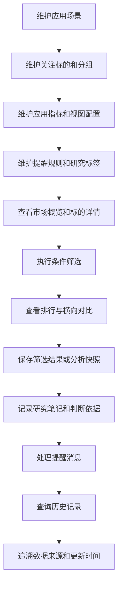

# 数据应用与分析需求规格说明书
    
## 文档信息

| 项目 | 内容 |
|---|---|
| 项目名称 | 数据应用与分析 |
| 文档名称 | 数据应用与分析需求规格说明书 |
| 文档版本 | V1.0-draft |
| 文档状态 | 草案 |
| 编制日期 | 2026-06-02 |

---

## 修订记录

| 版本 | 日期 | 修订内容 | 修订原因 |
|---|---|---|---|
| V1.0-draft | 2026-06-02 | 形成数据应用与分析需求规格说明初稿，完成应用域业务分解、功能需求、业务对象、流程、规则、验收口径和边界说明 | 根据当前应用域子系统、模块、功能划分编制 |

---

## 1. 文档说明

### 1.1 编制目的

为支撑个人交易研究场景下的数据查看、标的观察、条件筛选、指标对比、提醒通知和研究记录，需要在既有数据采集能力基础上建设面向使用者的数据应用与分析能力。数据应用与分析承接采集域形成的数据集、结果摘要、指标数据、行情数据、财务数据、公告资讯和追溯信息，为个人交易研究过程提供统一入口和持续使用能力。

本文档聚焦个人辅助交易平台数据应用与分析内容，明确建设背景、业务目标、用户对象、业务场景、功能需求、业务对象、业务流程、业务规则、验收标准及实施边界，作为后续产品设计、概要设计、研发实施和测试验收的依据。

### 1.2 文档定位

本文档重点回答以下问题：

1. 为什么要建设个人辅助交易平台数据应用与分析能力；
2. 数据应用与分析在平台全链条能力中的定位与范围是什么；
3. 数据应用与分析优先解决哪些业务问题；
4. 数据应用与分析按业务口径划分为哪些子系统、模块和功能；
5. 数据应用与分析涉及哪些核心业务对象和对象关系；
6. 数据应用与分析主业务流程如何组织；
7. 数据应用与分析成果如何验收；
8. 数据应用与分析与采集域、后续治理能力之间如何衔接。

### 1.3 术语说明

- **平台**：面向个人辅助交易场景建设的统一业务平台，长期覆盖采集、管理、治理、服务、应用与辅助分析等全链条能力。
- **数据应用与分析**：面向平台使用者提供配置、展示、筛选、对比、提醒、记录、查询和追溯的业务能力集合。
- **应用场景**：用户在平台中使用数据完成查看、筛选、对比、记录、提醒或追溯的一类业务场景。
- **关注标的**：用户在交易研究过程中持续观察的股票、指数、板块、基金或其他可扩展对象。
- **应用指标**：在数据应用与分析中用于展示、筛选、排行、对比和提醒的数据项，如价格指标、涨跌幅指标、财务指标、估值指标、公告事件指标等。
- **视图配置**：用户对看板、列表、详情页、字段、排序、筛选入口和默认展示方式的配置。
- **提醒规则**：由用户维护的价格、指标、公告、事件等触发条件及通知方式。
- **研究标签**：用户对标的、记录、筛选结果或研究观点进行分类、标记和检索的标签。
- **分析快照**：用户在某个时点保存的看板、标的、筛选结果或对比结果的展示状态和关键数据。
- **追溯**：用户从应用展示结果回看数据来源、更新时间、采集执行记录、数据集或相关配置口径的过程。
- **功能**：面向用户和业务场景定义的业务能力项。
- **模块**：业务子系统内部按职责划分的组成单元。

### 1.4 目标读者

本文档面向项目发起人、业务评审人员、产品经理、需求分析人员、技术架构、开发、测试、运维人员，以及后续使用平台开展个人交易研究、标的观察和数据分析的使用者。

### 1.5 文档使用原则

本文档重点描述业务需求、业务边界、功能划分和验收口径，不展开数据库表结构、接口协议、前端组件实现、调度实现细节、权限模型细节和部署拓扑。数据应用与分析功能描述采用业务语言表达，重点说明系统提供什么能力、用户能够完成什么操作、业务对象之间形成什么关系、验收时如何确认功能完成。

## 2. 项目背景

### 2.1 业务背景

在个人辅助交易场景中，用户不仅需要稳定获取行情、财务、基础资料、公告资讯等数据，还需要围绕这些数据完成持续观察、条件筛选、横向对比、重点标记、提醒处理、研究记录和历史回看。数据采集域为平台提供数据获取和结果沉淀能力，数据应用与分析把已采集的数据、指标、公告、结果摘要和追溯信息组织成面向个人交易研究的使用场景。

### 2.2 当前存在的主要问题

当前主要问题包括数据查看入口分散、关注标的缺少统一管理、指标展示与筛选口径不统一、提醒和研究记录缺少闭环、应用结果缺少来源解释。上述问题导致用户需要反复查找数据、手工维护记录，并且难以解释历史筛选、提醒和展示结果。

### 2.3 建设必要性

数据应用与分析用于把采集域沉淀的数据转化为面向使用者的交易研究能力。通过统一应用配置、统一分析展示、统一查询追溯，平台形成覆盖“配置—观察—筛选—对比—提醒—记录—回看”的应用闭环，提高日常使用效率、研究过程连续性和结果可解释性。

### 2.4 建设思路

建设思路包括配置统一、展示统一、追溯统一和边界清晰。配置统一覆盖场景、标的、指标、视图、提醒规则和标签；展示统一覆盖市场概览、标的详情、筛选、对比、提醒和研究记录；追溯统一覆盖应用结果、数据集、采集执行记录和更新时间。

## 3. 建设目标

### 3.1 总体目标

建设个人辅助交易平台应用域能力，围绕**应用配置管理、应用分析展示、应用查询与追溯**三类业务能力，形成统一配置、统一展示、统一筛选、统一提醒、统一记录、统一查询和统一追溯的应用支撑体系。用户能够基于平台沉淀的数据完成市场观察、标的研究、指标筛选、财务分析、公告查看、结果对比、提醒处理和历史回看。

### 3.2 分项目标

#### 3.2.1 提高数据使用效率

通过市场概览、标的详情、自选观察和统一视图配置，降低用户查找数据、切换页面和重复整理字段的成本。

#### 3.2.2 提高标的观察连续性

通过关注标的、标的分组、观察状态、重点标记和研究记录，帮助用户持续跟踪关注对象。

#### 3.2.3 提高筛选与对比效率

通过应用指标配置、条件筛选、排行与对比功能，支持用户快速生成候选标的集合，并按指标、区间表现和关键差异进行横向比较。

#### 3.2.4 提高事件处理闭环能力

通过提醒规则配置、提醒触发、提醒消息、处理状态和提醒历史，形成从触发到查看再到处理的完整闭环。

#### 3.2.5 提高研究过程可回看性

通过研究标签、研究笔记、筛选记录、分析快照和历史观点回看，保留用户在不同时间点的观察、判断和依据。

#### 3.2.6 提高应用结果可解释性

通过数据来源追溯，把应用展示结果与数据集、采集执行记录、更新时间和来源信息建立关联。

### 3.3 建设成功标志

1. 应用场景、关注标的、应用指标、视图、提醒规则和研究标签具备统一配置入口；
2. 市场概览、标的详情、自选观察、财务与基本面分析、公告资讯、条件筛选、排行对比、标的组合、研究记录和提醒通知具备统一使用入口；
3. 用户能够按标的、场景、指标、时间范围和标签查询应用结果和研究记录；
4. 条件筛选、提醒触发和分析快照均能保存历史记录；
5. 应用展示数据能够回看来源数据集、采集执行记录和数据更新时间；
6. 本阶段能力为后续更深层的数据治理、指标服务和辅助分析能力保留扩展空间；

## 4. 适用范围

### 4.1 平台整体适用范围

平台面向个人辅助交易相关的数据全链条业务建设，长期覆盖数据采集、数据管理、数据治理、数据服务、数据应用与辅助分析等能力域。

### 4.2 适用业务范围

1. 市场行情观察；
2. 指数、板块和标的概览；
3. 自选标的维护与观察；
4. 财务与基本面查看；
5. 公告资讯查看与事件标记；
6. 指标筛选、排行和横向对比；
7. 标的组合维护；
8. 研究笔记、观察记录和标签管理；
9. 提醒规则配置、提醒触发和提醒处理；
10. 应用结果、筛选记录、分析快照、提醒记录、研究记录和数据来源追溯；

### 4.3 本期建设范围

1. 应用场景管理模块：应用场景分类管理、应用场景目录；
2. 关注标的管理模块：关注标的维护、标的分组管理；
3. 应用指标配置模块：指标项选择、指标分组、展示字段配置、指标口径说明；
4. 视图配置管理模块：看板配置、列表视图配置、详情页视图配置、默认展示配置；
5. 提醒规则配置模块：价格提醒规则、指标提醒规则、公告提醒规则、提醒启停管理；
6. 研究标签管理模块：标签分类管理、标签维护、标签与标的关联、标签使用统计；
7. 市场概览模块：市场行情概览、指数概览、板块概览、涨跌分布展示；
8. 标的详情模块：标的基础信息查看、行情走势查看、关键指标查看、历史数据查看；
9. 财务与基本面分析模块：财务摘要查看、核心财务指标展示、财务趋势分析、同行对比；
10. 公告资讯应用模块：公告列表查看、公告详情查看、资讯分类查看、重要事件标记；
11. 条件筛选模块：筛选条件配置、筛选结果生成、筛选结果排序、筛选结果保存；
12. 排行与对比模块：指标排行、区间表现排行、标的横向对比、指标差异展示；
13. 标的组合模块：标的组合维护、组合成分查看、组合行情概览、组合风险提示；
14. 研究记录模块：标的研究笔记、观察记录、判断依据记录、附件或链接引用；
15. 提醒通知模块：提醒触发展示、提醒消息列表、提醒处理状态、提醒历史查看；
16. 应用结果查询模块：按标的查询、按场景查询、按指标查询、按时间范围查询；
17. 筛选记录查询模块：历史筛选记录查看、筛选条件回看、筛选结果回看、结果导出；
18. 分析快照管理模块：标的快照保存、看板快照保存、筛选快照保存、快照对比；
19. 提醒记录查询模块：提醒触发记录、提醒处理记录、提醒命中原因、提醒规则回看；
20. 研究记录查询模块：笔记检索、标签筛选、标的关联查询、历史观点回看；
21. 数据来源追溯模块：应用数据来源查看、关联数据集查看、采集执行记录关联、数据更新时间查看；

### 4.4 本期不纳入范围

1. 自动交易执行；
2. 交易指令生成和下单闭环；
3. 策略历史验证和收益模拟类能力；
4. 参数寻优和模型训练；
5. 复杂组合绩效归因；
6. 面向多人协作的完整权限体系和审批流；
7. 外部系统开放服务体系；
8. 移动端专项体验建设；
9. 大规模实时行情推送和低延迟交易通道；
10. 完整投研知识库和自动报告生成体系；

### 4.5 边界说明

本期应用域聚焦个人使用者对已沉淀数据的查看、筛选、对比、提醒、记录和追溯。需要深度计算、复杂模型、自动决策、交易执行或专业投研报告生成的内容，仅保留业务扩展方向，不纳入本期交付承诺。

## 5. 目标用户与职责分工

### 5.1 个人交易研究者/使用者

1. 快速查看市场、指数、板块和标的数据；
2. 维护自选标的、分组和观察状态；
3. 基于指标和条件筛选候选标的；
4. 查看财务、公告和历史数据；
5. 记录研究判断、后续观察事项；
6. 查询历史筛选、提醒、快照和研究记录；
7. 核验展示数据来源和更新时间；

### 5.2 应用配置维护者

1. 维护应用场景目录和启停状态；
2. 维护应用指标分组、字段展示和口径说明；
3. 维护看板、列表和详情页视图配置；
4. 维护提醒规则分类和启停状态；
5. 维护研究标签分类、标签状态和关联规则；
6. 关注应用配置变更对展示、筛选、提醒和历史记录的影响；

### 5.3 平台管理者

1. 查看应用域功能覆盖情况；
2. 监督关键应用入口的可用性；
3. 关注提醒触发、筛选保存、快照生成和追溯链路完整性；
4. 关注应用域与采集域的数据衔接；
5. 为后续治理、指标服务和辅助分析能力提供管理依据；

## 6. 核心业务场景

### 6.1 日常市场观察场景

用户进入平台后查看市场整体表现、指数走势、板块表现、涨跌分布和重点标的状态，快速判断当前市场环境和关注方向。

### 6.2 自选标的持续观察场景

用户把关注标的加入自选列表，按分组、和重点程度组织观察对象，并通过标的详情查看行情、指标、财务、公告和研究记录。

### 6.3 条件筛选场景

用户根据价格、涨跌幅、成交额、估值、财务指标、公告事件、标签等条件配置筛选规则，生成候选标的列表，并保存筛选条件和筛选结果。

### 6.4 指标排行与横向对比场景

用户按某一指标或区间表现查看排行，并选择多个标的进行横向对比，观察关键指标差异、趋势差异和相对表现。

### 6.5 财务与基本面分析场景

用户查看标的财务摘要、核心财务指标、趋势变化和同行对比结果，用于辅助理解标的经营状况和估值水平。

### 6.6 公告资讯查看场景

用户查看公告列表、公告详情和资讯分类，对重要事件进行标记，并在标的详情或研究记录中引用相关公告资讯。

### 6.7 提醒触发与处理场景

用户维护价格、指标或公告提醒规则。触发后，系统形成提醒消息和提醒记录，用户查看触发原因并更新处理状态。

### 6.8 研究记录与观点回看场景

用户在标的、筛选结果或分析快照上记录研究笔记、观察结论、判断依据和附件链接，并通过标签、标的和时间范围进行检索。

### 6.9 数据来源追溯场景

当用户对展示结果、筛选结果或提醒命中结果存在疑问时，通过追溯入口查看数据来源、关联数据集、采集执行记录和数据更新时间。

## 7. 建设原则

### 7.1 平台能力分层清晰原则

平台整体覆盖采集、管理、治理、服务和应用能力，应用域聚焦用户侧的数据使用、分析展示、提醒记录和追溯回看。

### 7.2 统一入口原则

平台为场景配置、关注标的、指标视图、市场概览、标的详情、筛选、提醒、研究记录和追溯查询提供统一入口。

### 7.3 面向业务对象原则

应用域功能围绕应用场景、关注标的、应用指标、视图配置、提醒规则、研究标签、筛选条件、筛选结果、分析快照、提醒记录、研究记录和数据来源等业务对象展开。

### 7.4 过程可回看原则

用户在平台中完成的筛选、提醒、记录、快照和查询行为形成历史记录，用于后续回看、复盘和解释。

### 7.5 来源可解释原则

应用展示结果、筛选结果和提醒命中结果能够关联到来源数据、更新时间、数据集或采集执行记录。

### 7.6 使用体验聚焦原则

本期功能优先覆盖个人使用者高频使用链路，包括看数据、筛标的、做对比、设提醒、写记录、查来源和回看历史。

### 7.7 渐进演进原则

应用域在本期稳定运行基础上，后续逐步拓展更完整的指标服务、数据质量提示、研究报告和辅助分析能力。

## 8. 业务分解体系

### 8.1 分解原则

应用域业务分解统一采用“**子系统—模块—功能**”三级结构。子系统表达相对完整的业务边界，模块表达子系统内部职责分工，功能表达面向用户和业务场景的能力项。

### 8.2 子系统划分

1. **应用配置管理子系统**：负责应用场景、关注标的、指标、视图、提醒规则和研究标签等应用侧基础配置。
2. **应用分析展示子系统**：负责市场概览、标的详情、自选观察、财务分析、公告资讯、条件筛选、排行对比、标的组合、研究记录和提醒通知等面向使用者的分析展示能力。
3. **应用查询与追溯子系统**：负责应用结果、筛选记录、分析快照、提醒记录、研究记录和数据来源的查询回看。

### 8.3 子系统、模块与功能映射

| 模块编号 | 子系统 | 模块 | 功能 |
|---|---|---|---|
| A-01 | 应用配置管理子系统 | 应用场景管理模块 | 应用场景分类管理、应用场景目录 |
| A-02 | 应用配置管理子系统 | 关注标的管理模块 | 关注标的维护、标的分组管理 |
| A-03 | 应用配置管理子系统 | 应用指标配置模块 | 指标项选择、指标分组、展示字段配置、指标口径说明 |
| A-04 | 应用配置管理子系统 | 视图配置管理模块 | 看板配置、列表视图配置、详情页视图配置、默认展示配置 |
| A-05 | 应用配置管理子系统 | 提醒规则配置模块 | 价格提醒规则、指标提醒规则、公告提醒规则、提醒启停管理 |
| A-06 | 应用配置管理子系统 | 研究标签管理模块 | 标签分类管理、标签维护、标签与标的关联、标签使用统计 |
| A-07 | 应用分析展示子系统 | 市场概览模块 | 市场行情概览、指数概览、板块概览、涨跌分布展示 |
| A-08 | 应用分析展示子系统 | 标的详情模块 | 标的基础信息查看、行情走势查看、关键指标查看、历史数据查看 |
| A-09 | 应用分析展示子系统 | 财务与基本面分析模块 | 财务摘要查看、核心财务指标展示、财务趋势分析、同行对比 |
| A-10 | 应用分析展示子系统 | 公告资讯应用模块 | 公告列表查看、公告详情查看、资讯分类查看、重要事件标记 |
| A-11 | 应用分析展示子系统 | 条件筛选模块 | 筛选条件配置、筛选结果生成、筛选结果排序、筛选结果保存 |
| A-12 | 应用分析展示子系统 | 排行与对比模块 | 指标排行、区间表现排行、标的横向对比、指标差异展示 |
| A-13 | 应用分析展示子系统 | 标的组合模块 | 标的组合维护、组合成分查看、组合行情概览、组合风险提示 |
| A-14 | 应用分析展示子系统 | 研究记录模块 | 标的研究笔记、观察记录、判断依据记录、附件或链接引用 |
| A-15 | 应用分析展示子系统 | 提醒通知模块 | 提醒触发展示、提醒消息列表、提醒处理状态、提醒历史查看 |
| A-16 | 应用查询与追溯子系统 | 应用结果查询模块 | 按标的查询、按场景查询、按指标查询、按时间范围查询 |
| A-17 | 应用查询与追溯子系统 | 筛选记录查询模块 | 历史筛选记录查看、筛选条件回看、筛选结果回看、结果导出 |
| A-18 | 应用查询与追溯子系统 | 分析快照管理模块 | 标的快照保存、看板快照保存、筛选快照保存、快照对比 |
| A-19 | 应用查询与追溯子系统 | 提醒记录查询模块 | 提醒触发记录、提醒处理记录、提醒命中原因、提醒规则回看 |
| A-20 | 应用查询与追溯子系统 | 研究记录查询模块 | 笔记检索、标签筛选、标的关联查询、历史观点回看 |
| A-21 | 应用查询与追溯子系统 | 数据来源追溯模块 | 应用数据来源查看、关联数据集查看、采集执行记录关联、数据更新时间查看 |

### 8.4 模块职责说明

#### 8.4.1 A-01 应用场景管理模块

维护平台中面向使用者的业务入口和场景目录，为市场观察、标的研究、财务分析、公告查看、条件筛选、提醒处理和研究记录提供统一入口。

#### 8.4.2 A-02 关注标的管理模块

维护用户持续观察的标的清单、标的分组和关注依据，支撑自选观察、标的详情、提醒规则和研究记录。

#### 8.4.3 A-03 应用指标配置模块

维护应用域中可展示、可筛选、可排行、可对比和可提醒的指标范围，保证各类页面和筛选结果使用统一指标口径。

#### 8.4.4 A-04 视图配置管理模块

维护看板、列表、详情页和默认展示方式，控制字段、排序、筛选入口、分组和常用视图。

#### 8.4.5 A-05 提醒规则配置模块

维护价格、指标和公告类提醒规则，管理触发条件、适用对象、通知方式和启停状态。

#### 8.4.6 A-06 研究标签管理模块

维护研究标签及其分类，支撑标的、笔记、筛选结果、提醒记录和分析快照的标记、检索与统计。

#### 8.4.7 A-07 市场概览模块

展示市场整体表现、指数表现、板块表现和涨跌分布，帮助用户快速了解市场环境。

#### 8.4.8 A-08 标的详情模块

围绕单个标的展示基础信息、行情走势、关键指标、历史数据、公告资讯、研究记录和数据来源入口。

#### 8.4.9 A-09 财务与基本面分析模块

展示财务摘要、核心财务指标、趋势变化和同行对比，辅助用户理解标的基本面情况。

#### 8.4.10 A-10 公告资讯应用模块

展示公告和资讯内容，支持分类查看、详情查看和重要事件标记，并与标的详情、提醒和研究记录衔接。

#### 8.4.11 A-11 条件筛选模块

支持用户基于行情、财务、估值、公告、标签和观察状态等条件生成候选标的集合。

#### 8.4.12 A-12 排行与对比模块

提供指标排行、区间表现排行和多标的横向对比，帮助用户识别相对表现和关键差异。

#### 8.4.13 A-13 标的组合模块

支持用户按主题、方向或个人观察逻辑组织多个标的，并查看组合层面的行情概览和风险提示。

#### 8.4.14 A-14 研究记录模块

沉淀用户研究过程，记录标的笔记、观察事项、判断依据以及附件或链接。

#### 8.4.15 A-15 提醒通知模块

展示提醒触发结果、消息列表和处理状态，形成从规则触发到用户处理的闭环。

#### 8.4.16 A-16 应用结果查询模块

按标的、场景、指标和时间范围查询应用展示结果，支持用户回看关键数据变化。

#### 8.4.17 A-17 筛选记录查询模块

查看历史筛选过程、筛选条件、筛选结果和导出记录，支持筛选复用和历史核验。

#### 8.4.18 A-18 分析快照管理模块

保存某一时点的标的、看板或筛选展示状态，并支持不同快照之间的对比。

#### 8.4.19 A-19 提醒记录查询模块

查询提醒触发、处理、命中原因和触发时规则内容，支撑提醒结果解释。

#### 8.4.20 A-20 研究记录查询模块

检索研究笔记、观察记录和历史观点，按标的、标签、关键字和时间范围恢复研究上下文。

#### 8.4.21 A-21 数据来源追溯模块

把应用展示结果与来源数据、数据集、采集执行记录和更新时间关联，支撑结果核验。

### 8.5 模块依赖关系

1. 应用配置管理子系统为应用分析展示子系统提供场景、标的、指标、视图、提醒规则和研究标签等基础配置；
2. 应用分析展示子系统基于采集域沉淀的数据集、指标数据、公告资讯和历史结果形成展示、筛选、对比、提醒和记录能力；
3. 提醒规则配置模块为提醒通知模块和提醒记录查询模块提供规则来源；
4. 关注标的管理模块为自选观察、标的详情、提醒规则、研究记录和应用结果查询提供标的基础；
5. 应用指标配置模块为市场概览、标的详情、财务分析、条件筛选、排行对比和提醒规则提供指标口径；
6. 研究标签管理模块为研究记录、筛选记录、标的查询和历史观点回看提供标签基础；
7. 应用查询与追溯子系统基于应用分析展示子系统产生的筛选记录、快照、提醒记录和研究记录开展查询回看；
8. 数据来源追溯模块通过数据集、采集执行记录和更新时间打通应用结果与采集域结果之间的关联；

## 9. 业务对象定义

### 9.1 应用场景

用于组织平台中的业务入口和功能目录，包含场景编码、场景名称、场景分类、排序、状态、说明等信息。

### 9.2 关注标的

表示用户持续观察的对象，包含标的编码、标的名称、标的类型、所属市场、关注分组、重点标记、创建时间和更新时间等内容。

### 9.3 标的分组

用于对关注标的进行分类组织，包含分组名称、分组说明、排序、状态和分组下标的关系。

### 9.4 应用指标

用于展示、筛选、排行、对比和提醒，包含指标编码、指标名称、指标分类、指标口径、数据来源、计算周期、适用场景、展示格式、单位和状态等内容。

### 9.5 视图配置

表示用户或系统对看板、列表、详情页和默认展示的配置结果，包含视图名称、适用场景、字段清单、排序方式、筛选入口、默认分组、展示顺序和状态等信息。

### 9.6 提醒规则

表示用户维护的触发条件，包含规则名称、规则类型、适用标的或分组、触发条件、触发阈值、比较方式、通知方式、启停状态、有效时间和规则说明等内容。

### 9.7 提醒消息

表示提醒规则触发后形成的待查看信息，包含触发时间、触发规则、触发标的、命中原因、触发值、处理状态和处理说明等内容。

### 9.8 研究标签

用于对标的、笔记、筛选结果、提醒记录或分析快照进行分类标记，包含标签名称、标签分类、标签说明、状态、使用次数和关联对象等内容。

### 9.9 筛选条件

表示用户配置的筛选逻辑，包含条件名称、适用范围、指标条件、行情条件、财务条件、公告条件、标签条件、排序规则和保存状态等内容。

### 9.10 筛选结果

表示根据筛选条件生成的标的集合，包含筛选时间、筛选条件、命中标的、排序结果、关键指标、结果说明、保存状态和来源数据时间。

### 9.11 排行结果

表示按某一指标或区间表现生成的排序数据，包含排行指标、排行范围、统计区间、标的清单、指标值、排序位次、更新时间和数据来源。

### 9.12 对比结果

表示多个标的在一组指标下的横向比较结果，包含对比标的、对比指标、指标差异、趋势差异、更新时间和来源说明。

### 9.13 标的组合

表示用户按主题、方向或个人观察逻辑组织的一组标的，包含组合名称、组合说明、组合成分、排序、状态、组合行情概览和风险提示信息。

### 9.14 研究记录

表示用户在交易研究过程中形成的笔记和判断依据，包含记录标题、记录类型、关联标的、关联标签、正文内容、附件或链接、记录时间和更新时间等内容。

### 9.15 分析快照

表示用户在某一时点保存的展示状态和关键数据，包含快照类型、关联对象、保存时间、关键字段、展示配置、筛选条件、结果摘要和来源数据时间等内容。

### 9.16 应用结果

表示用户通过市场概览、标的详情、财务分析、筛选、排行、对比、提醒和研究记录等功能看到或生成的业务结果，包含结果类型、关联对象、生成时间、关键内容和来源信息。

### 9.17 数据来源信息

表示应用结果所使用的数据来源、数据集、采集执行记录和更新时间，用于应用结果核验、展示解释和异常定位。

### 9.18 对象之间的关系

1. 应用场景组织应用入口、模块和展示内容；
2. 关注标的是标的详情、自选观察、提醒规则、研究记录和结果查询的核心对象；
3. 标的分组用于组织关注标的，并影响自选观察和提醒规则适用范围；
4. 应用指标用于市场概览、标的详情、财务分析、筛选、排行、对比和提醒；
5. 视图配置决定看板、列表和详情页的展示方式；
6. 提醒规则触发后形成提醒消息和提醒记录；
7. 研究标签可关联标的、研究记录、筛选结果和分析快照；
8. 筛选条件生成筛选结果，筛选结果可保存并进入历史查询；
9. 排行结果和对比结果可形成分析快照；
10. 研究记录可关联标的、公告资讯、筛选结果、提醒记录和分析快照；
11. 应用结果可追溯到数据来源、数据集、采集执行记录和更新时间；

## 10. 功能需求

### 10.1 应用配置管理子系统

应用配置管理子系统用于统一维护数据应用与分析的基础配置，包括应用场景、关注标的、应用指标、视图配置、提醒规则和研究标签。该子系统沉淀可复用的业务口径，为后续展示、筛选、提醒、记录、查询和追溯提供统一依据。

#### 10.1.1 应用场景管理模块

应用场景管理模块维护平台中的业务入口、场景分类和场景目录，形成面向市场观察、标的研究、财务分析、公告查看、条件筛选、提醒处理和研究记录的统一导航。

##### 10.1.1.1 应用场景分类管理

系统提供应用场景分类维护能力，用户能够按业务用途建立市场观察、标的分析、筛选对比、提醒处理、研究记录和追溯查询等分类，并维护排序、状态和说明。分类结果用于组织场景目录和页面入口，停用后的分类不再出现在默认入口中，历史记录仍保留原分类信息。

##### 10.1.1.2 应用场景目录

系统提供应用场景目录维护能力，用户能够维护场景名称、场景编码、所属分类、顺序、启停状态、说明。场景目录用于把分散功能组织成可访问的业务入口，用户进入场景后能够跳转至对应的看板、列表、详情、筛选、记录或追溯页面。

#### 10.1.2 关注标的管理模块

关注标的管理模块维护用户持续观察的标的清单、分组和关注依据，支撑标的详情、提醒规则、研究记录、筛选结果保存和历史查询。

##### 10.1.2.1 关注标的维护

系统提供关注标的维护能力，用户能够将股票、指数、板块、基金等对象加入关注范围，并维护标的类型、所属市场、重点标记、关注理由、观察状态、创建时间和更新时间。系统按照标的编码和市场识别唯一对象，避免同一标的在同一关注范围内重复维护。

##### 10.1.2.2 标的分组管理

系统提供标的分组管理能力，用户能够按行业、主题、观察阶段、个人研究逻辑等方式建立分组，并维护分组名称、说明、排序和状态。用户能够在分组之间移动标的，系统在分组列表中展示标的数量和重点标的数量，已被历史记录引用的分组保留回看信息。

#### 10.1.3 应用指标配置模块

应用指标配置模块维护可展示、可筛选、可排行、可对比和可提醒的指标范围，保证市场概览、标的详情、条件筛选、排行对比和提醒规则使用一致的数据口径。

##### 10.1.3.1 指标项选择

系统提供指标项选择能力，用户能够从采集域沉淀的数据字段、结果摘要和已定义指标中选择进入应用域的指标项，并配置指标适用的场景、模块和使用方式。指标项可被标记为展示、筛选、排行、对比或提醒用途，未启用的指标不出现在新增配置入口中。

##### 10.1.3.2 指标分组

系统提供指标分组能力，用户能够按行情、估值、财务、成长、公告事件、风险提示等维度组织指标，并维护分组排序和分组说明。指标分组用于详情页分区、筛选条件分类、排行入口组织和指标检索，帮助用户快速定位指标。

##### 10.1.3.3 展示字段配置

系统提供展示字段配置能力，用户能够为看板、列表、详情页、筛选结果和对比结果配置字段名称、展示顺序、单位、精度、默认排序、空值展示和是否固定展示。配置结果控制不同视图中的字段呈现方式，保证同一指标在不同入口中保持可理解的展示口径。

##### 10.1.3.4 指标口径说明

系统提供指标口径说明维护能力，用户能够记录指标含义、计算口径、数据来源、统计周期、更新时间、适用范围和注意事项。用户在查看指标、配置筛选条件、设置提醒或回看结果时，能够打开口径说明核验指标含义和来源依据。

#### 10.1.4 视图配置管理模块

视图配置管理模块维护看板、列表、详情页和默认展示方式，控制应用页面的字段、排序、筛选入口、分组和常用视图。

##### 10.1.4.1 看板配置

系统提供看板配置能力，用户能够配置看板名称、适用场景、卡片布局、展示指标、数据范围、刷新时间、排序方式和跳转入口。看板配置用于市场概览、组合概览和重点标的观察等场景，用户能够通过看板快速进入详情、筛选、记录或追溯功能。

##### 10.1.4.2 列表视图配置

系统提供列表视图配置能力，用户能够配置列表字段、字段顺序、默认排序、筛选入口、分组方式、固定列和批量操作入口。列表视图用于自选标的、筛选结果、公告资讯、提醒消息和查询结果等页面，不同场景可使用不同的默认字段集合。

##### 10.1.4.3 详情页视图配置

系统提供详情页视图配置能力，用户能够配置标的详情页中的基础信息、行情走势、关键指标、财务摘要、公告资讯、研究记录和来源追溯等区块顺序。详情页视图以标的为中心组织信息，用户能够在同一页面完成查看、记录、标记和追溯。

##### 10.1.4.4 默认展示配置

系统提供默认展示配置能力，用户能够为不同场景配置默认进入页面、默认标的分组、默认指标集合、默认时间范围和默认排序规则。默认展示配置降低重复设置成本，用户仍可在页面中临时调整视图和筛选条件。

#### 10.1.5 提醒规则配置模块

提醒规则配置模块维护价格、指标和公告类提醒规则，管理触发对象、触发条件、通知方式、有效范围和启停状态。

##### 10.1.5.1 价格提醒规则

系统提供价格提醒规则维护能力，用户能够按标的、分组或指数配置价格上穿、下穿、涨跌幅达到阈值、成交额变化等触发条件。规则内容包含比较方式、阈值、有效时间、重复触发控制和触发说明，触发后形成提醒消息和提醒记录。

##### 10.1.5.2 指标提醒规则

系统提供指标提醒规则维护能力，用户能够围绕估值、财务、行情、排行、公告事件等指标配置阈值、区间、排名变化或数据异常等触发条件。系统在指标数据更新后按规则进行匹配，并记录命中指标、触发值、对比值和数据时间。

##### 10.1.5.3 公告提醒规则

系统提供公告提醒规则维护能力，用户能够按标的、公告类型、关键词、事件标签和重要程度配置提醒条件。公告数据进入应用域后，系统根据规则匹配公告标题、摘要、分类和关联标的，形成公告类提醒消息。

##### 10.1.5.4 提醒启停管理

系统提供提醒启停管理能力，用户能够启用、停用、暂停或恢复单条规则，也能够按标的、分组、规则类型进行批量处理。启停状态变化保留操作时间和说明，历史提醒记录仍按照触发时的规则状态进行回看。

#### 10.1.6 研究标签管理模块

研究标签管理模块维护研究标签和标签分类，为标的、笔记、筛选结果、提醒记录和分析快照提供标记、检索和统计能力。

##### 10.1.6.1 标签分类管理

系统提供标签分类管理能力，用户能够维护标签分类名称、分类说明、排序和启停状态。标签分类用于区分行业主题、观察阶段、事件类型、研究结论和风险特征等标签集合，便于后续检索和统计。

##### 10.1.6.2 标签维护

系统提供标签维护能力，用户能够新增、修改、停用和查询标签，并维护标签名称、所属分类、说明、颜色标识、状态和使用范围。标签名称在同一分类下保持唯一，停用标签不再用于新增关联，历史关联继续保留。

##### 10.1.6.3 标签与标的关联

系统提供标签与标的关联能力，用户能够在标的详情、筛选结果、研究记录和提醒记录中为对象添加或移除标签。关联关系保留创建时间和来源入口，用户后续能够按标签快速找回相关标的和研究内容。

##### 10.1.6.4 标签使用统计

系统提供标签使用统计能力，系统按标签分类、关联对象类型、标的数量、记录数量和最近使用时间统计标签使用情况。统计结果用于识别高频标签、空置标签和需要整理的标签分类。

### 10.2 应用分析展示子系统

应用分析展示子系统承接采集域沉淀的数据和应用配置，向用户提供市场观察、标的查看、财务分析、公告资讯、条件筛选、排行对比、标的组合、研究记录和提醒通知等能力。

#### 10.2.1 市场概览模块

市场概览模块展示市场整体表现、指数表现、板块表现和涨跌分布，帮助用户快速了解当前市场环境和主要变化。

##### 10.2.1.1 市场行情概览

系统提供市场行情概览能力，页面展示交易日期、市场状态、主要指数涨跌、成交概况、上涨下跌数量、热点板块和数据更新时间。用户能够从概览入口进入指数、板块、标的详情或筛选页面，继续查看具体对象。

##### 10.2.1.2 指数概览

系统提供指数概览能力，用户能够查看主要指数的最新点位、涨跌幅、成交额、振幅、区间表现和走势入口。指数列表按照市场、指数类型或关注状态组织，用户能够选择指数进入历史走势和关联成分观察。

##### 10.2.1.3 板块概览

系统提供板块概览能力，用户能够查看板块涨跌幅、成交额、上涨下跌家数、领涨标的、领跌标的和板块热度变化。板块数据可按行业、概念或自定义分类展示，用户能够进入板块内标的列表开展进一步筛选和对比。

##### 10.2.1.4 涨跌分布展示

系统提供涨跌分布展示能力，按照涨跌幅区间统计标的数量和占比，并展示涨停、跌停、平盘、上涨和下跌等分布信息。用户能够按市场、板块、标的范围和时间点切换分布视角，用于判断市场强弱和分化程度。

#### 10.2.2 标的详情模块

标的详情模块围绕单个标的展示基础资料、行情走势、关键指标、历史数据、公告资讯、研究记录和来源追溯入口。

##### 10.2.2.1 标的基础信息查看

系统提供标的基础信息查看能力，页面展示标的编码、名称、类型、所属市场、行业板块、上市时间、状态、关注分组和标签信息。用户能够在详情页完成关注、取消关注、重点标记、添加标签和进入相关记录。

##### 10.2.2.2 行情走势查看

系统提供行情走势查看能力，用户能够按日内、日线、周线、月线等周期查看价格、成交量、涨跌幅和关键节点。走势区域展示数据时间和来源入口，用户能够结合指标、公告和研究记录查看变化背景。

##### 10.2.2.3 关键指标查看

系统提供关键指标查看能力，按照行情、估值、财务、成长、风险和公告事件等分组展示核心指标。用户能够查看指标当前值、历史变化、更新时间和口径说明，并将指标加入筛选、对比或提醒配置。

##### 10.2.2.4 历史数据查看

系统提供历史数据查看能力，用户能够按时间范围查询标的历史行情、历史指标、公告事件和关键变化记录。历史数据以列表和趋势形式展示，用户能够查看数据时间、字段说明和来源追溯入口。

#### 10.2.3 财务与基本面分析模块

财务与基本面分析模块展示财务摘要、核心财务指标、趋势变化和同行对比，帮助用户理解标的基本面情况。

##### 10.2.3.1 财务摘要查看

系统提供财务摘要查看能力，用户能够查看最新报告期的营业收入、净利润、现金流、资产负债、每股指标和报告披露时间。摘要信息按报告期组织，并展示同比、环比和数据来源。

##### 10.2.3.2 核心财务指标展示

系统提供核心财务指标展示能力，按照盈利能力、成长能力、偿债能力、营运能力、现金流质量和估值水平展示指标。用户能够查看指标值、单位、报告期、排名信息和口径说明，快速识别关键财务特征。

##### 10.2.3.3 财务趋势分析

系统提供财务趋势分析能力，用户能够按年度、季度或报告期查看核心财务指标的连续变化。趋势展示包含增长率、变化方向、异常波动和最近披露时间，便于用户观察标的基本面的持续性。

##### 10.2.3.4 同行对比

系统提供同行对比能力，用户能够按行业、板块或自定义对比范围查看多个标的的财务指标和估值指标差异。对比结果展示排名、分位、指标差距和更新时间，帮助用户识别同类标的之间的相对位置。

#### 10.2.4 公告资讯应用模块

公告资讯应用模块展示公告和资讯内容，提供分类查看、详情查看、事件标记以及与标的详情、提醒和研究记录的关联。

##### 10.2.4.1 公告列表查看

系统提供公告列表查看能力，用户能够按标的、公告类型、发布时间、关键词、重要程度和是否已读筛选公告。列表展示标题、关联标的、公告类型、发布时间、摘要和标记状态，用户能够进入详情或关联研究记录。

##### 10.2.4.2 公告详情查看

系统提供公告详情查看能力，用户能够查看公告标题、来源、发布时间、正文摘要、原文链接、关联标的和系统解析的事件标签。详情页提供重要事件标记、标签关联、研究记录引用和来源追溯入口。

##### 10.2.4.3 资讯分类查看

系统提供资讯分类查看能力，用户能够按照市场资讯、板块资讯、标的资讯、政策事件、财报事件和风险事件等分类浏览信息。分类结果用于公告资讯列表、提醒规则配置和研究记录引用。

##### 10.2.4.4 重要事件标记

系统提供重要事件标记能力，用户能够对公告或资讯设置事件类型、重要程度、影响方向、处理状态和备注。被标记的事件能够出现在标的详情、提醒记录、研究记录和历史查询中，形成持续跟踪线索。

#### 10.2.5 条件筛选模块

条件筛选模块支持用户基于行情、财务、估值、公告、标签和观察状态等条件生成候选标的集合，并保存筛选过程和结果。

##### 10.2.5.1 筛选条件配置

系统提供筛选条件配置能力，用户能够选择标的范围、指标字段、比较方式、取值区间、公告事件、标签和观察状态，并配置条件之间的逻辑关系。筛选条件可命名、保存和复用，系统记录条件使用的数据时间和指标口径。

##### 10.2.5.2 筛选结果生成

系统提供筛选结果生成能力，根据用户配置的条件生成命中标的列表，并展示命中数量、关键字段、生成时间、数据更新时间和条件摘要。用户能够从结果列表进入标的详情、横向对比、标签标记、研究记录和结果保存。

##### 10.2.5.3 筛选结果排序

系统提供筛选结果排序能力，用户能够按单个指标或多个指标组合设置升序、降序、置顶和分组排序。排序结果展示排名变化和关键指标值，帮助用户在候选集合中快速识别优先观察对象。

##### 10.2.5.4 筛选结果保存

系统提供筛选结果保存能力，用户能够保存筛选条件、命中结果、排序方式、展示字段、生成时间和来源数据时间。保存后的结果进入筛选记录查询和分析快照，后续可用于回看、对比和研究记录引用。

#### 10.2.6 排行与对比模块

排行与对比模块提供指标排行、区间表现排行和多标的横向对比，帮助用户识别相对表现和关键差异。

##### 10.2.6.1 指标排行

系统提供指标排行能力，用户能够选择指标、统计范围、排序方向和时间点，生成标的排名列表。排行结果展示排名、指标值、更新时间、所属板块和关注状态，用户能够把排行对象加入关注或进入横向对比。

##### 10.2.6.2 区间表现排行

系统提供区间表现排行能力，用户能够按起止日期查看标的在区间内的涨跌幅、成交额变化、换手变化和波动情况。区间排行支持市场、板块、关注分组和筛选结果等范围，便于用户观察阶段性表现。

##### 10.2.6.3 标的横向对比

系统提供标的横向对比能力，用户能够选择多个标的和一组指标进行并列表格或趋势图对比。对比内容包括行情、估值、财务、公告事件、标签和研究记录摘要，用户能够保存对比结果为分析快照。

##### 10.2.6.4 指标差异展示

系统提供指标差异展示能力，系统根据用户选定的对比对象展示指标差距、排名位置、变化方向和异常差异。差异结果用于辅助用户识别相对优势、明显短板和需要进一步核验的数据点。

#### 10.2.7 标的组合模块

标的组合模块支持用户按主题、方向或个人观察逻辑组织多个标的，并查看组合层面的行情概览和风险提示。

##### 10.2.7.1 标的组合维护

系统提供标的组合维护能力，用户能够创建组合、维护组合名称、说明、主题标签、排序、状态和成分标的。组合用于观察对象组织，不承载交易下单、收益计算或自动调仓逻辑。

##### 10.2.7.2 组合成分查看

系统提供组合成分查看能力，用户能够查看组合内标的清单、所属市场、分组、重点标记、关键指标、最近提醒和最近研究记录。用户能够从成分列表进入标的详情、对比页面或研究记录。

##### 10.2.7.3 组合行情概览

系统提供组合行情概览能力，系统汇总展示组合内标的上涨下跌数量、区间表现分布、成交变化、重点标的状态和数据更新时间。该能力用于观察组合内对象的整体状态，不计算真实持仓收益。

##### 10.2.7.4 组合风险提示

系统提供组合风险提示能力，系统根据组合内标的异常波动、公告事件、数据缺失、集中分布和提醒触发情况形成提示。用户能够查看提示来源、涉及标的、触发原因和后续处理入口。

#### 10.2.8 研究记录模块

研究记录模块沉淀用户研究过程，记录标的笔记、观察事项、判断依据以及附件或链接。

##### 10.2.8.1 标的研究笔记

系统提供标的研究笔记能力，用户能够围绕单个标的创建标题、正文、标签、记录类型、关联指标、关联公告和记录时间。笔记与标的详情关联展示，后续可通过标的、标签、关键字和时间范围检索。

##### 10.2.8.2 观察记录

系统提供观察记录能力，用户能够记录观察事项、触发背景、后续关注点、观察状态和更新时间。观察记录用于跟踪某个标的、组合或筛选结果的持续变化，便于后续回看研究过程。

##### 10.2.8.3 判断依据记录

系统提供判断依据记录能力，用户能够把行情指标、财务指标、公告事件、筛选结果、排行结果、对比结果和分析快照作为依据关联到研究记录。依据保留当时的数据时间和来源入口，保证历史观点具备回看基础。

##### 10.2.8.4 附件或链接引用

系统提供附件或链接引用能力，用户能够在研究记录中维护外部链接、文件说明、公告原文链接或其他参考资料。引用信息包含名称、类型、地址、说明和关联记录，方便用户集中管理研究材料。

#### 10.2.9 提醒通知模块

提醒通知模块展示提醒触发结果、消息列表和处理状态，形成从规则触发到用户处理的闭环。

##### 10.2.9.1 提醒触发展示

系统提供提醒触发展示能力，用户能够查看提醒触发时间、触发规则、关联标的、命中条件、触发值、阈值、数据时间和提醒类型。触发详情提供进入标的详情、规则回看、处理状态更新和研究记录引用的入口。

##### 10.2.9.2 提醒消息列表

系统提供提醒消息列表能力，用户能够按提醒类型、标的、分组、处理状态、触发时间和关键词筛选消息。列表展示提醒摘要、重要程度、是否已读、处理状态和命中原因，便于用户集中处理提醒。

##### 10.2.9.3 提醒处理状态

系统提供提醒处理状态维护能力，用户能够将提醒标记为未处理、已查看、已处理、忽略或继续观察，并填写处理说明。处理状态变化形成记录，后续可在提醒历史和研究记录中回看。

##### 10.2.9.4 提醒历史查看

系统提供提醒历史查看能力，用户能够按规则、标的、提醒类型和时间范围查看历史触发情况。历史结果展示触发次数、最近触发时间、处理状态、命中原因和关联研究记录，帮助用户判断提醒规则是否有效。

### 10.3 应用查询与追溯子系统

应用查询与追溯子系统用于回看应用结果、筛选记录、分析快照、提醒记录、研究记录和数据来源，保证用户能够还原结果生成过程和数据来源。

#### 10.3.1 应用结果查询模块

应用结果查询模块按标的、场景、指标和时间范围查询应用展示结果，支持用户回看关键数据变化。

##### 10.3.1.1 按标的查询

系统提供按标的查询能力，用户输入或选择标的后，能够集中查看该标的关联的行情数据、关键指标、财务摘要、公告资讯、提醒记录、研究记录、筛选命中记录和分析快照。查询结果按时间线和对象类型组织，便于恢复标的研究上下文。

##### 10.3.1.2 按场景查询

系统提供按场景查询能力，用户能够选择市场概览、标的详情、条件筛选、排行对比、提醒通知、研究记录和来源追溯等场景查看历史结果。系统展示场景名称、生成时间、关联对象、结果摘要和来源入口。

##### 10.3.1.3 按指标查询

系统提供按指标查询能力，用户能够选择指标后查看该指标在不同标的、时间范围和应用场景中的使用记录。查询结果展示指标值、统计周期、来源数据时间、关联筛选条件、排行记录和提醒规则。

##### 10.3.1.4 按时间范围查询

系统提供按时间范围查询能力，用户能够按起止日期检索应用结果、筛选记录、提醒记录、研究记录和分析快照。查询结果按照日期分组展示，并保留进入详情、导出和来源追溯的入口。

#### 10.3.2 筛选记录查询模块

筛选记录查询模块查看历史筛选过程、筛选条件、筛选结果和导出记录，支持筛选复用和历史核验。

##### 10.3.2.1 历史筛选记录查看

系统提供历史筛选记录查看能力，用户能够查看筛选名称、执行时间、筛选范围、命中数量、保存状态、创建来源和最近引用情况。用户能够进入筛选详情回看条件、结果和来源数据时间。

##### 10.3.2.2 筛选条件回看

系统提供筛选条件回看能力，用户能够查看历史筛选在执行时使用的指标、阈值、逻辑关系、标的范围、标签条件、排序规则和指标口径。条件回看不受当前配置变更影响，便于解释历史筛选结果。

##### 10.3.2.3 筛选结果回看

系统提供筛选结果回看能力，用户能够查看历史筛选命中的标的清单、排序结果、关键字段、生成时间和来源数据时间。用户能够把历史结果重新进入对比、记录或快照查看流程。

##### 10.3.2.4 结果导出

系统提供结果导出能力，用户能够按照当前查询条件导出筛选结果、关键字段、条件摘要、生成时间和来源说明。导出文件用于离线查看和归档，导出动作记录操作时间和导出范围。

#### 10.3.3 分析快照管理模块

分析快照管理模块保存某一时点的标的、看板或筛选展示状态，并支持不同快照之间的对比。

##### 10.3.3.1 标的快照保存

系统提供标的快照保存能力，用户能够在标的详情页保存基础信息、关键指标、行情状态、公告事件、研究标签和来源数据时间。快照保留当时的展示字段和数据值，用于后续对照查看。

##### 10.3.3.2 看板快照保存

系统提供看板快照保存能力，用户能够保存市场概览、组合概览或自定义看板在某一时点的展示内容。快照包含看板配置、指标卡片、数据范围、展示顺序、关键结果和保存时间。

##### 10.3.3.3 筛选快照保存

系统提供筛选快照保存能力，用户能够把筛选条件、筛选结果、排序方式、展示字段和来源数据时间固化为快照。筛选快照用于保留某一时点的候选集合，后续可与新的筛选结果进行对照。

##### 10.3.3.4 快照对比

系统提供快照对比能力，用户能够选择两个或多个快照，比较标的清单、指标值、排序、状态、标签和关键说明的变化。对比结果突出新增、减少、上升、下降和字段差异，便于用户观察变化过程。

#### 10.3.4 提醒记录查询模块

提醒记录查询模块查询提醒触发、处理、命中原因和触发时规则内容，支撑提醒结果解释。

##### 10.3.4.1 提醒触发记录

系统提供提醒触发记录查询能力，用户能够按规则、标的、提醒类型、触发时间和处理状态查看历史触发记录。记录展示触发值、阈值、数据时间、命中条件和消息状态。

##### 10.3.4.2 提醒处理记录

系统提供提醒处理记录查询能力，用户能够查看提醒从生成、查看、处理、忽略到继续观察的状态变化。处理记录包含操作时间、处理状态、处理说明和关联研究记录。

##### 10.3.4.3 提醒命中原因

系统提供提醒命中原因查看能力，用户能够查看提醒触发时的规则条件、实际值、比较方式、命中字段、数据来源和数据更新时间。命中原因用于解释为什么生成该提醒，并辅助用户判断处理动作。

##### 10.3.4.4 提醒规则回看

系统提供提醒规则回看能力，用户能够查看提醒触发时使用的规则内容，包括规则类型、适用对象、阈值、有效期、启停状态和通知方式。规则回看保留触发时口径，不被后续规则修改覆盖。

#### 10.3.5 研究记录查询模块

研究记录查询模块检索研究笔记、观察记录和历史观点，按标的、标签、关键字和时间范围恢复研究上下文。

##### 10.3.5.1 笔记检索

系统提供笔记检索能力，用户能够按标题、正文关键字、记录类型、创建时间、更新时间和关联对象查询研究笔记。检索结果展示摘要、关联标的、标签、引用依据和最近更新时间。

##### 10.3.5.2 标签筛选

系统提供标签筛选能力，用户能够按一个或多个标签查询标的、研究记录、筛选结果、提醒记录和分析快照。筛选结果展示标签来源、关联对象类型和记录时间，帮助用户按研究主题聚合内容。

##### 10.3.5.3 标的关联查询

系统提供标的关联查询能力，用户能够查看某个标的关联的研究笔记、观察记录、判断依据、公告引用、提醒记录和快照。查询结果按时间倒序或对象类型组织，形成标的研究档案。

##### 10.3.5.4 历史观点回看

系统提供历史观点回看能力，用户能够按时间线查看曾经记录的观察结论、判断依据、后续事项和状态变化。历史观点保留当时引用的数据和快照入口，帮助用户回看观点变化过程。

#### 10.3.6 数据来源追溯模块

数据来源追溯模块把应用展示结果与来源数据、数据集、采集执行记录和更新时间关联，支撑结果核验。

##### 10.3.6.1 应用数据来源查看

系统提供应用数据来源查看能力，用户能够在指标、筛选结果、排行结果、提醒记录和快照中查看字段来源、数据来源类型、来源说明和更新时间。来源信息用于解释应用页面中每个关键数据的出处。

##### 10.3.6.2 关联数据集查看

系统提供关联数据集查看能力，用户能够查看应用结果所依赖的数据集名称、数据类型版本、数据范围、生成时间、数据集状态和结果定位信息。用户能够从数据集进入对应的采集结果或历史记录。

##### 10.3.6.3 采集执行记录关联

系统提供采集执行记录关联能力，用户能够从应用结果追溯到产生数据的采集执行记录，查看任务名称、执行时间、执行状态、结果摘要和异常情况。该关联用于解释数据何时产生、由哪个任务产生以及执行是否正常。

##### 10.3.6.4 数据更新时间查看

系统提供数据更新时间查看能力，用户能够查看页面级、字段级或结果级的数据更新时间、采集时间、入库时间和展示刷新时间。系统在数据存在延迟、缺失或来源不一致时展示状态说明，帮助用户判断当前结果的时效性。

## 11. 业务流程说明

### 11.1 应用域核心流程

1. 应用场景管理模块维护场景分类、目录和启停状态；
2. 关注标的管理模块维护关注标的、分组；
3. 应用指标配置模块维护指标项、指标分组、展示字段和指标口径说明；
4. 视图配置管理模块维护看板、列表、详情页和默认展示配置；
5. 提醒规则配置模块维护价格、指标和公告提醒规则；
6. 研究标签管理模块维护标签分类、标签信息和标签关联关系；
7. 应用分析展示子系统基于配置和来源数据展示市场概览、标的详情、自选观察、财务分析和公告资讯；
8. 用户通过条件筛选模块生成筛选结果，并通过排行与对比模块完成排序和横向比较；
9. 用户通过标的组合模块维护标的组合并查看组合概览；
10. 用户通过研究记录模块记录笔记、观察过程和判断依据；
11. 提醒通知模块展示提醒触发结果和处理状态；
12. 应用查询与追溯子系统查询应用结果、筛选记录、分析快照、提醒记录和研究记录；
13. 数据来源追溯模块关联查看来源数据集、采集执行记录和数据更新时间；

### 11.2 标准业务流程

### 11.3 关注标的维护流程

1. 用户从标的详情、筛选结果、排行结果或手工入口选择关注标的；
2. 系统记录标的编码、名称、类型、所属市场和关注时间；
3. 用户选择标的分组、和重点标记；
4. 系统在自选观察列表、标的详情、提醒规则和研究记录中展示关注标的信息；
5. 用户根据观察过程更新、分组和关注理由；

### 11.4 条件筛选流程

1. 用户进入条件筛选模块；
2. 用户选择标的范围、指标条件、公告条件、标签条件和时间范围；
3. 系统读取应用指标配置和来源数据；
4. 系统生成筛选结果，展示命中标的、关键指标、排序结果和数据时间；
5. 用户调整排序或增减筛选条件；
6. 用户保存筛选条件和筛选结果；
7. 系统形成筛选记录，并可生成筛选快照；

### 11.5 提醒触发与处理流程

1. 用户配置价格、指标或公告提醒规则；
2. 系统基于规则范围和来源数据形成触发判断；
3. 规则命中后生成提醒消息；
4. 提醒消息记录触发时间、触发规则、触发标的、命中原因和触发值；
5. 用户查看提醒消息并进入标的详情、公告详情或研究记录；
6. 用户更新提醒处理状态并填写处理说明；
7. 系统保存提醒处理记录；

### 11.6 研究记录流程

1. 用户从标的详情、筛选结果、提醒消息、公告详情或独立入口创建研究记录；
2. 用户填写标题、正文、记录类型、关联标的和标签；
3. 用户引用指标、公告、筛选结果、分析快照、附件或链接；
4. 系统保存研究记录并建立关联关系；
5. 用户按标的、标签、关键字和时间范围检索研究记录；

### 11.7 查询与追溯流程

1. 用户选择按标的、场景、指标、时间范围或标签进行查询；
2. 系统展示应用结果、筛选记录、快照、提醒记录和研究记录；
3. 用户从结果详情进入数据来源追溯；
4. 系统展示数据来源、关联数据集、采集执行记录和数据更新时间；
5. 用户根据来源信息核验展示结果和排查异常；

### 11.8 异常处理流程

1. 应用展示结果缺少来源数据时，系统展示数据缺失说明和更新时间；
2. 指标值为空、格式异常或数据时间过旧时，系统在展示区域提供状态说明；
3. 筛选条件无法执行时，系统展示条件问题、指标缺失或数据范围异常；
4. 提醒规则缺少可用数据时，系统记录未触发原因或数据缺失说明；
5. 数据来源追溯失败时，系统展示缺失链路信息，保留应用结果本身和已知来源内容；

## 12. 业务规则

### 12.1 应用场景规则

应用场景用于组织应用入口和业务功能。已被视图、快照、记录或历史结果引用的场景，删除或停用时保留历史引用关系和追溯信息。

### 12.2 关注标的规则

关注标的以标的编码和标的类型识别唯一对象。变化保留更新时间和变更说明。移出关注列表不影响历史研究记录、筛选记录和提醒记录。

### 12.3 指标配置规则

应用指标具备明确的指标名称、口径说明、数据来源、展示格式和适用场景。用于筛选、排行、对比和提醒的指标需具备可用数据来源和更新时间。

### 12.4 视图配置规则

视图配置用于控制看板、列表和详情页展示方式。默认视图变更不影响已保存的分析快照。快照展示以保存时的视图和数据为准。

### 12.5 提醒规则

提醒规则需包含规则类型、适用对象、触发条件、触发阈值和启停状态。提醒触发后形成提醒记录，历史提醒记录保留触发时的规则内容和命中原因。

### 12.6 研究标签规则

标签用于标的、记录、筛选结果和快照分类。删除或停用标签时，历史对象保留已有关联信息或展示为历史标签。

### 12.7 筛选结果规则

筛选结果由筛选条件、来源数据和生成时间共同确定。保存后的筛选结果保留当次条件、结果列表、关键指标和来源数据时间。

### 12.8 分析快照规则

分析快照用于保存某一时点的展示状态和关键数据。快照内容不随当前数据、视图配置或指标配置变化而覆盖。

### 12.9 研究记录规则

研究记录可关联标的、标签、公告、筛选结果、提醒记录和分析快照。研究记录修改保留更新时间，删除操作结合后续审计要求处理。

### 12.10 数据来源追溯规则

应用结果展示数据来源、关联数据集、采集执行记录和更新时间。无法取得完整来源链路时，系统展示已知来源信息和缺失说明。

## 13. 非功能性要求

### 13.1 易用性要求

系统提供统一入口组织场景、标的、指标、看板、筛选、提醒、研究记录和追溯查询。页面结构采用目录、列表、详情和看板组合方式，减少用户重复查找和手工整理。

### 13.2 一致性要求

需求规格说明、概要设计、接口设计和数据库设计中的子系统、模块、功能、业务对象和术语保持一致。指标、字段、视图、筛选、排行、提醒和追溯展示之间保持统一口径。

### 13.3 可追溯性要求

系统保证应用结果、筛选记录、分析快照、提醒记录、研究记录、数据来源、数据集、采集执行记录和数据更新时间可关联查询。

### 13.4 可维护性要求

应用场景、关注标的、应用指标、视图配置、提醒规则和研究标签支持持续维护。关键配置变更保留必要留痕，避免影响历史结果解释。

### 13.5 可扩展性要求

应用域功能结构支持后续扩展更多指标类型、数据来源、分析视图、提醒类型、研究记录类型和追溯链路。

### 13.6 安全与审计要求

系统具备基础审计和最小留痕能力。提醒记录、研究记录、附件链接和来源信息中的敏感内容按规则展示，避免暴露认证信息和内部实现细节。

### 13.7 性能与稳定性要求

市场概览、自选观察、标的详情和筛选结果等高频页面具备稳定访问能力。数据量增加时，查询、筛选和分页展示保持可用，异常情况下提供明确状态说明。

## 14. 验收标准

### 14.1 应用配置管理子系统验收标准

1. 应用场景管理模块支持应用场景分类管理、应用场景目录；
2. 关注标的管理模块支持关注标的维护、标的分组管理；
3. 应用指标配置模块支持指标项选择、指标分组、展示字段配置、指标口径说明；
4. 视图配置管理模块支持看板配置、列表视图配置、详情页视图配置、默认展示配置；
5. 提醒规则配置模块支持价格提醒规则、指标提醒规则、公告提醒规则、提醒启停管理；
6. 研究标签管理模块支持标签分类管理、标签维护、标签与标的关联、标签使用统计；

### 14.2 应用分析展示子系统验收标准

1. 市场概览模块支持市场行情概览、指数概览、板块概览、涨跌分布展示；
2. 标的详情模块支持标的基础信息查看、行情走势查看、关键指标查看、历史数据查看；
3. 财务与基本面分析模块支持财务摘要查看、核心财务指标展示、财务趋势分析、同行对比；
4. 公告资讯应用模块支持公告列表查看、公告详情查看、资讯分类查看、重要事件标记；
5. 条件筛选模块支持筛选条件配置、筛选结果生成、筛选结果排序、筛选结果保存；
6. 排行与对比模块支持指标排行、区间表现排行、标的横向对比、指标差异展示；
7. 标的组合模块支持标的组合维护、组合成分查看、组合行情概览、组合风险提示；
8. 研究记录模块支持标的研究笔记、观察记录、判断依据记录、附件或链接引用；
9. 提醒通知模块支持提醒触发展示、提醒消息列表、提醒处理状态、提醒历史查看；

### 14.3 应用查询与追溯子系统验收标准

1. 应用结果查询模块支持按标的查询、按场景查询、按指标查询、按时间范围查询；
2. 筛选记录查询模块支持历史筛选记录查看、筛选条件回看、筛选结果回看、结果导出；
3. 分析快照管理模块支持标的快照保存、看板快照保存、筛选快照保存、快照对比；
4. 提醒记录查询模块支持提醒触发记录、提醒处理记录、提醒命中原因、提醒规则回看；
5. 研究记录查询模块支持笔记检索、标签筛选、标的关联查询、历史观点回看；
6. 数据来源追溯模块支持应用数据来源查看、关联数据集查看、采集执行记录关联、数据更新时间查看；

### 14.4 端到端主链路验收标准

1. 能够完成从应用场景、关注标的、指标、视图、提醒规则和标签配置到应用展示的完整链路；
2. 能够完成从自选观察到标的详情、财务分析、公告查看、筛选对比和研究记录的完整链路；
3. 能够完成从提醒规则配置到提醒触发、消息查看、处理状态更新和历史回看的完整链路；
4. 能够完成从筛选条件配置到筛选结果生成、保存、快照和历史查询的完整链路；
5. 能够从应用展示结果追溯到数据来源、关联数据集、采集执行记录和数据更新时间；
6. 文档中的子系统、模块、功能、对象和流程与后续概要设计保持一致；

### 14.5 评审通过条件

1. 应用域范围与非范围表达清晰；
2. 子系统、模块、功能划分完整覆盖当前应用域功能清单；
3. 业务对象定义能够支撑功能需求、业务流程和追溯关系；
4. 功能需求覆盖配置、展示、筛选、对比、提醒、记录、查询和追溯主链路；
5. 业务规则、非功能要求和验收标准能够支撑开发、测试和验收使用；
6. 文档不包含自动交易执行、策略历史验证和收益模拟类实现内容；

## 15. 实施边界、风险与后续规划

### 15.1 本文档边界

本文档仅描述应用域的业务需求、业务对象、业务规则、功能划分和验收口径，不展开接口字段、数据库表结构、前端组件实现、调度实现、部署拓扑和代码工程结构。

### 15.2 技术文档边界

概要设计说明承接本文档中的业务子系统、模块、业务对象和业务流程，进一步说明总体架构、系统边界、设计约束和实现职责。接口设计说明定义接口契约、调用关系和错误码。数据库设计说明定义数据表结构、字段、索引、状态和关联关系。

### 15.3 主要风险

1. 应用指标口径与来源数据口径不一致，可能影响展示、筛选、排行和提醒结果；
2. 视图配置和指标配置范围过大，可能增加前端实现和测试复杂度；
3. 筛选条件组合较多，可能影响查询性能和结果解释；
4. 提醒触发依赖数据更新时间，来源数据延迟可能影响提醒时效；
5. 分析快照需要保留保存时的数据和视图状态，快照边界不清可能影响历史回看；
6. 数据来源追溯依赖采集域数据集和执行记录关联完整性，链路缺失会影响结果解释；
7. 研究记录、附件和外部链接长期积累后，检索和维护复杂度增加；

### 15.4 风险控制措施

1. 应用指标配置中保留指标口径、数据来源和更新时间说明；
2. 高频视图优先固化基础字段和默认配置，扩展字段采用分阶段方式纳入；
3. 筛选条件配置中明确可用指标范围和数据时间范围；
4. 提醒触发记录保存触发时的数据时间和命中原因；
5. 分析快照保存关键字段、视图配置、结果摘要和来源数据时间；
6. 数据来源追溯保留已知来源信息，并展示缺失链路说明；
7. 研究记录检索围绕标的、标签、关键字和时间范围建立基础查询能力；

### 15.5 后续迭代方向

1. 更完整的指标服务和指标血缘说明；
2. 数据质量提示和异常数据标记；
3. 更丰富的可视化看板和自定义组件；
4. 更复杂的提醒类型和组合条件提醒；
5. 研究记录模板和结构化研究卡片；
6. 自动摘要、报告生成和知识整理能力；
7. 多端访问和移动端体验优化；
8. 多角色协作、权限控制和变更审计；
9. 外部数据服务和第三方工具集成；
10. 更完整的标的组合和风险提示能力；

## 16. 结论

个人辅助交易平台数据应用与分析以数据采集成果为基础，面向用户日常交易研究过程提供统一配置、统一展示、统一筛选、统一对比、统一提醒、统一记录、统一查询和统一追溯能力。

本版需求规格说明按照“应用配置管理子系统、应用分析展示子系统、应用查询与追溯子系统”展开，并细化为二十二个业务模块和对应功能。文档覆盖建设背景、目标、范围、用户、场景、业务分解、业务对象、功能需求、业务流程、业务规则、非功能要求、验收标准和实施边界，可作为后续概要设计、接口设计、数据库设计、研发实施和测试验收的输入材料。

本期重点聚焦个人使用者高频链路：**看数据、筛标的、做对比、设提醒、写记录、查来源、可回看**。通过应用域能力建设，平台从数据采集支撑进一步延展到可持续使用的个人交易研究工作台。
