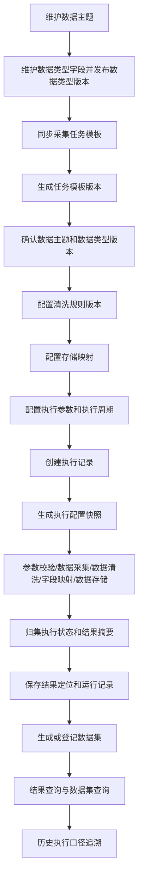

# 个人辅助交易平台一期建设需求规格说明书

## 文档信息

| 项目 | 内容 |
|---|---|
| 项目名称 | 个人辅助交易平台 |
| 文档名称 | 一期建设需求规格说明书 |
| 文档版本 | V1.5-review |
| 文档状态 | 修订稿 |
| 编制日期 | 2026-06-01 |

---

## 修订记录

| 版本 | 日期 | 修订内容 | 修订原因 |
|---|---|---|---|
| V1.0-review | 2026-04-21 | 形成初版评审稿 | 方案评审 |
| V1.1-review | 2026-04-21 | 需求规格说明仅采用业务视角进行表达，不在正文中展开技术分层 | 根据评审意见修订 |
| V1.2-review | 2026-04-22 | 本版在现有需求规格说明基础上，按“**层用于技术设计，子系统—模块—功能用于业务分解**”的原则进行了调整 | 根据评审意见修订 |
| V1.3-review | 2026-04-25 | 细化系统结构 | 根据需求变化 |
| V1.4-review | 2026-04-28 | 根据开发的数据主题管理模块修改已有内容，并调节其他模块的表述 | 改善表述 |
| V1.5-review | 2026-06-01 | 根据概要设计V1.8-review同步修订子系统、模块、功能划分，补充业务对象、业务流程、业务规则、验收口径及边界说明 | 根据概要设计修订 |

---

## 1. 文档说明

### 1.1 编制目的

为支撑个人交易场景下的数据获取与后续应用建设，需规划建设一套覆盖数据采集、数据管理、数据治理、数据应用等全链条能力的个人辅助交易平台。

本文档聚焦该平台一期建设内容，重点描述平台全链条能力中的数据采集域建设需求。一期建设围绕**采集配置管理、采集执行控制、采集查询与追溯**三类业务子系统展开，明确建设背景、业务目标、用户对象、业务场景、功能需求、业务规则、验收标准及实施边界，作为后续产品设计、概要设计、研发实施和测试验收的依据。

本次修订以概要设计中已明确的子系统、模块、功能、核心业务对象和主业务流程为依据，对需求规格说明中的业务分解体系、业务对象定义、功能需求、业务流程说明及相关说明性内容进行统一修订，保证需求文档与概要设计文档在范围、术语、对象和模块边界上保持一致。

### 1.2 文档定位

本文档重点回答以下问题：

1. 为什么要建设个人辅助交易平台；
2. 平台整体能力边界与一期建设范围分别是什么；
3. 一期应优先解决哪些业务问题；
4. 一期采集域在业务上应划分为哪些子系统、模块和功能；
5. 一期核心业务对象、对象关系和主业务流程是什么；
6. 一期建设成果如何验收；
7. 后续治理与应用能力如何衔接。

### 1.3 术语说明

- **平台**：指面向个人辅助交易场景建设的统一业务平台，长期规划覆盖采集、管理、治理、应用等全链条能力。
- **一期**：指本次建设阶段，聚焦平台中的数据采集域能力建设。
- **数据主题**：面向业务管理、目录组织、前端展示和查询筛选的分类体系，用于回答“采集任务在业务上属于哪个目录”。
- **数据类型**：面向采集结果逻辑结构标准化、数据归属和后续治理扩展的分类体系，用于回答“标准化后的业务数据属于什么类型”。
- **数据类型字段**：某一数据类型下用于描述标准化结果字段结构的业务字段定义。
- **数据类型版本**：数据类型字段结构在某一时点形成的版本快照，用于保证采集任务执行和历史追溯口径稳定。
- **采集任务模板**：由采集处理能力发布或同步的一类采集任务定义，包含任务编码、任务名称、任务说明、执行参数、数据源、业务分类和可返回字段等信息。
- **采集任务模板版本**：采集任务模板每次同步后形成的版本快照，用于保存当时的任务定义和返回字段结构。
- **采集任务配置**：在任务模板基础上，经业务确认后形成的可执行配置，包含数据主题、数据类型版本、清洗规则版本、执行参数、启停状态和存储映射等内容。
- **清洗规则**：在采集处理过程中用于筛选、校验、格式标准化、清洗、过滤和异常识别的业务规则定义。
- **规则版本**：清洗规则在某一时点形成的版本快照，用于保证历史执行可回看、可解释。
- **存储映射**：采集任务返回字段、数据类型字段和物理表字段之间的映射关系，用于确定标准化结果的落库口径。
- **任务执行记录**：某一采集任务在某一时间点的一次实际执行记录。
- **执行配置快照**：采集任务正式执行前，对任务模板版本、数据主题、数据类型版本、规则版本、存储映射和执行参数等执行上下文进行固化形成的快照。
- **结果摘要**：采集任务执行完成后形成的处理数量、成功数量、异常数量、结果说明等摘要信息。
- **结果定位信息**：用于定位采集结果实际存储位置或查询索引的信息。
- **数据集**：某一数据类型版本下由采集任务执行成功后生成或登记的数据资产。
- **运行记录**：采集执行过程中产生的状态变化、日志、异常、问题数据、失败原因和运行统计等记录。
- **历史追溯**：指对历史某次采集执行所使用的配置快照、模板版本、数据类型版本、规则版本、存储映射、结果摘要、数据集和异常信息进行回看和关联分析的能力。
- **功能**：指面向用户和业务场景定义的业务能力项，用于描述系统“应支持什么”。
- **模块**：指业务子系统内部按职责划分的组成单元，用于组织相关功能。

### 1.4 目标读者

本文档面向以下人员：

1. 项目发起人及业务评审人员；
2. 产品经理与需求分析人员；
3. 技术架构、开发、测试和运维人员；
4. 后续使用平台的业务使用者、维护者和管理者。

### 1.5 文档使用原则

本文档重点描述**业务需求与业务边界**，不展开数据库表结构、接口协议、调度实现细节、日志采集技术选型等技术方案内容；相关内容应在后续概要设计说明、接口设计说明、数据库设计说明和实施方案中单独定义。

本文档中的“子系统—模块—功能”用于表达业务需求分解，不直接等同于代码工程结构。概要设计、接口设计和数据库设计应在保持业务口径一致的基础上，进一步定义实现职责、接口契约和数据结构。

---

## 2. 项目背景

### 2.1 业务背景

在个人辅助交易场景中，使用者通常需要持续关注市场行情、财务数据、公司基础资料、公告及其他辅助信息，并基于这些信息完成筛选、观察、比较、判断和复盘。随着关注标的增加、数据来源扩展和更新频次提高，原有依赖人工整理、零散脚本和临时任务运行的方式，已难以满足持续、稳定、可回看、可解释的数据支撑要求。

### 2.2 当前存在的主要问题

#### 2.2.1 数据获取效率不足

多类数据来源分散、更新频率不同、采集方式不统一，导致人工整理和维护成本高，难以支撑长期稳定使用。

#### 2.2.2 配置管理分散

任务模板、执行参数、数据主题、数据类型、清洗规则、存储映射和结果查看缺少统一入口，导致维护成本高、复用能力弱、日常使用效率低。

#### 2.2.3 规则口径不统一

数据筛选、校验、清洗、过滤和异常识别规则分散在不同任务中，缺少统一配置、版本留痕和执行时点固化，导致结果难以解释、难以复现。

#### 2.2.4 执行过程不可视

任务执行后的执行状态、执行配置快照、日志信息、失败原因、处理数量、异常数量和问题数据不集中，影响问题定位和运行管理。

#### 2.2.5 历史结果难以追溯

任务历史结果与当时使用的任务模板版本、数据类型版本、规则版本、存储映射、执行参数和数据集之间缺少清晰关联，无法稳定支撑历史回看、问题分析与业务复盘。

### 2.3 建设必要性

为解决上述问题，需要从平台层面建立统一的数据采集能力底座，并优先落地一期采集域建设。通过统一配置管理、统一执行控制、统一结果归集、统一查询入口与统一历史追溯，形成**可配置、可执行、可监控、可查询、可追溯**的数据采集支撑体系，为后续数据治理、分析应用和辅助决策能力建设打好基础。

### 2.4 建设思路

本项目采用“**统一平台规划、分期能力建设**”的总体思路：

- **平台层**：长期建设覆盖采集、管理、治理、应用等全链条能力的个人辅助交易平台；
- **一期层**：优先建设平台中的数据采集域能力，重点完成采集配置、执行控制、结果查询和历史追溯主链路；
- **演进层**：在一期稳定运行基础上，逐步扩展数据质量治理、统一指标服务、分析展示、辅助决策等后续能力。

---

## 3. 建设目标

### 3.1 总体目标

建设个人辅助交易平台一期的数据采集能力，围绕**采集配置管理、采集执行控制、采集查询与追溯**三类业务能力，形成可配置、可执行、可监控、可查询、可追溯的数据采集支撑体系，提升个人辅助交易场景下的数据获取效率和采集过程可控性，并为后续治理和应用能力建设预留扩展空间。

### 3.2 分项目标

#### 3.2.1 提高数据获取与采集效率

通过统一采集入口、任务模板同步、任务配置维护和执行调度机制，降低人工整理、重复配置和零散维护成本。

#### 3.2.2 提高采集结果一致性

通过统一数据主题、数据类型、数据类型版本、清洗规则版本和存储映射配置，保证同类采集任务在同一业务口径下输出结果具备一致性和稳定性。

#### 3.2.3 提高采集过程可监控性

让使用者能够清晰查看任务执行状态、执行时间、处理数量、异常数量、失败原因、日志和问题数据，提高运行管理效率。

#### 3.2.4 提高采集结果可查询性

支持按数据主题、数据类型、任务、执行记录、执行状态、数据集状态、异常类型和时间范围等维度查询采集结果、数据集、异常信息和历史记录，提升日常使用效率。

#### 3.2.5 提高采集过程可追溯性

支持回看历史某次采集执行所使用的任务模板版本、执行参数、数据主题、数据类型版本、规则版本、存储映射、结果摘要、数据集和异常信息，确保问题分析和业务解释有依据。

#### 3.2.6 支持平台后续扩展

在一期核心能力建设完成的基础上，为平台后续拓展治理、分析和应用能力保留结构和机制上的扩展空间。

### 3.3 一期建设成功标志

一期建设成功应至少满足以下标志：

1. 采集任务模板同步、任务配置维护和任务启停具备统一入口；
2. 数据主题、数据类型、数据类型字段和数据类型版本能够支撑任务归属和结果标准化；
3. 清洗规则及规则版本能够被任务配置和执行记录引用；
4. 采集执行状态、配置快照、结果摘要、日志、异常和问题数据能够集中查看；
5. 执行成功后能够生成或登记数据集，并支持来源执行记录查询；
6. 历史执行记录、配置快照、模板版本、数据类型版本、规则版本、结果摘要和数据集已建立清晰关联；
7. 一期能力能够为后续治理与应用阶段提供稳定的数据采集基础。

---

## 4. 适用范围

### 4.1 平台整体适用范围

平台面向个人辅助交易相关的数据全链条业务建设，长期可覆盖以下能力域：

1. 数据采集；
2. 数据管理；
3. 数据治理；
4. 数据服务；
5. 数据应用与辅助分析。

### 4.2 一期适用业务范围

一期建设仅适用于平台中的**数据采集业务场景**，主要覆盖：

1. 市场行情类数据采集；
2. 财务类数据采集；
3. 基础资料类数据采集；
4. 公告及参考信息类数据采集；
5. 其他可在后续逐步扩展的采集主题。

### 4.3 本期建设范围

本期重点建设以下业务能力：

1. 数据主题管理；
2. 数据类型管理、数据类型字段维护和数据类型版本管理；
3. 采集任务模板同步、任务模板版本管理和任务信息查看；
4. 采集任务配置维护，包括数据主题、数据类型版本、清洗规则版本、启停状态和存储映射等配置；
5. 清洗规则管理、规则版本管理和规则查看追溯；
6. 采集任务手动执行和定时执行；
7. 执行记录、执行配置快照、结果摘要、结果定位信息、日志、异常和问题数据管理；
8. 执行成功后的数据集生成或登记；
9. 结果概览查询、数据集查询、日志/异常/问题数据查询；
10. 以执行记录为主线的历史追溯；
11. 基础审计与最小留痕能力。

### 4.4 本期不纳入范围

以下内容不作为一期交付范围，由后续阶段逐步建设或按扩展点预留：

1. 完整的数据治理体系建设；
2. 深度数据质量评分与自动修复机制；
3. 复杂的数据分析建模能力；
4. 策略推演、自动决策与交易执行能力；
5. 多租户与细粒度权限体系；
6. 复杂任务编排中心、高级调度策略与复杂重试编排；
7. 全量结果明细模型的完整建设；
8. 大规模归档治理与冷热分层系统化建设；
9. 面向外部系统的完整数据服务开放体系；
10. 字段级血缘、字段级影响分析和字段级治理闭环。

### 4.5 边界说明

对于清洗规则、结果查询、数据集和历史回看等内容，一期仅建设**与数据采集直接相关的必要支撑能力**，不扩展至完整治理和分析域。对于结果明细尚未完整建模的场景，一期应通过结果定位信息、物理存储位置或索引信息支撑查询和追溯，不将完整明细治理作为一期交付承诺。

---

## 5. 目标用户与职责分工

### 5.1 个人交易研究者/使用者

该类用户主要关注数据是否及时更新、结果是否可查看、异常是否可定位、历史是否可回看，希望通过平台提升交易辅助效率。核心诉求包括：

1. 快速获取所需数据；
2. 快速查看结果摘要、数据集和结果定位信息；
3. 快速定位异常、日志和问题数据；
4. 快速回看历史执行口径和历史结果。

### 5.2 采集任务维护者

该类用户负责维护采集任务配置、数据主题、数据类型、清洗规则和日常运行情况，希望通过统一平台降低维护复杂度，提升任务复用率和问题处理效率。核心职责包括：

1. 同步和核验采集任务模板；
2. 配置和维护采集任务；
3. 维护数据主题、数据类型、数据类型字段、数据类型版本和清洗规则；
4. 配置任务返回字段、数据类型字段与物理表字段之间的存储映射；
5. 查看任务运行情况并定位异常；
6. 维护统一入口组织方式和标准数据归类方式。

### 5.3 平台管理者

该类用户关注平台整体运行质量，包括任务成功率、异常分布、更新时间、采集覆盖情况、数据集登记情况和整体稳定性。核心职责包括：

1. 审核平台运行情况；
2. 监督关键任务可用性；
3. 关注采集链路稳定性与风险；
4. 关注配置变更、版本留痕和追溯完整性；
5. 为后续扩展提供管理依据。

---

## 6. 核心业务场景

### 6.1 日常定时采集场景

用户希望平台能够按预设频率自动获取指定主题的数据，并形成可查看的执行记录、结果摘要和数据集，减少重复手工操作。

### 6.2 临时手动执行场景

用户在盘前、盘中、盘后或复盘过程中，可能临时需要获取最新数据，平台应支持对已启用且配置完整的采集任务进行手动执行。

### 6.3 任务模板同步与配置确认场景

采集处理能力新增或调整任务后，平台应支持同步任务模板信息和返回字段信息，并由维护者完成数据主题、数据类型版本、规则版本和存储映射等配置确认，确保任务具备正式执行条件。

### 6.4 规则筛选与异常识别场景

用户希望平台能够在采集过程中基于已确认的清洗规则版本完成筛选、校验、格式标准化、清洗、过滤或异常识别，帮助快速定位关注对象和异常数据。

### 6.5 异常排查场景

当任务执行失败或采集结果明显异常时，用户希望快速查看执行状态、失败原因、日志信息、异常记录和问题数据，用于定位问题和恢复运行。

### 6.6 历史回看与采集追溯场景

用户希望回看某一历史时点的采集结果，并了解当时所使用的任务模板版本、执行参数、数据主题、数据类型版本、规则版本和存储映射，用于核验、差异分析和过程解释。

### 6.7 分类查询与数据集查询场景

用户希望按数据主题、数据类型、任务类别、执行状态、数据集状态和时间范围快速检索采集任务、执行结果和数据集，提高日常使用效率。

---

## 7. 建设原则

### 7.1 平台与一期边界清晰原则

平台定义应体现全链条能力规划；一期表述应严格限定在数据采集域建设范围内，避免在一期文档中混入完整治理和应用建设目标。

### 7.2 统一入口原则

平台应为采集任务查看、配置、执行、运行信息、结果查询、数据集查询和历史追溯提供统一入口，降低使用成本和切换成本。

### 7.3 面向业务对象原则

一期功能应围绕数据主题、数据类型、数据类型版本、采集任务模板、采集任务配置、清洗规则、执行记录、执行配置快照、结果摘要、数据集、异常记录和历史追溯等业务对象展开，而非以技术组件为组织方式。

### 7.4 过程可解释原则

每次采集执行的结果都应能追溯到对应的任务配置、模板版本、数据类型版本、规则版本、存储映射和执行参数，确保结果具备解释依据。

### 7.5 历史可追溯原则

平台应保证历史执行记录、执行配置快照、结果摘要、数据集、日志、异常和问题数据长期可回看、可核对、可分析，避免因后续配置变更导致历史结果失真。

### 7.6 范围聚焦原则

本期优先建设与采集直接相关的核心能力，不追求一次性覆盖所有治理和分析需求。

### 7.7 渐进演进原则

平台能力建设应采用分阶段演进方式，在一期稳定运行基础上逐步拓展更深层治理与应用能力。

### 7.8 版本留痕原则

任务模板、数据类型、清洗规则和执行配置等关键口径应形成版本或快照，任务执行与历史追溯应引用执行时点的版本或快照，而不依赖当前配置反推历史口径。

---

## 8. 一期业务分解体系

### 8.1 分解原则

一期业务分解统一采用“**子系统—模块—功能**”三级结构：

- **子系统**：用于表达相对完整的业务边界；
- **模块**：用于表达子系统内部职责分工；
- **功能**：用于表达面向用户和业务场景的能力项。

本章中的“子系统—模块—功能”用于需求规格说明中的业务划分；概要设计、接口设计、数据库设计应在保持该业务划分一致的基础上，进一步补充实现职责、数据对象和接口契约等内容。

### 8.2 子系统划分

结合当前一期建设范围，一期划分为以下三个业务子系统：

1. **采集配置管理子系统**：负责采集任务模板、任务配置、数据主题、数据类型、数据类型版本、存储映射和清洗规则等配置基础能力。
2. **采集执行控制子系统**：负责采集任务执行参数、执行触发、执行配置快照、任务执行、执行状态、结果归集和数据集登记等执行闭环能力。
3. **采集查询与追溯子系统**：负责结果、数据集、异常、日志、问题数据、历史执行和执行口径追溯等查询回看能力。

### 8.3 子系统、模块与功能映射

| 模块编号 | 子系统 | 模块 | 功能 |
|---|---|---|---|
| M-01 | 采集配置管理子系统 | 采集任务管理模块 | 任务模板管理、任务信息查看、任务配置维护 |
| M-02 | 采集配置管理子系统 | 数据主题管理模块 | 数据主题分类管理、数据主题目录 |
| M-03 | 采集配置管理子系统 | 数据类型管理模块 | 数据类型分类管理、数据类型目录、数据类型字段与版本维护 |
| M-04 | 采集配置管理子系统 | 清洗规则管理模块 | 规则定义管理、规则版本管理、规则查看追溯 |
| M-05 | 采集执行控制子系统 | 执行调度模块 | 执行参数配置、采集任务创建、配置快照生成 |
| M-06 | 采集执行控制子系统 | 任务执行模块 | 参数校验、数据采集、数据清洗、字段映射、数据存储 |
| M-07 | 采集执行控制子系统 | 状态结果管理模块 | 执行状态管理、执行结果归集、数据集登记管理 |
| M-08 | 采集查询与追溯子系统 | 查询管理模块 | 查询入口与条件筛选、结果与数据集查询、异常与运行信息查询 |
| M-09 | 采集查询与追溯子系统 | 追溯管理模块 | 历史执行查询、执行口径追溯、关联链路回看 |

### 8.4 模块职责说明

#### 8.4.1 M-01 采集任务管理模块

采集任务管理模块负责采集任务模板同步、任务模板删除、任务模板版本管理、任务信息查看、任务配置维护和物理存储映射管理。该模块是采集任务从“可识别任务模板”转为“可执行任务配置”的主要入口。

#### 8.4.2 M-02 数据主题管理模块

数据主题管理模块面向业务管理、目录组织和前端展示，负责维护数据主题分类体系，为采集任务归属、统一入口展示和查询筛选提供基础数据。

#### 8.4.3 M-03 数据类型管理模块

数据类型管理模块面向采集数据的逻辑结构标准化，负责维护数据类型分类体系、数据类型字段和数据类型版本，并以目录树形式组织和展示。

#### 8.4.4 M-04 清洗规则管理模块

清洗规则管理模块面向采集任务的数据清洗、校验和过滤口径管理，负责维护清洗规则定义、规则与数据类型的绑定关系、规则版本和追溯查看能力。

#### 8.4.5 M-05 执行调度模块

执行调度模块负责对已启用采集任务的执行参数与周期进行配置，实现手动执行和定时执行能力，并在任务正式执行前生成执行配置快照。

#### 8.4.6 M-06 任务执行模块

任务执行模块负责根据执行上下文完成参数校验、数据采集、数据清洗、字段映射、数据存储和结果生成，并返回标准化结果、结果摘要和运行记录。

#### 8.4.7 M-07 状态结果管理模块

状态结果管理模块面向采集任务执行后的结果沉淀，负责归集执行状态、结果摘要、结果定位和数据集登记信息，并为结果查询、异常定位和历史追溯提供稳定数据基础。

#### 8.4.8 M-08 查询管理模块

查询管理模块面向采集任务执行后的结果、数据集和运行信息查询，负责统一提供查询入口、条件筛选、结果展示、数据集展示、异常记录、运行日志、问题数据和运行概况等查询能力。

#### 8.4.9 M-09 追溯管理模块

追溯管理模块面向采集任务执行后的历史口径还原，负责以执行记录为主线，关联回看执行配置快照、任务模板版本、数据类型版本、规则版本、存储映射、结果摘要、数据集和异常信息。

### 8.5 模块依赖关系

1. 采集配置管理子系统为采集执行控制子系统提供任务模板版本、任务配置、数据主题、数据类型、数据类型版本、存储映射和规则版本等配置基础；
2. 执行调度模块基于已确认的任务配置创建执行记录，生成执行配置快照，并向任务执行模块下发执行上下文；
3. 任务执行模块根据执行上下文完成参数校验、数据采集、数据清洗、字段映射、数据存储和结果生成，并回传标准化结果、结果摘要、日志、异常和问题数据；
4. 状态结果管理模块负责承接任务执行模块回传的执行结果，维护执行状态、结果摘要、结果定位和数据集登记信息；
5. 查询管理模块面向当前结果和运行信息查询，统一提供结果摘要、结果定位、数据集、异常记录、运行日志、问题数据和运行概况等查询能力；
6. 追溯管理模块面向历史执行口径还原，以执行记录为主线聚合执行配置快照、任务模板版本、数据类型版本、规则版本、存储映射、结果摘要、数据集和异常信息；
7. 查询管理模块与追溯管理模块均基于状态结果管理模块沉淀的执行记录、结果摘要、结果定位、数据集和运行记录关联信息开展读取，不直接维护执行状态和结果资产。

---

## 9. 业务对象定义

### 9.1 数据主题

数据主题是面向业务管理、目录组织、前端展示和查询筛选的分类体系，用于组织采集任务和统一业务入口展示。数据主题应支持树形结构组织，并通过父子关系形成可浏览、可筛选的目录。

数据主题主要包含主题编码、主题名称、父级主题、层级、排序、状态、说明和引用状态等信息。已被任务配置引用的数据主题，应按规则限制删除或影响历史追溯的变更。

### 9.2 数据类型

数据类型是面向采集结果逻辑结构标准化、数据归属和后续治理扩展的分类体系，用于明确标准化后的业务数据属于什么类型。数据类型采用树形结构组织，分类节点用于目录组织，具体节点用于数据结构定义，具体节点原则上应为叶子节点。

数据类型不直接承载原始数据、中间处理结果、运行日志、异常记录、问题数据等运行类数据，也不直接决定最终物理落库结构。采集结果的实际落库口径应通过数据类型版本和存储映射共同确定。

### 9.3 数据类型字段

数据类型字段用于描述某一数据类型下标准化业务结果的逻辑字段结构。字段信息包括字段编码、字段名称、字段类型、是否必填、是否唯一键、说明和排序等属性。

数据类型字段是任务返回字段标准化、清洗规则定义、存储映射配置和结果查询展示的重要依据。

### 9.4 数据类型版本

数据类型版本是在数据类型字段维护基础上形成的字段结构快照，用于保证任务配置、任务执行和历史追溯使用稳定的数据结构口径。

数据类型版本应包含版本号、字段信息快照、版本说明、版本状态、发布时间等信息。任务配置应基于已发布的数据类型版本进行确认，历史执行应引用执行时使用的数据类型版本。

### 9.5 采集任务模板

采集任务模板用于描述平台当前可识别的一类采集任务定义，应包含任务编码、任务名称、任务说明、处理入口、数据源、资产类型、业务分类、执行参数和可返回字段等信息。

采集任务模板主要来源于采集处理能力同步，模板自身不保存后台确认后的配置项，不直接代表可执行任务。

### 9.6 采集任务模板版本

采集任务模板版本用于保存采集任务模板每次同步形成的快照。模板版本应保存任务基础信息、执行参数、返回字段结构、字段哈希、版本号、同步时间和同步状态等内容。

任务正式执行时应能够追溯到所使用的任务模板版本。模板版本形成后不应覆盖修改历史版本内容。

### 9.7 采集任务配置

采集任务配置是在采集任务模板基础上，经业务确认后形成的可执行配置。配置内容包括采集任务、任务模板版本、数据主题、数据类型版本、清洗规则版本、启停状态、执行参数、执行周期和存储映射等信息。

采集任务配置用于确定任务是否具备正式执行条件。未完成必要配置确认、未启用或缺少有效存储映射的任务，不应进入正式执行流程。

### 9.8 存储映射

存储映射用于描述任务返回字段、数据类型字段与物理表字段之间的映射关系，形成“任务返回字段 -> 数据类型字段 -> 物理表字段”的映射链。

存储映射直接影响采集结果的落库结构、结果定位和后续查询。任务正式执行前，应完成存储映射确认，并在执行配置快照中固化当次执行使用的映射口径。

### 9.9 清洗规则

清洗规则用于定义采集处理过程中涉及的筛选、校验、格式标准化、清洗、过滤和异常识别等业务口径。清洗规则应明确规则编码、规则名称、规则说明、规则分类、所属数据类型、作用字段、规则条件、规则表达式、处理方式和状态等信息。

清洗规则可与数据类型、任务配置和执行记录建立关联，用于支撑任务执行、异常识别和历史追溯。

### 9.10 规则版本

规则版本用于保存清洗规则在某一时点的内容快照。规则版本应包含规则内容、所属数据类型、作用范围、版本号、版本说明、版本状态和发布时间等信息。

任务配置和任务执行应引用规则版本而不是仅引用规则当前主档，保证后续能够还原任务执行时的数据清洗口径。

### 9.11 任务执行记录

任务执行记录用于描述某一采集任务的一次具体运行，包含执行记录编号、采集任务配置、触发方式、执行状态、开始时间、结束时间、失败原因、结果摘要关联、配置快照关联等信息。

任务执行记录是结果查询、异常定位和历史追溯的主线对象。

### 9.12 执行配置快照

执行配置快照是在采集任务正式执行前，对任务模板版本、数据主题、数据类型版本、规则版本、存储映射、执行参数、物理库表信息等执行上下文进行固化形成的快照。

执行配置快照用于保证任务执行口径可解释、可复现、可追溯，不受后续配置变更影响。

### 9.13 结果摘要

结果摘要用于描述采集任务执行完成后的结果概况，包括处理数量、成功数量、异常数量、结果说明、摘要生成时间、关联执行记录等信息。

结果摘要用于结果概览、运行概况、历史回看和数据集登记判断。

### 9.14 结果定位信息

结果定位信息用于描述采集结果实际存储位置或查询索引，包括物理表、数据范围、索引条件、结果批次或其他定位信息。

对于一期未完整建模的结果明细，结果定位信息是结果查询和历史回看的重要支撑。

### 9.15 数据集

数据集表示某一数据类型版本下实际沉淀的数据资产，于采集任务执行成功后生成或登记。数据集应包含数据集名称、数据类型版本、来源执行记录、结果摘要、结果定位信息、生成时间和数据集状态等信息。

数据集用于支撑结果查询、资产展示、历史追溯和后续治理扩展。

### 9.16 运行日志

运行日志用于记录任务执行过程中的关键运行信息，包括日志级别、日志内容、发生时间、定位信息和关联执行记录等内容。

运行日志用于运行问题排查、异常定位和历史执行解释。

### 9.17 异常记录

异常记录用于记录任务执行过程中出现的异常情况，包括异常类型、异常摘要、异常详情、处理状态、发生时间和关联执行记录等内容。

异常记录用于失败原因展示、问题排查、运行统计和历史追溯。

### 9.18 问题数据

问题数据用于记录清洗、校验、字段映射或存储过程中识别出的异常样本或问题数据说明，包括问题类型、字段信息、规则信息、样本内容、处理状态和关联执行记录等内容。

问题数据用于数据质量核验、异常解释和后续治理扩展。

### 9.19 对象之间的关系

一期建设中需形成以下清晰关系：

1. 数据主题用于组织采集任务和统一业务入口展示；
2. 数据类型用于组织标准化结果的逻辑结构和数据归属；
3. 数据类型字段组成数据类型版本，数据类型版本用于任务配置和历史追溯；
4. 采集任务模板通过同步形成采集任务模板版本；
5. 采集任务配置应关联采集任务模板版本、数据主题、数据类型版本、规则版本和存储映射；
6. 存储映射连接任务返回字段、数据类型字段和物理表字段；
7. 每次任务执行都会生成任务执行记录和执行配置快照；
8. 任务执行完成后应形成执行状态、结果摘要、结果定位、日志、异常和问题数据等运行记录；
9. 执行成功且满足条件时，应生成或登记数据集；
10. 历史追溯能力应将“任务配置—任务模板版本—数据主题—数据类型版本—规则版本—存储映射—执行记录—结果摘要—数据集—日志/异常/问题数据”进行关联展示。

---

## 10. 功能需求

### 10.1 采集配置管理子系统

采集配置管理子系统用于统一维护数据采集相关的基础配置，包括采集任务模板、采集任务配置、数据主题、数据类型、数据类型版本、存储映射和清洗规则等内容。该子系统为后续采集执行、结果查询和历史追溯提供配置基础。

#### 10.1.1 采集任务管理模块

采集任务管理模块用于管理平台支持的各类采集任务，支撑任务模板同步、任务模板版本管理、任务信息查看、任务配置维护以及任务与数据主题、数据类型版本、清洗规则版本和存储映射之间的关系维护。

##### 10.1.1.1 任务模板管理

平台应支持同步当前可用的采集任务模板信息，包括任务编码、任务名称、任务说明、处理入口、数据源、资产类型、业务分类、执行参数和接口可返回字段等内容。

平台应支持根据同步内容生成或更新采集任务模板主档，并保存采集任务模板版本。模板版本应能够保留返回字段结构和版本信息，不应因后续同步覆盖历史版本。

平台应支持展示任务模板同步状态。对于同步失败、已下线或不再使用的任务模板，应支持按规则删除或停用模板主档，同时保留历史版本信息以支撑历史追溯。

##### 10.1.1.2 任务信息查看

平台应支持以列表形式查看已同步采集任务信息，展示任务编码、任务名称、任务说明、同步状态、当前模板版本、启停状态、配置状态和最近执行情况。

平台应支持查看单个采集任务详情，包括任务说明、数据源、资产类型、业务分类、执行参数、返回字段、模板版本、配置状态和物理存储映射状态等内容。

任务信息查看应区分“模板信息”和“任务配置”，避免将后台确认后的配置内容混入模板定义。

##### 10.1.1.3 任务配置维护

平台应支持在任务模板基础上维护采集任务配置，包括数据主题、数据类型版本、清洗规则版本、执行参数、执行周期、启停状态和存储映射等内容。

平台应支持根据任务模板版本中的返回字段、数据类型字段和物理表字段配置存储映射，形成“任务返回字段 -> 数据类型字段 -> 物理表字段”的映射链。

平台应支持在任务配置中绑定可用清洗规则版本。任务正式执行前，应能够校验任务配置是否完整、规则版本是否可用、存储映射是否确认、任务是否启用。

#### 10.1.2 数据主题管理模块

数据主题管理模块用于按照业务视角维护采集任务的分类体系，支撑统一业务入口、目录展示、任务归属和查询筛选。

##### 10.1.2.1 数据主题分类管理

平台应支持按业务视角建立和维护数据主题分类，包括数据主题新增、修改、删除、启停、查询和排序等操作。

平台应支持维护数据主题父子关系、层级和状态，形成树形结构。数据主题编码应具备唯一性，已被任务配置引用的数据主题应按规则限制删除或影响历史口径的变更。

##### 10.1.2.2 数据主题目录

平台应支持以目录树方式展示数据主题层级结构，支持节点展开、节点筛选和层级浏览。

平台应支持在数据主题目录下查看关联采集任务，帮助用户从业务目录入口查找和管理采集任务。

#### 10.1.3 数据类型管理模块

数据类型管理模块用于维护采集数据的逻辑结构标准化体系，支撑数据类型分类、数据类型目录、数据类型字段和数据类型版本管理。

##### 10.1.3.1 数据类型分类管理

平台应支持维护数据类型编码、名称、说明、状态、节点类型、父级节点和排序等信息。数据类型节点应区分分类节点和具体节点，分类节点用于目录组织，具体节点用于标准结果归属。

平台应支持维护数据类型父子关系和层级结构。具体数据类型节点原则上应为叶子节点，任务配置应绑定到具体数据类型及其已发布版本。

##### 10.1.3.2 数据类型目录

平台应支持以目录树方式展示数据类型层级结构，支持层级浏览、节点展开、节点筛选和任务归属查看。

平台应支持查看某一数据类型节点关联的采集任务和数据集，帮助用户理解标准化结果归属。

##### 10.1.3.3 数据类型字段与版本维护

平台应支持维护数据类型下的逻辑字段信息，包括字段编码、字段名称、字段类型、是否必填、是否唯一键、说明和排序等字段属性。

平台应支持基于数据类型字段发布数据类型版本，保存字段信息快照、版本说明、版本状态和发布时间。已发布版本应供任务配置引用，历史版本应可查看但不应被覆盖修改。

平台应支持在任务模板返回字段与数据类型字段之间进行匹配、核验和确认，为存储映射配置提供依据。

#### 10.1.4 清洗规则管理模块

清洗规则管理模块用于维护采集过程中涉及的数据清洗、校验、过滤和异常识别等业务规则，并通过版本管理支撑规则复用与历史追溯。

##### 10.1.4.1 规则定义管理

平台应支持维护清洗规则基础信息，包括规则编码、规则名称、规则说明、规则分类、所属数据类型、创建来源和规则状态等内容。

平台应支持维护规则内容，包括作用字段、规则条件、规则表达式、规则参数、处理方式和异常判定口径等内容。规则定义应围绕所属数据类型的逻辑字段进行描述。

平台应支持规则启用、停用和草稿状态管理。已被任务配置或历史执行引用的规则，不应直接物理删除其历史口径。

##### 10.1.4.2 规则版本管理

平台应支持对清洗规则生成版本记录，保存规则内容快照、所属数据类型、版本号、版本说明、版本状态和发布时间等信息。

平台应支持将已确认的规则版本标记为可用，并供任务配置和执行配置快照引用。任务正式执行时应记录实际使用的规则版本。

##### 10.1.4.3 规则查看追溯

平台应支持查看规则当前信息、历史版本信息和引用信息，包括规则被任务配置、执行记录或执行配置快照引用的情况。

平台应支持通过规则引用关系辅助判断规则变更影响范围，并支撑异常排查和历史追溯。

### 10.2 采集执行控制子系统

采集执行控制子系统用于统一管理采集任务的执行参数、执行触发、执行配置快照、任务执行、执行状态、执行结果归集和数据集登记，支撑手动执行、定时执行和执行闭环管理。

#### 10.2.1 执行调度模块

执行调度模块用于对已启用采集任务的执行参数与周期进行配置，实现手动执行和定时执行能力，并在任务执行前固化执行上下文。

##### 10.2.1.1 执行参数配置

平台应支持依据采集任务模板版本中的执行参数信息配置任务执行所需参数值，并对参数完整性、格式和范围进行校验。

平台应支持维护定时执行周期，包括执行频率、执行时间和周期表达式等信息。对于时间类参数，应支持常用时间口径配置，如今日、昨日、当前时间等。

##### 10.2.1.2 采集任务创建

平台应支持用户手动创建采集执行请求。手动执行前应校验任务是否启用、配置是否完整、数据类型版本是否已发布、规则版本是否可用、存储映射是否已确认。

平台应支持基于已配置执行周期创建定时任务执行请求。定时触发应与手动触发共用相同的执行前校验和执行记录生成机制。

##### 10.2.1.3 配置快照生成

平台应在采集任务正式执行前生成执行配置快照，固化任务配置、任务模板版本、数据主题、数据类型版本、清洗规则版本、存储映射、执行参数和结果落库口径等信息。

执行配置快照应与任务执行记录建立关联，并作为结果查询、数据集登记和历史追溯的主要依据。

#### 10.2.2 任务执行模块

任务执行模块用于根据执行上下文完成参数校验、数据采集、数据清洗、字段映射、数据存储和结果生成等过程，并按既定字段契约返回标准化结果、结果摘要和运行记录。

##### 10.2.2.1 参数校验

平台应支持对执行上下文中的参数进行校验，包括参数是否完整、格式是否正确、取值范围是否满足执行要求。校验失败时，应返回明确失败原因并关联执行记录。

##### 10.2.2.2 数据采集

平台应支持依据执行上下文中的数据源、采集对象和执行参数完成数据采集。采集失败时，应记录失败原因、异常摘要和必要定位信息。

##### 10.2.2.3 数据清洗

平台应支持依据执行配置快照中的清洗规则版本，对采集到的数据进行筛选、校验、格式标准化、清洗、过滤和异常识别，并记录问题数据和异常信息。

##### 10.2.2.4 字段映射

平台应支持将采集任务返回字段映射为数据类型字段，并进一步映射到物理表字段。字段映射应遵循已确认的存储映射口径。

字段映射失败或存在缺失字段、冲突字段时，应记录异常信息，并根据规则决定任务失败、部分成功或输出问题数据。

##### 10.2.2.5 数据存储

平台应支持将映射后的结果数据按照执行配置快照中的存储映射写入指定存储位置，并记录存储结果、结果定位信息和必要日志。

#### 10.2.3 状态结果管理模块

状态结果管理模块用于归集采集任务执行后的状态、结果摘要、结果定位和数据集登记信息，为结果查询、异常定位和历史追溯提供基础数据。

##### 10.2.3.1 执行状态管理

平台应支持维护任务执行状态，包括 CREATED、PENDING、RUNNING、SUCCESS、FAILED 等状态，并根据执行调度、任务受理结果、任务执行回传结果和异常处理结果更新执行记录状态。

平台应支持归集失败原因、异常摘要和必要定位信息，并以可理解的业务语言展示，不应暴露敏感认证信息或内部实现细节。

平台应支持记录状态变更时间、变更来源、变更说明和关联执行记录，保证任务执行过程可追踪。

##### 10.2.3.2 执行结果归集

平台应支持接收并保存任务执行后形成的结果摘要，包括处理数量、成功数量、异常数量、结果说明和摘要生成时间等信息。

平台应支持保存结果定位信息、物理存储位置或索引信息。对于一期未完整建模的结果明细，应以结果定位信息作为结果查询和历史回看的基础。

平台应支持将执行记录、结果摘要、日志、异常记录和问题数据建立关联，支撑后续查询、异常定位和历史追溯。

##### 10.2.3.3 数据集登记管理

平台应支持判断任务执行是否满足数据集生成或登记条件。只有执行成功且结果定位信息、数据类型版本和实际落库情况满足要求时，才应进入数据集登记流程。

平台应支持登记数据集名称、数据类型版本、来源执行记录、结果摘要、结果定位信息、生成时间和数据集状态等信息。

平台应支持维护数据集与执行记录、数据类型版本、结果摘要、数据主题和结果定位信息之间的关系，用于结果查询、资产展示和历史追溯。

### 10.3 采集查询与追溯子系统

采集查询与追溯子系统用于面向用户提供结果查询、数据集查询、运行信息查看和历史执行口径回看能力，支撑日常使用、异常排查和历史复盘。

#### 10.3.1 查询管理模块

查询管理模块用于统一提供查询入口、条件筛选、结果展示、数据集展示、异常记录、运行日志、问题数据和运行概况等查询能力。

##### 10.3.1.1 查询入口与条件筛选

平台应支持以数据主题、数据类型、采集任务、执行记录和数据集为主要维度提供统一查询入口。

平台应支持按任务、数据主题、数据类型、数据类型版本、执行时间、执行状态、数据集状态、异常类型和处理状态等条件进行筛选。

平台应支持将查询结果按结果摘要、数据集、异常记录、运行日志、问题数据和运行概况等类型进行分区展示，并提供进入详情页面的跳转入口。

##### 10.3.1.2 结果与数据集查询

平台应支持按采集任务、数据主题、数据类型和执行时间查询结果摘要信息，包括处理数量、成功数量、异常数量、结果说明、最近更新时间和执行状态等内容。

平台应支持查询结果明细或结果定位信息。对于一期未完整建模的结果明细，应通过结果定位信息、物理表位置或索引信息进行说明。

平台应支持展示任务执行成功后生成或登记的数据集，包括数据集名称、数据类型版本、来源执行记录、结果摘要、结果定位信息、生成时间和数据集状态等内容。

##### 10.3.1.3 异常与运行信息查询

平台应支持按任务、数据主题、数据类型、执行记录、执行时间、异常类型和处理状态筛选异常记录，并展示异常类型、异常摘要、异常详情和关联执行记录等信息。

平台应支持查询运行日志、问题数据或异常样本。运行日志应展示日志级别、日志内容、发生时间和定位信息；问题数据应展示异常说明、字段信息、校验规则和必要样本内容。

平台应支持按任务聚合最近执行时间、最近执行状态、成功失败次数、异常数量和日志概况等运行概况信息，并支持从运行概况进入异常记录、日志和问题数据详情。

#### 10.3.2 追溯管理模块

追溯管理模块用于以执行记录为主线，关联回看执行配置快照、任务模板版本、数据类型版本、规则版本、存储映射、结果摘要、数据集和异常信息。

##### 10.3.2.1 历史执行查询

平台应支持按任务、数据主题、数据类型、执行状态、触发方式和执行时间查询历史执行记录，并支持从任务详情、结果查询和异常记录进入历史执行列表。

平台应支持展示历史执行时间、执行状态、触发方式、处理数量、异常数量、失败原因摘要和结果摘要等信息。

平台应支持从历史执行记录进入执行口径追溯、结果资产回看、异常信息回看和关联链路展示等页面。

##### 10.3.2.2 执行口径追溯

平台应支持读取某次执行对应的执行配置快照，并以快照内容作为历史追溯的主要依据，不受当前任务配置变化影响。

平台应支持展示执行时的任务模板版本、执行参数、数据主题、数据类型版本、存储映射和结果落库信息，用于还原当时执行和入库口径。

平台应支持展示执行时实际使用的规则版本、规则内容、适用范围和版本说明。规则追溯应基于执行记录或执行配置快照中的规则版本关联，不依赖当前规则状态。

##### 10.3.2.3 关联链路回看

平台应支持根据执行记录回看历史结果摘要、结果定位信息、数据集和必要明细，用于核验历史结果和进行差异比对。

平台应支持回看本次执行关联的异常记录、运行日志和问题数据，用于解释历史执行失败或结果异常原因。

平台应支持以执行记录为主线聚合任务配置、任务模板版本、数据主题、数据类型版本、规则版本、存储映射、结果摘要、数据集、日志和异常信息，保证历史结果具备完整解释依据。

---

## 11. 业务流程说明

### 11.1 一期核心流程

一期核心流程围绕“配置准备—执行触发—执行处理—结果归集—查询追溯”展开：

1. 数据主题管理模块维护数据主题分类和目录；
2. 数据类型管理模块维护数据类型、数据类型字段并发布数据类型版本；
3. 采集任务管理模块同步采集任务模板信息，模板信息需包含唯一任务编码、执行参数和接口可返回字段；
4. 采集任务管理模块生成或更新采集任务模板主档，并形成采集任务模板版本；
5. 采集任务管理模块根据采集任务说明选择数据主题；
6. 采集任务管理模块根据任务模板版本中的返回字段选择或确认数据类型版本；
7. 采集任务管理模块根据数据类型字段、任务返回字段和物理表字段配置存储映射；
8. 清洗规则管理模块基于数据类型维护可选清洗规则和规则版本，并供采集任务配置绑定；
9. 执行调度模块配置执行参数和执行周期，生成手动执行任务或定时执行任务；
10. 执行调度模块在正式执行前校验任务配置完整性，并固化任务模板版本、数据主题、数据类型版本、存储映射和清洗规则版本等信息；
11. 执行调度模块创建执行记录，并生成执行配置快照；
12. 任务执行模块根据执行上下文完成参数校验、数据采集、数据清洗、字段映射、数据存储和异常识别；
13. 任务执行模块回传标准化结果、结果摘要、日志、异常和问题数据；
14. 状态结果管理模块归集执行状态、结果摘要、结果定位和运行记录关联信息；
15. 任务执行成功后，状态结果管理模块生成或登记数据集；
16. 用户通过查询管理模块查询结果、数据集、异常、日志和问题数据；
17. 用户通过追溯管理模块回看历史执行口径和关联链路。

### 11.2 标准业务流程

标准业务流程适用于配置完整、任务启用、规则版本可用、存储映射已确认的采集任务。

### 11.3 任务模板同步与配置确认流程

任务模板同步与配置确认流程用于保证任务从后台采集能力发布后，能够经过业务确认后进入正式执行。

1. 采集任务管理模块同步任务模板信息和返回字段信息；
2. 平台根据任务编码识别任务模板主档；
3. 平台根据返回字段结构变化生成或复用任务模板版本；
4. 维护者根据返回字段与已有数据类型版本进行匹配；
5. 匹配成功时形成数据类型版本和存储映射候选；
6. 部分匹配时记录缺失字段、新增字段或冲突字段，并由维护者确认处理方式；
7. 未匹配时可形成数据类型字段和存储映射草稿，并由维护者确认是否维护为正式数据类型版本；
8. 维护者确认数据主题、数据类型版本、规则版本和存储映射；
9. 平台形成可执行的采集任务配置。

### 11.4 采集执行流程

采集执行流程适用于手动执行和定时执行：

1. 用户发起手动执行，或系统根据执行周期触发定时执行；
2. 执行调度模块校验任务启停状态、参数完整性、数据类型版本、规则版本和存储映射状态；
3. 校验通过后，执行调度模块创建任务执行记录；
4. 执行调度模块生成执行配置快照；
5. 任务执行模块接收执行上下文并返回受理状态；
6. 任务执行模块完成参数校验、数据采集、数据清洗、字段映射和数据存储；
7. 任务执行模块回传标准化结果、结果摘要、日志、异常和问题数据；
8. 状态结果管理模块更新执行状态，保存结果摘要、结果定位和运行记录；
9. 执行成功且满足条件时，状态结果管理模块生成或登记数据集；
10. 执行失败时，状态结果管理模块记录失败原因、异常摘要和必要定位信息。

### 11.5 查询与追溯流程

查询与追溯流程用于支撑日常结果查看、异常排查和历史回看：

1. 用户通过统一查询入口选择数据主题、数据类型、采集任务、执行记录或数据集；
2. 查询管理模块按查询条件检索结果摘要、数据集、结果定位、异常记录、运行日志和问题数据；
3. 用户可从结果摘要进入数据集详情、异常详情或运行日志详情；
4. 用户可从任务详情、结果查询或异常记录进入历史执行列表；
5. 追溯管理模块以执行记录为主线读取执行配置快照；
6. 追溯管理模块展示任务模板版本、执行参数、数据主题、数据类型版本、规则版本、存储映射和结果落库信息；
7. 追溯管理模块关联展示结果摘要、数据集、日志、异常和问题数据；
8. 用户基于追溯结果完成历史核验、差异分析和异常解释。

### 11.6 异常处理流程

异常处理流程用于任务执行失败、部分成功、结果异常或配置不完整等场景：

1. 执行前校验发现任务未启用、配置不完整、规则版本不可用或存储映射未确认时，应阻断执行并返回明确提示；
2. 参数校验失败时，应记录校验失败原因，并将执行记录更新为失败或终止状态；
3. 数据采集失败时，应记录数据源、采集对象、失败摘要和必要定位信息；
4. 数据清洗、字段映射或数据存储过程中发现异常时，应记录异常记录和问题数据；
5. 状态结果管理模块应归集失败原因、异常摘要、日志和问题数据，并与执行记录关联；
6. 查询管理模块应支持用户查看异常详情、运行日志和问题数据；
7. 追溯管理模块应支持用户回看异常发生时的执行配置快照、规则版本、存储映射和结果摘要。

---

## 12. 业务规则

### 12.1 配置完整性规则

采集任务正式执行前，应完成任务模板版本、数据主题、数据类型版本、清洗规则版本、执行参数和存储映射等必要配置确认。配置不完整、任务未启用或关键版本不可用时，不应进入正式执行流程。

### 12.2 版本与快照规则

采集任务模板版本、数据类型版本、规则版本和执行配置快照应作为历史执行口径的主要依据。任务执行后，历史执行记录不应依赖当前配置反推当时口径。

### 12.3 数据主题规则

数据主题用于业务目录组织、任务归属和查询筛选。已被任务配置引用的数据主题，不应在未处理引用关系的情况下删除或进行影响历史解释的变更。

### 12.4 数据类型规则

数据类型用于标准化结果归属和逻辑结构管理。数据类型分类节点用于目录组织，具体节点用于数据结构定义和结果归属，具体节点原则上应为叶子节点。任务配置应绑定已发布的数据类型版本。

### 12.5 存储映射规则

存储映射应明确任务返回字段、数据类型字段和物理表字段之间的关系。任务正式执行时，应使用执行配置快照中固化的存储映射，不应受后续映射变更影响。

### 12.6 清洗规则追溯规则

任务配置和任务执行应引用清洗规则版本。历史追溯应展示执行时实际使用的规则版本、规则内容和适用范围，不应仅展示规则当前状态。

### 12.7 执行状态规则

任务执行状态应能够覆盖创建、等待、运行、成功、失败等主要状态。状态变更应记录时间、来源、说明和关联执行记录。

### 12.8 结果与数据集规则

任务执行完成后应形成结果摘要和结果定位信息。执行成功且结果定位信息、数据类型版本和实际落库情况满足要求时，应生成或登记数据集。数据集应关联来源执行记录和数据类型版本。

### 12.9 异常留痕规则

任务执行过程中的失败原因、异常记录、日志和问题数据应与执行记录建立关联。异常信息展示应使用可理解的业务语言，不应暴露敏感认证信息或内部实现细节。

### 12.10 查询与追溯规则

查询管理模块应面向当前结果、数据集和运行信息提供查询能力。追溯管理模块应以执行记录为主线进行历史口径还原，关联展示配置快照、版本信息、结果摘要、数据集和异常信息。

---

## 13. 非功能性要求

### 13.1 易用性要求

平台应提供统一的任务查看、配置、执行、查询和追溯入口，降低用户在多个页面之间切换的成本。数据主题、数据类型、任务配置和查询结果应尽量采用目录树、列表和详情组合方式展示。

### 13.2 一致性要求

需求规格说明、概要设计、接口设计和数据库设计中的子系统、模块、功能、业务对象和术语应保持一致。任务配置、执行记录、结果摘要、数据集和追溯结果之间的关联关系应保持一致。

### 13.3 可追溯性要求

系统应保证历史执行记录、执行配置快照、任务模板版本、数据类型版本、规则版本、存储映射、结果摘要、数据集、日志、异常和问题数据可关联查询。

### 13.4 可维护性要求

数据主题、数据类型、清洗规则、任务模板、任务配置和存储映射应支持持续维护。关键配置变更应保留必要留痕，避免影响历史执行解释。

### 13.5 安全与审计要求

系统应具备基础审计和最小留痕能力。对于执行失败原因、日志、异常和问题数据中的敏感信息，应进行必要脱敏或避免展示内部实现细节。

---

## 14. 验收标准

### 14.1 采集配置管理子系统验收标准

1. 支持采集任务模板同步、模板版本保存、任务信息查看和任务配置维护；
2. 支持数据主题新增、修改、删除、查询、排序、目录展示和任务归属查看；
3. 支持数据类型分类管理、目录展示、字段维护和版本发布；
4. 支持清洗规则定义、规则版本管理和规则引用查看；
5. 支持配置任务的数据主题、数据类型版本、规则版本和存储映射；
6. 已被引用的关键对象能够按规则限制删除或保留历史追溯依据。

### 14.2 采集执行控制子系统验收标准

1. 支持配置执行参数和执行周期；
2. 支持手动执行和定时执行；
3. 执行前能够校验任务启停状态、配置完整性、数据类型版本、规则版本和存储映射状态；
4. 执行时能够生成任务执行记录和执行配置快照；
5. 能够归集执行状态、失败原因、结果摘要、结果定位、日志、异常和问题数据；
6. 执行成功且满足条件时，能够生成或登记数据集。

### 14.3 采集查询与追溯子系统验收标准

1. 支持按数据主题、数据类型、采集任务、执行记录、执行状态、数据集状态、异常类型和时间范围进行条件筛选；
2. 支持查询结果摘要、结果定位信息和数据集；
3. 支持查询异常记录、运行日志、问题数据和运行概况；
4. 支持查询历史执行记录；
5. 支持基于执行记录回看执行配置快照、任务模板版本、数据类型版本、规则版本、存储映射、结果摘要、数据集和异常信息；
6. 历史追溯结果不受当前任务配置、规则内容或数据类型字段变更影响。

### 14.4 端到端主链路验收标准

1. 能够完成从任务模板同步、数据类型确认、规则配置、存储映射配置到任务执行的完整链路；
2. 能够在任务执行成功后形成执行记录、执行配置快照、结果摘要、结果定位和数据集；
3. 能够通过查询入口查看结果、数据集、异常、日志和问题数据；
4. 能够通过追溯入口还原历史执行口径和关联链路；
5. 文档中的子系统、模块、功能、对象和流程与概要设计保持一致。

### 14.5 评审通过建议标准

评审通过建议至少满足以下条件：

1. 一期范围与非范围表达清晰；
2. 第8章子系统、模块、功能划分与概要设计一致；
3. 第9章业务对象定义与概要设计核心对象一致；
4. 第10章功能需求能够覆盖概要设计中各模块功能；
5. 第11章业务流程能够覆盖配置、执行、结果归集、查询和追溯主链路；
6. 业务规则、验收标准和后续规划能够支撑开发、测试和验收使用。

---

## 15. 实施边界、风险与后续规划

### 15.1 本文档边界

本文档仅描述一期数据采集域的业务需求、业务对象、业务规则、功能划分和验收口径，不展开接口字段、数据库表结构、调度实现、部署拓扑和代码工程结构。

### 15.2 技术文档边界

概要设计说明应承接本文档中的业务子系统、模块、业务对象和业务流程，进一步说明总体架构、系统边界、设计约束和实现职责。接口设计说明应定义接口契约、调用关系和错误码。数据库设计说明应定义数据表结构、字段、索引、状态和关联关系。

### 15.3 一期主要风险

1. 任务模板返回字段结构变化可能影响数据类型字段匹配和存储映射；
2. 清洗规则内容和版本管理复杂度可能超出一期实现范围；
3. 数据集定位和结果明细模型边界不清可能影响查询体验；
4. 定时执行、异步执行和状态回传链路存在联调风险；
5. 历史追溯依赖执行配置快照、版本关系和结果关联完整性，任何关键链路缺失都会影响追溯效果；
6. 外部数据源稳定性和可调用性可能影响采集执行成功率。

### 15.4 风险控制建议

1. 任务模板同步后，应优先完成返回字段解析、字段匹配和存储映射确认；
2. 清洗规则一期应优先保证规则定义、规则版本和执行引用关系可留痕；
3. 对结果明细尚未完整建模的场景，应明确以结果定位信息支撑一期查询和追溯；
4. 执行记录、执行配置快照、结果摘要、数据集、日志和异常应建立稳定关联；
5. 手动执行链路和定时执行链路应共用执行前校验和结果归集口径；
6. 对外部数据源异常应提供清晰失败原因和必要定位信息。

### 15.5 后续迭代方向

后续阶段可在一期基础上逐步扩展以下能力：

1. 完整结果明细模型和字段级查询能力；
2. 更细粒度的数据类型层级、字段标准和字段级治理能力；
3. 数据类型与扩展存储表的多表关系模型；
4. 高级监控、告警、重试和调度策略；
5. 数据归档、历史治理和冷热分层能力；
6. 权限细化、多角色审批和配置变更审计；
7. 数据质量评分、规则编排和治理闭环；
8. 分析应用、指标服务和辅助决策能力。

---

## 16. 结论

本项目的目标是建设一套面向个人辅助交易场景的统一平台，其中平台整体按全链条能力进行规划，覆盖数据采集、管理、治理和应用等能力域；本期建设则聚焦其中的数据采集域能力，重点支撑**采集配置管理、采集执行控制、采集查询与追溯**三类业务子系统。

一期建设应围绕“**统一配置、统一执行、统一结果归集、统一查询、统一追溯**”五项核心业务能力展开，并在分类体系上同时建立“数据主题”和“数据类型”两类口径：前者用于业务目录、任务归属和前端展示，后者用于标准业务数据归类、字段结构管理、结果归属和后续治理扩展。

本修订版本已根据概要设计V1.8-review完成子系统、模块、功能、业务对象、业务流程、业务规则和验收口径的同步调整，可作为后续概要设计核对、接口设计、数据库设计、研发实施和测试验收的正式输入材料。
