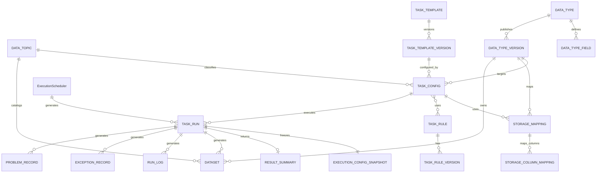

# 个人辅助交易平台一期数据库设计说明（执行与追溯表结构精简版）

## 文档信息

| 项目 | 内容 |
|---|---|
| 项目名称 | 个人辅助交易平台 |
| 文档名称 | 一期数据库设计说明 |
| 文档版本 | V1.7-review |
| 文档状态 | 精简修订稿 |
| 编制日期 | 2026-06-01 |

## 修订记录

| 版本 | 日期 | 修订内容 | 修订原因 |
|---|---|---|---|
| V1.0-review | 2026-04-21 | 形成初版评审稿 | 方案评审 |
| V1.1-review | 2026-04-22 | 统一命名口径、补全表设计深度、增加追溯关联、归档审计与跨文档引用 | 根据评审意见修订 |
| V1.2-review | 2026-04-22 | 按新版概要设计重构分类体系，补充数据主题、数据类型、主标准业务表相关表设计，并同步更新实体关系、字段口径、索引与跨文档映射 | 根据概要设计修订 |
| V1.3-review | 2026-04-25 | 按新版概要设计修订数据主题、数据类型分类体系，并修订采集任务与数据主题、数据类型、主标准业务表的绑定关系 | 根据概要设计修订 |
| V1.4-review | 2026-04-29 | 以概要设计第5章 M-01、M-02、M-03 为准，移除主标准业务表表设计，补充数据类型字段、数据类型版本、数据集、存储映射、候选输出字段及任务数据集绑定关系 | 根据第5章模块调整同步修订 |
| V1.5-review | 2026-05-12 | 根据概要设计新的修改进行同步修订，包括任务模板、模板版本、任务配置、存储映射等内容 | 根据概要设计 M-01 新版模块功能修订 |
| V1.6-review | 2026-05-25 | 根据采集任务管理模块的开发内容进行修订 | 根据实际开发修订 |
| V1.7-review | 2026-06-01 | 根据采集执行控制子系统、采集查询与追溯子系统的开发内容进行修订 | 根据实际开发修订 |

---

## 修订摘要

本版本在保留采集配置管理子系统表结构的基础上，重点调整采集执行控制子系统和采集查询与追溯子系统表结构：

1. `task_run` 删除 `snapshot_id`、`dataset_code`、`run_info`、`updated_by` 等冗余或派生字段，新增 `task_config_code`、`task_code` 和 `fail_reason`，用于执行列表与失败原因展示；
2. `execution_config_snapshot` 将多份快照 JSON 合并为 `snapshot_json`，仅保留常用追溯筛选字段；
3. `result_summary` 删除任务、主题、数据类型、数据集、存储映射等重复上下文字段，只保留统计与定位信息；
4. `dataset` 删除 `storage_mapping_code` 和审计冗余字段，保留结果查询必要维度；
5. `run_log`、`exception_record`、`problem_record` 删除可由 `run_id` 追溯获得的任务编码、数据类型编码、数据集编码等字段；
6. 同步调整唯一键、逻辑约束、索引、一致性和验收口径，保证设计文档前后一致。

---

## 1. 文档说明

### 1.1 编写目的

本文档基于《个人辅助交易平台一期概要设计说明》明确一期数据库设计方案，作为数据库建模、表结构落地、后端开发、接口联调、测试验证和历史追溯实现依据。

### 1.2 设计范围

一期数据库设计覆盖以下内容：

1. 采集配置管理相关数据模型；
2. 采集执行控制相关数据模型；
3. 采集查询与追溯相关数据模型；
4. 关键字段、约束、索引、审计与数据保留口径；
5. 任务模板同步、任务模板版本、任务配置、存储映射、执行配置快照和执行后数据集资产的表结构设计。

---

## 2. 数据库设计目标

1. 直接支撑采集配置管理子系统、采集执行控制子系统、采集查询与追溯子系统；
2. 支撑“任务模板同步—模板版本生成—返回字段 JSON 解析—数据类型版本匹配—任务配置—存储映射确认—执行创建—执行配置快照—结果归集—数据集生成或登记—查询追溯”主链路；
3. 支撑数据主题、数据类型、数据类型字段、数据类型版本、采集任务模板、任务模板版本、任务配置、存储映射、规则版本、执行配置快照、执行记录、结果摘要和数据集之间的历史关联；
4. 保持业务管理类表、结果类表、运行记录类表边界清晰；
5. 形成最小可追溯、可审计、可维护的数据模型；
6. 保证任务处理层同步信息与后台确认配置分离保存；
7. 保证数据集作为任务执行成功后的结果资产进行生成、查询和追溯。

---

## 3. 数据架构设计

### 3.1 数据分类

#### 3.1.1 业务管理类表

主要承载：

- 数据主题管理；
- 数据类型管理；
- 数据类型字段管理；
- 数据类型版本管理；
- 采集任务模板管理；
- 采集任务模板版本管理；
- 采集任务配置管理；
- 采集任务物理存储映射管理；
- 采集规则与规则版本管理。

#### 3.1.2 结果类表

主要承载：

- 结果摘要；
- 结果定位信息；
- 执行成功后生成或登记的数据集资产；
- 标准化结果归属的数据类型版本信息。

#### 3.1.3 运行记录类表

主要承载：

- 执行记录；
- 调度记录；
- 执行配置快照；
- 执行日志；
- 异常记录；
- 问题数据；
- 运行统计留痕。

### 3.2 数据边界原则

1. 业务管理类表与结果类表分离；
2. 结果类表与运行记录类表分离；
3. 数据主题与数据类型分离建模，不混用职责；
4. 采集任务模板与采集任务配置分离建模，Python 同步信息与后台确认配置分离保存；
5. 任务模板版本保存 Python 任务处理层某次同步形成的模板快照；
6. 任务模板版本中的接口可返回字段以结构化 JSON 保存，不单独设计候选输出字段明细表；
7. 数据类型字段、数据类型版本和存储映射独立保存，以支撑标准结果归属、字段契约和物理落库解耦；
8. 数据集作为执行成功后的结果资产在执行链路中生成或登记，不作为采集任务配置阶段的前置配置对象；
9. 执行配置快照独立保存，不依赖当前任务配置重建历史；
10. 规则版本独立保存，不依赖当前规则反推历史；
11. 查询与追溯以执行记录为主线组织；
12. 一期结果明细以“结果定位信息/索引信息”为主，不强制建设完整明细表；
13. 物理表结构不由任务处理层直接决定，正式落库目标由任务模板版本、数据类型版本和存储映射共同确定。

### 3.3 本次精简修订原则

本次修订以采集配置管理子系统已经确认的任务配置、模板版本、数据主题、数据类型版本、规则版本和存储映射为基础，对执行控制与查询追溯相关表进行精简：

1. 执行记录只保存执行主状态和触发信息，不重复保存数据集、结果摘要等派生对象编码；
2. 执行配置快照统一使用 `snapshot_json` 保存执行时完整配置，常用查询维度单独保留；
3. 结果摘要只保存统计和结果定位，不重复保存任务、主题、数据类型和存储映射字段；
4. 数据集保留查询高频维度，不保存可由执行快照追溯获得的存储映射字段；
5. 日志、异常、问题数据统一以 `run_id` 关联执行记录，不重复保存任务编码和数据类型编码；
6. 查询与追溯以 `run_id` 为主线，通过执行记录、执行配置快照、结果摘要、数据集和运行留痕完成关联。

---

## 4. 实体关系设计

### 4.1 核心关系说明

1. 一个数据主题可对应多个采集任务配置；
2. 一个数据类型可包含多个数据类型字段；
3. 一个数据类型可发布多个数据类型版本；
4. 一个采集任务模板可对应多个任务模板版本；
5. 一个采集任务配置应绑定一个明确的采集任务模板；
6. 一个采集任务配置应绑定明确的数据主题和数据类型版本；
7. 一个采集任务配置只可关联一个存储映射；
8. 一个存储映射可包含多条字段映射；
9. 一个采集任务配置可绑定多个规则；
10. 一个规则可对应多个规则版本；
11. 一个采集任务配置可创建多次执行记录；
12. 一次执行记录通过 `run_id` 绑定一份执行配置快照；
13. 一次执行记录可对应一份结果摘要；
14. 一个调度记录生成生成多个执行记录；
15. 一次成功执行可生成或登记一个或多个数据集；
16. 一次执行记录可关联多条日志、异常和问题数据记录；
17. 任务处理层同步的返回字段 JSON 用于生成或更新任务模板版本及存储映射草稿，不直接决定正式落库结构。

### 4.2 实体关系图

### 4.3 历史追溯关键关联主线

| 主线对象 | 关键字段 | 说明 |
|---|---|---|
| 执行记录 | run_id | 历史追溯主键 |
| 执行配置快照 | run_id / snapshot_id | 对应一次执行时冻结配置 |
| 任务模板 | task_code | 对应执行所属采集任务 |
| 任务模板版本 | task_template_version_id / version_no | 对应执行时 Python 同步模板快照 |
| 任务配置 | task_config_code / task_code | 对应执行时生效配置 |
| 数据主题 | data_topic_code | 对应执行时业务目录 |
| 数据类型版本 | data_type_code / data_type_version_no | 对应执行时字段契约 |
| 存储映射 | storage_mapping_code | 对应执行时物理落库映射 |
| 规则版本 | rule_code / version_no | 对应执行时使用的规则版本 |
| 结果摘要 | run_id / summary_id | 对应执行结果主摘要 |
| 数据集 | dataset_code / run_id | 对应执行成功后的结果资产 |
| 日志/异常/问题数据 | run_id | 对应执行过程留痕 |

---

## 5. 表设计总览

| 表编号 | 表名 | 中文名 | 用途 | 所属业务子系统 |
|---|---|---|---|---|
| T-01 | data_topic | 数据主题表 | 保存数据主题分类 | 采集配置管理 |
| T-02 | data_type | 数据类型表 | 保存数据类型定义 | 采集配置管理 |
| T-03 | data_type_field | 数据类型字段表 | 保存数据类型逻辑字段 | 采集配置管理 |
| T-04 | data_type_version | 数据类型版本表 | 保存数据类型版本和字段结构快照 | 采集配置管理 |
| T-05 | task_template | 采集任务模板表 | 保存 Python 上报任务的主档信息 | 采集配置管理 |
| T-06 | task_template_version | 采集任务模板版本表 | 保存每次 Python 同步形成的任务模板版本快照 | 采集配置管理 |
| T-07 | task_config | 采集任务配置表 | 保存后台确认后的当前任务配置 | 采集配置管理 |
| T-08 | storage_mapping | 存储映射表 | 保存任务配置、模板版本、数据类型版本与物理表之间的映射主信息 | 采集配置管理 |
| T-09 | storage_column_mapping | 存储字段映射表 | 保存来源字段、数据类型字段与物理列之间的字段级映射 | 采集配置管理 |
| T-10 | task_rule | 采集规则表 | 保存规则主信息 | 采集配置管理 |
| T-11 | task_rule_version | 规则版本表 | 保存规则版本快照 | 采集配置管理 / 采集查询与追溯 |
| T-12 | task_run | 执行记录表 | 保存执行记录主信息 | 采集执行控制 |
| T-13 | execution_config_snapshot | 执行配置快照表 | 保存执行时关键配置快照 | 采集执行控制 / 采集查询与追溯 |
| T-14 | execution_scheduler | 执行调度表 | 保存定时执行任务的调度信息 | 采集执行控制 |
| T-15 | result_summary | 结果摘要表 | 保存执行结果摘要和定位信息 | 采集执行控制 / 采集查询与追溯 |
| T-16 | dataset | 数据集表 | 保存执行成功后生成或登记的数据集资产 | 采集执行控制 / 采集查询与追溯 |
| T-17 | run_log | 运行日志表 | 保存执行日志 | 采集查询与追溯 |
| T-18 | exception_record | 异常记录表 | 保存异常信息 | 采集查询与追溯 |
| T-19 | problem_record | 问题数据表 | 保存问题数据 | 采集查询与追溯 |

---

## 6. 命名规范与统一口径

### 6.1 表名规范

1. 表名统一采用小写英文和下划线；
2. 业务对象表采用对象英文名；
3. 快照类表以 `_snapshot` 结尾；
4. 版本类表以 `_version` 结尾；
5. 映射类表以 `_mapping` 结尾。

### 6.2 时间字段命名

- 创建时间统一使用 `created_at`；
- 更新时间统一使用 `updated_at`；
- 业务开始/结束时间使用 `start_time`、`end_time`；
- 同步时间使用 `sync_time` 或 `latest_sync_time`；
- 发布时间使用 `publish_time`。

### 6.3 审计字段规范

核心业务表包含：

- `created_at`
- `updated_at`
- `created_by`
- `updated_by`

执行快照、日志类、版本快照类表可按不可变记录口径保留 `created_at`、`created_by`。

### 6.4 状态字段规范

- 通用启停状态统一使用 `status`；
- 执行状态统一使用 `run_status`；
- 触发方式统一使用 `trigger_type`；
- 发布状态统一使用 `publish_status`；
- 配置状态统一使用 `config_status`；
- 映射状态统一使用 `mapping_status`；
- 数据集状态统一使用 `dataset_status`。

---

## 7. 表结构详细设计

### 7.1 T-01 data_topic

| 字段名 | 类型 | 说明 |
|---|---|---|
| id | bigint | 主键 |
| data_topic_code | varchar(32) | 数据主题编码，唯一 |
| data_topic_name | varchar(32) | 数据主题名称 |
| data_topic_label | varchar(32) | 数据主题标签 |
| parent_code | varchar(32) | 父级数据主题编码 |
| description | varchar(255) | 业务说明 |
| node_level | int | 节点层级 |
| is_leaf | tinyint | 是否为叶子节点 |
| sort_no | int | 排序号 |
| status | varchar(32) | 状态，ENABLED/DISABLED |
| created_at | datetime | 创建时间 |
| updated_at | datetime | 更新时间 |
| created_by | varchar(64) | 创建人 |
| updated_by | varchar(64) | 更新人 |

### 7.2 T-02 data_type

| 字段名 | 类型 | 说明 |
|---|---|---|
| id | bigint | 主键 |
| data_type_code | varchar(32) | 数据类型编码，唯一 |
| data_type_name | varchar(32) | 数据类型名称 |
| data_type_label | varchar(32) | 数据类型标签 |
| parent_code | varchar(32) | 父类型编码 |
| node_type | tinyint(1) | 节点类型，CATEGORY:0/CONCRETE:1/OFFLINE:2 |
| sort_no | int | 排序号 |
| node_level | int | 节点层级 |
| is_leaf | tinyint | 是否为叶子节点 |
| status | tinyint(1) | 状态，ENABLED:1/DISABLED:0, |
| version | int | 当前发布版本号 |
| description | varchar(255) | 数据类型说明 |
| created_at | datetime | 创建时间 |
| updated_at | datetime | 更新时间 |
| created_by | varchar(64) | 创建人 |
| updated_by | varchar(64) | 更新人 |

### 7.3 T-03 data_type_field

| 字段名 | 类型 | 说明 |
|---|---|---|
| id | bigint | 主键 |
| data_type_code | varchar(32) | 数据类型编码 |
| field_code | varchar(32) | 字段编码 |
| field_name | varchar(128) | 字段名称 |
| field_type | varchar(32) | 逻辑字段类型 |
| default_value | varchar(255) | 字段默认值 |
| required | tinyint | 是否必填 |
| unique_key | tinyint | 是否业务唯一键 |
| sort_no | int | 排序号 |
| description | varchar(500) | 字段说明 |
| created_at | datetime | 创建时间 |
| updated_at | datetime | 更新时间 |
| created_by | varchar(64) | 创建人 |
| updated_by | varchar(64) | 更新人 |

### 7.4 T-04 data_type_version

| 字段名 | 类型 | 说明 |
|---|---|---|
| id | bigint | 主键 |
| data_type_code | varchar(32) | 数据类型编码 |
| version | int | 数据类型版本号 |
| version_name | varchar(64) | 版本名称 |
| field_schema_content | longtext | 字段结构JSON字符串 |
| publish_status | tinyint(1) | 发布状态，DRAFT:0/PUBLISHED:1/OFFLINE:2 |
| publish_time | datetime | 发布时间 |
| change_summary | varchar(500) | 变更说明 |
| created_at | datetime | 创建时间 |
| updated_at | datetime | 更新时间 |
| created_by | varchar(64) | 创建人 |
| updated_by | varchar(64) | 更新人 |

### 7.5 T-05 task_template

| 字段名 | 类型 | 说明 |
|---|---|---|
| id | bigint | 主键 |
| task_code | varchar(64) | 任务编码，唯一 |
| task_name | varchar(128) | 任务名称 |
| current_version_id | bigint | 当前任务模板版本主键 |
| current_version_no | int | 当前任务模板版本号 |
| sync_status | tinyint(1) | 同步状态，SYNCED:0/FAILED:1/PENDING:2 |
| latest_sync_time | datetime | 最近同步时间 |
| created_at | datetime | 创建时间 |
| updated_at | datetime | 更新时间 |
| created_by | varchar(64) | 创建人 |
| updated_by | varchar(64) | 更新人 |

### 7.6 T-06 task_template_version

| 字段名 | 类型 | 说明 |
|---|---|---|
| id | bigint | 主键 |
| task_code | varchar(64) | 任务编码 |
| version_no | int | 任务模板版本号 |
| task_name | varchar(128) | 任务名称快照 |
| task_desc | varchar(500) | 任务说明 |
| handler_name | varchar(128) | 任务处理入口 |
| data_source | varchar(64) | 数据源 |
| asset_type | varchar(64) | 资产类型 |
| biz_type | varchar(64) | 业务类型 |
| params_schema_json | json | 执行参数结构 |
| output_fields_json | json | 接口可返回字段结构 |
| output_fields_hash | varchar(128) | 返回字段哈希 |
| rule_category_codes | varchar(512) | 可选清洗规则类别 |
| sync_time | datetime | 同步时间 |
| change_summary | varchar(500) | 变更摘要 |
| created_at | datetime | 创建时间 |
| created_by | varchar(64) | 创建人 |

### 7.7 T-07 task_config

| 字段名 | 类型 | 说明 |
|---|---|---|
| id | bigint | 主键 |
| task_config_code | varchar(64) | 任务配置编码，唯一 |
| task_code | varchar(64) | 任务编码 |
| task_template_version_no | int | 任务模板版本号 |
| data_topic_code | varchar(32) | 所属数据主题 |
| data_type_code | varchar(32) | 数据类型编码 |
| data_type_version_no | int | 数据类型版本号 |
| storage_mapping_code | varchar(64) | 存储映射编码 |
| rule_codes_json | json | 绑定规则编码列表 |
| config_status | tinyint(1) | 配置状态，DRAFT:0/CONFIRMED:1/ENABLED:2/DISABLED:3/EXPIRED:4 |
| status | tinyint(1) | 启停状态 |
| description | varchar(500) | 配置说明 |
| created_at | datetime | 创建时间 |
| updated_at | datetime | 更新时间 |
| created_by | varchar(64) | 创建人 |
| updated_by | varchar(64) | 更新人 |

### 7.8 T-08 storage_mapping

| 字段名 | 类型 | 说明 |
|---|---|---|
| id | bigint | 主键 |
| storage_mapping_code | varchar(64) | 存储映射编码，唯一 |
| task_config_code | varchar(64) | 任务配置编码 |
| physical_schema_name | varchar(128) | 物理库/Schema 名称 |
| physical_table_name | varchar(128) | 物理表名 |
| write_strategy | varchar(32) | 写入策略，INSERT/UPSERT/REPLACE |
| mapping_status | tinyint(1) | 映射状态，DRAFT:0/CONFIRMED:1/ENABLED:2/DISABLED:3 |
| confirm_remark | varchar(500) | 确认说明 |
| created_at | datetime | 创建时间 |
| updated_at | datetime | 更新时间 |
| created_by | varchar(64) | 创建人 |
| updated_by | varchar(64) | 更新人 |

### 7.9 T-09 storage_column_mapping

| 字段名 | 类型 | 说明 |
|---|---|---|
| id | bigint | 主键 |
| storage_mapping_code | varchar(64) | 存储映射编码 |
| source_field_code | varchar(64) | 任务返回字段编码 |
| source_field_name | varchar(128) | 任务返回字段名称 |
| source_field_type | varchar(64) | 任务返回字段类型 |
| data_type_field_code | varchar(64) | 数据类型字段编码 |
| data_type_field_type | varchar(64) | 数据类型字段类型 |
| physical_column_name | varchar(128) | 物理列名 |
| physical_column_type | varchar(64) | 物理列类型 |
| default_value | varchar(255) | 默认值 |
| required | tinyint(1) | 是否必填 |
| unique_key | tinyint(1) | 是否业务唯一键 |
| created_at | datetime | 创建时间 |
| updated_at | datetime | 更新时间 |
| created_by | varchar(64) | 创建人 |
| updated_by | varchar(64) | 更新人 |

### 7.10 T-10 task_rule

| 字段名 | 类型 | 说明 |
|---|---|---|
| id | bigint | 主键 |
| rule_code | varchar(64) | 规则编码，唯一 |
| rule_name | varchar(128) | 规则名称 |
| rule_category | varchar(64) | 规则分类 |
| rule_content | text | 规则内容 |
| status | varchar(32) | 状态 |
| description | varchar(500) | 规则说明 |
| created_at | datetime | 创建时间 |
| updated_at | datetime | 更新时间 |
| created_by | varchar(64) | 创建人 |
| updated_by | varchar(64) | 更新人 |

### 7.11 T-11 task_rule_version

| 字段名 | 类型 | 说明 |
|---|---|---|
| id | bigint | 主键 |
| rule_code | varchar(64) | 规则编码 |
| version_no | int | 规则版本号 |
| rule_content_snapshot | text | 规则内容快照 |
| rule_config_json | json | 规则配置快照 |
| publish_status | varchar(32) | 发布状态 |
| publish_time | datetime | 发布时间 |
| change_summary | varchar(500) | 变更说明 |
| created_at | datetime | 创建时间 |
| created_by | varchar(64) | 创建人 |

### 7.12 T-12 task_run

| 字段名 | 类型 | 说明 |
|---|---|---|
| id | bigint | 主键 |
| run_id | varchar(64) | 执行记录编号，唯一 |
| task_config_code | varchar(64) | 任务配置编码 |
| task_code | varchar(64) | 任务编码，便于执行列表筛选 |
| trigger_type | varchar(32) | 触发方式，MANUAL/SCHEDULED |
| request_id | varchar(64) | 幂等请求号 |
| run_status | varchar(32) | 执行状态，CREATED/PENDING/RUNNING/SUCCESS/FAILED |
| start_time | datetime | 开始时间 |
| end_time | datetime | 结束时间 |
| run_info | varchar(512) | 失败原因摘要 |
| created_at | datetime | 创建时间 |
| updated_at | datetime | 更新时间 |
| created_by | varchar(64) | 创建人 |
| updated_by | varchar(64) | 更新人 |

### 7.13 T-13 execution_config_snapshot

执行配置快照表保存一次执行时冻结的关键配置。为减少字段膨胀，配置、模板版本、存储映射、规则版本和执行参数统一收敛到一份快照 JSON 中；常用追溯筛选字段单独保留。

| 字段名 | 类型 | 说明 |
|---|---|---|
| id | bigint | 主键 |
| snapshot_id | varchar(64) | 快照编号，唯一 |
| run_id | varchar(64) | 执行记录编号，唯一 |
| task_config_code | varchar(64) | 任务配置编码 |
| task_code | varchar(64) | 任务编码 |
| task_template_version_no | int | 执行时任务模板版本号 |
| data_topic_code | varchar(32) | 执行时数据主题编码 |
| data_type_code | varchar(32) | 执行时数据类型编码 |
| data_type_version_no | int | 执行时数据类型版本号 |
| snapshot_json | json | 执行配置完整快照 |
| created_at | datetime | 创建时间 |
| created_by | varchar(64) | 创建人 |

### 7.14 T-14 execution_scheduler
执行调度表保存定时执行任务的调度信息。与执行记录通过 `run_id` 关联，支持定时任务的执行追溯和调度信息查询。

| 字段名 | 类型 | 说明 |
|---|---|---|
| id | bigint | 主键 |
| scheduler_id | varchar(64) | 调度编号，唯一 |
| task_config_code | varchar(64) | 任务配置编码 |
| task_code | varchar(64) | 任务编码 |
| cron_expression | varchar(64) | 定时表达式 |
| time_zone | varchar(64) | 时区 |
| status | tinyint(1) | 调度状态，ACTIVE:1/PAUSED:0 |
| params_template | json | 调度参数模板 |
| next_fire_time | datetime | 下次执行时间 |
| last_fire_time | datetime | 上次执行时间 |
| last_run_id | varchar(64) | 上次执行记录编号 |
| request_id | varchar(64) | 幂等请求号 |
| created_at | datetime | 创建时间 |
| updated_at | datetime | 更新时间 |
| created_by | varchar(64) | 创建人 |
| updated_by | varchar(64) | 更新人 |

### 7.15 T-15 result_summary

结果摘要表只保存一次执行的统计摘要、结果定位和最小扩展信息。任务、主题、数据类型等上下文优先从执行配置快照读取，避免与快照重复。

| 字段名 | 类型 | 说明 |
|---|---|---|
| id | bigint | 主键 |
| summary_id | varchar(64) | 结果摘要编号，唯一 |
| run_id | varchar(64) | 执行记录编号，唯一 |
| total_count | bigint | 处理总数 |
| success_count | bigint | 成功数 |
| exception_count | bigint | 异常数 |
| result_location | varchar(500) | 结果定位信息 |
| summary_json | json | 摘要扩展内容 |
| created_at | datetime | 创建时间 |

### 7.16 T-16 dataset

数据集表表示执行成功后生成或登记的数据资产。保留数据集查询常用维度，并通过 `run_id`、`summary_id` 关联执行记录和结果摘要；不再重复保存存储映射等可由快照追溯的信息。

| 字段名 | 类型 | 说明 |
|---|---|---|
| id | bigint | 主键 |
| dataset_code | varchar(64) | 数据集编码，唯一 |
| dataset_name | varchar(128) | 数据集名称 |
| run_id | varchar(64) | 来源执行记录编号 |
| summary_id | varchar(64) | 结果摘要编号 |
| task_code | varchar(64) | 来源任务编码 |
| data_topic_code | varchar(32) | 数据主题编码 |
| data_type_code | varchar(32) | 数据类型编码 |
| data_type_version_no | int | 数据类型版本号 |
| result_location | varchar(500) | 结果定位信息 |
| dataset_status | varchar(32) | 数据集状态，GENERATED/AVAILABLE/INVALID/ARCHIVED |
| generated_at | datetime | 生成或登记时间 |
| description | varchar(500) | 数据集说明 |
| created_at | datetime | 创建时间 |
| updated_at | datetime | 更新时间 |

### 7.17 T-17 run_log

运行日志表保存执行过程关键日志。日志只以 `run_id` 关联执行记录，不冗余任务编码；任务筛选可通过执行记录或快照关联获得。

| 字段名 | 类型 | 说明 |
|---|---|---|
| id | bigint | 主键 |
| log_id | varchar(64) | 日志编号，唯一 |
| run_id | varchar(64) | 执行记录编号 |
| log_level | varchar(32) | 日志级别，INFO/WARN/ERROR |
| log_content | text | 日志内容 |
| trace_id | varchar(64) | 链路编号 |
| created_at | datetime | 创建时间 |

### 7.18 T-18 exception_record

异常记录表保存执行过程中的异常摘要和必要上下文。任务、数据类型等上下文不在本表重复保存，通过 `run_id` 追溯。

| 字段名 | 类型 | 说明 |
|---|---|---|
| id | bigint | 主键 |
| exception_id | varchar(64) | 异常编号，唯一 |
| run_id | varchar(64) | 执行记录编号 |
| exception_type | varchar(64) | 异常类型 |
| exception_message | varchar(1000) | 异常信息 |
| exception_context_json | json | 异常上下文 |
| created_at | datetime | 创建时间 |

### 7.19 T-19 problem_record

问题数据表保存采集处理过程中识别的问题样本。数据集编码、任务编码、数据类型编码等可通过执行记录、摘要和数据集反查，不在本表重复保存。

| 字段名 | 类型 | 说明 |
|---|---|---|
| id | bigint | 主键 |
| problem_id | varchar(64) | 问题数据编号，唯一 |
| run_id | varchar(64) | 执行记录编号 |
| problem_type | varchar(64) | 问题类型 |
| problem_message | varchar(1000) | 问题说明 |
| sample_data_json | json | 问题样本 |
| created_at | datetime | 创建时间 |

---

## 8. 枚举与状态设计

### 8.1 run_status 枚举

| 值 | 含义 |
|---|---|
| CREATED | 已创建 |
| PENDING | 待执行 |
| RUNNING | 执行中 |
| SUCCESS | 执行成功 |
| FAILED | 执行失败 |

### 8.2 status 枚举

| 值 | 含义 |
|---|---|
| ENABLED | 启用 |
| DISABLED | 停用 |
| OFFLINE | 下线 |

### 8.3 publish_status 枚举

| 值 | 含义 |
|---|---|
| DRAFT | 草稿 |
| PUBLISHED | 已发布 |
| OFFLINE | 已下线 |

### 8.4 config_status 枚举

| 值 | 含义 |
|---|---|
| DRAFT | 草稿 |
| CONFIRMED | 已确认 |
| ENABLED | 已启用 |
| DISABLED | 已停用 |
| EXPIRED | 已失效 |

### 8.5 version_status 枚举

| 值 | 含义 |
|---|---|
| SYNCED | 已同步 |
| CURRENT | 当前版本 |
| SUPERSEDED | 已被新版本替代 |
| INVALID | 无效 |

### 8.6 mapping_status 枚举

| 值 | 含义 |
|---|---|
| DRAFT | 草稿 |
| CONFIRMED | 已确认 |
| ENABLED | 已启用 |
| DISABLED | 已停用 |

### 8.7 dataset_status 枚举

| 值 | 含义 |
|---|---|
| GENERATED | 已生成 |
| AVAILABLE | 可查询 |
| INVALID | 无效 |
| ARCHIVED | 已归档 |

### 8.8 node_type 枚举

| 值 | 含义 |
|---|---|
| CATEGORY | 分类节点 |
| CONCRETE | 具体节点 |

### 8.9 trigger_type 枚举

| 值 | 含义 |
|---|---|
| MANUAL | 手动触发 |
| SCHEDULED | 定时触发 |

### 8.10 log_level 枚举

| 值 | 含义 |
|---|---|
| INFO | 普通信息 |
| WARN | 警告信息 |
| ERROR | 错误信息 |

---

## 9. 主键、约束与索引设计

### 9.1 主键与唯一键

以下主键与唯一键以已提供建表 SQL 为准；`task_rule`、`task_rule_version` 未提供对应建表 SQL，本次沿用原设计口径。

| 表名 | 主键 | 唯一键 / 唯一索引 |
|---|---|---|
| data_topic | id | uk_data_topic_code(data_topic_code) |
| data_type | id | uk_data_type_code(data_type_code) |
| data_type_field | id | uk_data_type_field_code(data_type_code, field_code) |
| data_type_version | id | uk_data_type_version(data_type_code, version) |
| task_template | id | uk_task_code(task_code) |
| task_template_version | id | uk_task_version(task_code, version_no) |
| task_config | id | uk_task_config_code(task_config_code) |
| storage_mapping | id | uk_storage_mapping_code(storage_mapping_code) |
| storage_column_mapping | id | uk_mapping_column(storage_mapping_code, physical_column_name) |
| task_rule | id | rule_code |
| task_rule_version | id | rule_code + version_no |
| task_run | id | uk_run_id(run_id)，uk_request_id(request_id) |
| execution_config_snapshot | id | uk_snapshot_id(snapshot_id)，uk_snapshot_run_id(run_id) |
| execution_scheduler | id | uk_scheduler_id(scheduler_id)，uk_scheduler_request_id(request_id) |
| result_summary | id | uk_summary_id(summary_id)，uk_summary_run_id(run_id) |
| dataset | id | uk_dataset_code(dataset_code) |
| run_log | id | 无 |
| exception_record | id | uk_exception_id(exception_id) |
| problem_record | id | uk_problem_id(problem_id) |

### 9.2 逻辑关系约束

1. `task_template_version.task_code` 应引用 `task_template.task_code`；
2. `task_config.task_code` 应引用 `task_template.task_code`；
3. `task_config.task_code + task_template_version_no` 应引用 `task_template_version`；
4. `task_config.data_topic_code` 应引用 `data_topic.data_topic_code`；
5. `task_config.data_type_code` 应引用 `data_type.data_type_code`；
6. `task_config.data_type_code + data_type_version_no` 应引用 `data_type_version`；
7. `storage_mapping.task_config_code` 应引用 `task_config.task_config_code`；
8. `storage_column_mapping.storage_mapping_code` 应引用 `storage_mapping.storage_mapping_code`；
9. `storage_column_mapping.data_type_field_code` 应与对应数据类型字段匹配；
10. `task_run.task_config_code` 应引用执行时生效的 `task_config.task_config_code`；
11. `execution_config_snapshot.run_id` 应引用 `task_run.run_id`，且一条执行记录只对应一份快照；
12. `execution_scheduler.task_config_code` 应引用 `task_config.task_config_code`；
13. `execution_scheduler.task_code` 应引用 `task_template.task_code`；
14. `result_summary.run_id` 应引用 `task_run.run_id`，且一条执行记录最多对应一份结果摘要；
15. `dataset.run_id` 应引用 `task_run.run_id`；
16. `run_log`、`exception_record`、`problem_record` 均应通过 `run_id` 关联执行记录。

### 9.3 索引设计

以下索引以已提供建表 SQL 中显式定义的 `UNIQUE KEY` 和 `KEY` 为准，不重复列出主键索引；`task_rule`、`task_rule_version` 未提供对应建表 SQL，本次沿用原设计口径。

| 表名 | 索引名 | 索引类型 | 索引字段 | 用途 |
|---|---|---|---|---|
| data_topic | uk_data_topic_code | 唯一索引 | data_topic_code | 数据主题编码唯一性控制与主题定位 |
| data_topic | idx_parent_code | 普通索引 | parent_code | 目录树构建与父级主题查询 |
| data_type | uk_data_type_code | 唯一索引 | data_type_code | 数据类型编码唯一性控制与类型定位 |
| data_type | idx_parent_code | 普通索引 | parent_code | 目录树构建与父级数据类型查询 |
| data_type_field | uk_data_type_field_code | 唯一索引 | data_type_code, field_code | 同一数据类型下字段编码唯一性控制 |
| data_type_field | idx_data_type_code | 普通索引 | data_type_code | 数据类型字段列表查询 |
| data_type_version | uk_data_type_version | 唯一索引 | data_type_code, version | 同一数据类型下版本唯一性控制 |
| data_type_version | idx_data_type_code | 普通索引 | data_type_code | 数据类型版本列表查询 |
| task_template | uk_task_code | 唯一索引 | task_code | 任务模板编码唯一性控制与任务主档定位 |
| task_template_version | uk_task_version | 唯一索引 | task_code, version_no | 同一任务下模板版本唯一性控制 |
| task_config | uk_task_config_code | 唯一索引 | task_config_code | 任务配置编码唯一性控制与配置定位 |
| storage_mapping | uk_storage_mapping_code | 唯一索引 | storage_mapping_code | 存储映射编码唯一性控制与映射定位 |
| storage_column_mapping | uk_mapping_column | 唯一索引 | storage_mapping_code, physical_column_name | 同一存储映射下物理列唯一性控制 |
| task_rule | rule_code | 唯一索引 | rule_code | 规则编码唯一性控制与规则定位 |
| task_rule_version | rule_code + version_no | 唯一索引 | rule_code, version_no | 同一规则下版本唯一性控制 |
| task_run | uk_run_id | 唯一索引 | run_id | 执行记录编号唯一性控制与执行记录定位 |
| task_run | uk_request_id | 唯一索引 | request_id | 执行创建幂等控制 |
| execution_config_snapshot | uk_snapshot_id | 唯一索引 | snapshot_id | 快照编号唯一性控制与快照定位 |
| execution_config_snapshot | uk_snapshot_run_id | 唯一索引 | run_id | 一次执行对应一份配置快照的唯一性控制 |
| execution_scheduler | uk_scheduler_id | 唯一索引 | scheduler_id | 调度编号唯一性控制与调度配置定位 |
| execution_scheduler | uk_scheduler_request_id | 唯一索引 | request_id | 调度请求幂等控制 |
| execution_scheduler | idx_scheduler_status_next | 普通索引 | status, next_fire_time | 按调度状态和下次触发时间筛选待调度任务 |
| result_summary | uk_summary_id | 唯一索引 | summary_id | 结果摘要编号唯一性控制与摘要定位 |
| result_summary | uk_summary_run_id | 唯一索引 | run_id | 一次执行对应一份结果摘要的唯一性控制 |
| dataset | uk_dataset_code | 唯一索引 | dataset_code | 数据集编码唯一性控制与数据集定位 |
| dataset | idx_dataset_run_id | 普通索引 | run_id | 按来源执行记录查询数据集 |
| run_log | idx_log_run_created | 普通索引 | run_id, created_at | 按执行记录和时间查询运行日志 |
| exception_record | uk_exception_id | 唯一索引 | exception_id | 异常编号唯一性控制与异常记录定位 |
| problem_record | uk_problem_id | 唯一索引 | problem_id | 问题数据编号唯一性控制与问题记录定位 |

### 9.4 查询场景—索引映射

| 查询场景 | 主要表 | 主要索引 |
|---|---|---|
| 查询采集任务列表 | task_template、task_config、task_run | `task_config(task_code,config_status)`、`task_run(task_code,created_at)` |
| 查询采集任务详情 | task_template、task_template_version、task_config、storage_mapping | `task_template(task_code)`、`task_config(task_code,config_status)` |
| 查询模板版本与返回字段 | task_template_version | `task_template_version(task_code,version_no)` |
| 维护存储映射 | storage_mapping、storage_column_mapping | `storage_mapping(task_config_code,mapping_status)`、`storage_column_mapping(storage_mapping_code)` |
| 创建执行记录 | task_config、task_run、execution_config_snapshot | `task_config(task_code,config_status)`、`task_run(request_id)` |
| 查询执行历史 | task_run、result_summary | `task_run(task_code,created_at)`、`result_summary(run_id)` |
| 查询数据集 | dataset、result_summary |  |
| 历史追溯 | task_run、execution_config_snapshot、result_summary、dataset | `execution_config_snapshot(run_id)`、`result_summary(run_id)`、`dataset(run_id)` |

---

## 10. 数据一致性与补偿设计

### 10.1 事务边界

需重点明确：

1. 任务模板主档与任务模板版本生成的一致性；
2. 数据类型字段变更与版本发布的一致性；
3. 任务配置与存储映射确认的一致性；
4. 任务配置与规则关系保存的一致性；
5. 执行记录与执行配置快照保存的一致性；
6. 执行状态、结果摘要和数据集生成或登记的一致性。

### 10.2 关键一致性场景

- 任务模板主档保存成功但模板版本保存失败；
- 任务模板版本保存成功但当前版本标识更新失败；
- 数据类型字段保存成功但版本发布失败；
- 任务配置保存成功但存储映射确认失败；
- 执行记录创建成功但执行配置快照生成失败；
- 任务处理已写结果但结果摘要未归集；
- 结果摘要生成成功但数据集登记失败；
- 执行状态更新与结果摘要更新不一致。

### 10.3 幂等落库

1. 配置保存类操作按业务主键控制幂等；
2. 任务模板同步按 `task_code`、`version_no` 和 `output_fields_hash` 做幂等合并；
3. 执行记录创建结合 `request_id` 做幂等控制；
4. 执行配置快照和结果摘要写入按 `run_id` 控制幂等；
5. 数据集生成或登记按 `dataset_code` 控制幂等，并保留来源 `run_id`；
6. 补偿逻辑应优先保证 `task_run`、`execution_config_snapshot`、`result_summary` 和 `dataset` 的最终一致。

### 10.4 补偿处理

1. 任务模板主档保存成功但版本保存失败时，标记同步失败并允许重新同步；
2. 数据类型字段保存成功但版本发布失败时，保留草稿并允许重新发布；
3. 任务配置保存成功但存储映射确认失败时，配置保持非启用状态；
4. 创建执行记录成功但执行配置快照失败时，标记执行失败并阻断后续执行；
5. 结果已写入但摘要未归集时，支持二次归集；
6. 结果摘要已归集但数据集未生成或登记时，支持按 `run_id` 补偿生成数据集；
7. 查询链路优先读取主状态，避免因局部记录缺失导致全链路不可用。

---

## 11. 性能、容量、归档与保留周期

### 11.1 数据量预估

| 表名 | 日增量预估 | 说明 |
|---|---:|---|
| data_topic | 低 | 分类数据，长期稳定 |
| data_type | 低 | 数据类型增长有限 |
| data_type_field | 低/中 | 随数据类型字段增长 |
| data_type_version | 低/中 | 字段版本发布时增长 |
| task_template | 低 | 采集任务主档数量有限 |
| task_template_version | 低/中 | Python 同步产生版本 |
| task_config | 低/中 | 后台配置维护产生 |
| storage_mapping | 低/中 | 每个任务配置对应映射 |
| storage_column_mapping | 中 | 随字段数量增长 |
| task_rule | 低 | 规则主数据 |
| task_rule_version | 低/中 | 规则发布时增长 |
| task_run | 中/高 | 每次执行产生 |
| execution_config_snapshot | 中/高 | 每次执行产生 |
| result_summary | 中/高 | 每次执行产生 |
| dataset | 中/高 | 执行成功后产生或登记 |
| run_log | 高 | 执行过程日志 |
| exception_record | 中 | 异常时产生 |
| problem_record | 中/高 | 问题数据识别时产生 |

### 11.2 归档原则

1. 业务管理类表默认长期保留；
2. 版本类、快照类表按历史追溯要求保留；
3. 执行记录、结果摘要和数据集按业务查询周期保留；
4. 日志、异常和问题数据按运维保留周期归档；
5. 归档不得破坏执行记录、执行配置快照、结果摘要和数据集之间的追溯链路。

### 11.3 保留周期

| 数据类别 | 保留口径 |
|---|---|
| 数据主题、数据类型、任务模板、任务配置 | 长期保留 |
| 数据类型版本、任务模板版本、规则版本 | 长期保留或按历史追溯周期保留 |
| 执行记录、执行配置快照、结果摘要、数据集 | 按业务追溯周期保留 |
| 运行日志 | 按运维日志周期保留 |
| 异常记录、问题数据 | 按问题排查周期保留 |

---

## 12. 安全与审计设计

### 12.1 敏感信息处理

1. 任务执行参数中涉及认证、密钥、令牌等敏感信息时，应进行脱敏展示；
2. 执行配置快照中涉及敏感参数时，应加密存储或脱敏存储；
3. 日志、异常、问题数据不得直接保存明文敏感认证信息；
4. 页面查询接口不得返回内部处理入口的敏感路径或认证内容。

### 12.2 审计留痕

以下操作需保留审计字段：

1. 数据主题维护；
2. 数据类型维护与版本发布；
3. 任务模板同步；
4. 任务配置维护；
5. 存储映射确认；
6. 规则维护与版本发布；
7. 任务执行触发；
8. 数据集生成或状态变更。

### 12.3 软删除口径

1. 分类、模板、配置、规则等业务管理类数据优先采用逻辑删除；
2. 已被执行记录引用的数据不得物理删除；
3. 已生成历史快照的数据不得因当前对象删除而影响历史追溯。

---

## 13. 跨文档映射

### 13.1 概要设计对象—数据库表映射

| 概要设计对象 | 数据库表 |
|---|---|
| DataTopic | data_topic |
| DataType | data_type |
| DataTypeField | data_type_field |
| DataTypeVersion | data_type_version |
| TaskTemplate | task_template |
| TaskTemplateVersion | task_template_version |
| TaskConfig | task_config |
| StorageMapping | storage_mapping |
| StorageColumnMapping | storage_column_mapping |
| TaskRule | task_rule |
| TaskRuleVersion | task_rule_version |
| TaskRun | task_run |
| ExecutionConfigSnapshot | execution_config_snapshot |
| ResultSummary | result_summary |
| Dataset | dataset |
| RunLog | run_log |
| ExceptionRecord | exception_record |
| ProblemRecord | problem_record |

### 13.2 接口设计—数据库表映射

| 接口能力 | 主要数据库表 |
|---|---|
| 任务模板同步 | task_template、task_template_version |
| 任务配置维护 | task_config、storage_mapping、storage_column_mapping |
| 数据主题管理 | data_topic |
| 数据类型管理 | data_type、data_type_field、data_type_version |
| 规则管理 | task_rule、task_rule_version |
| 执行创建 | task_run、execution_config_snapshot |
| 执行结果归集 | result_summary、dataset |
| 结果查询 | result_summary、dataset |
| 历史追溯 | task_run、execution_config_snapshot、task_template_version、task_rule_version、result_summary、dataset |
| 异常监控 | run_log、exception_record、problem_record |

---

## 14. 验收与校验口径

### 14.1 表结构校验

1. 表名、字段名、类型与本文档保持一致；
2. 主键、唯一键、索引满足设计要求；
3. 状态枚举值与接口设计保持一致；
4. 核心关联字段满足追溯链路需要。

### 14.2 主链路数据校验

1. Python 同步任务模板后，可生成任务模板主档和任务模板版本；
2. 任务模板版本可保存返回字段 JSON 和字段哈希；
3. 任务配置可绑定任务模板版本、数据主题、数据类型版本、规则和存储映射；
4. 创建执行记录时可生成执行配置快照；
5. 执行成功后可按 `run_id` 保存结果摘要，并生成或登记数据集；
6. 历史追溯可通过 `run_id` 查询执行配置快照、任务模板版本、规则版本、结果摘要、数据集、日志、异常和问题数据。

### 14.3 查询校验

1. 任务列表可按任务、数据主题、数据类型、状态筛选；
2. 数据类型可按目录、版本和字段查询；
3. 执行记录可按任务、状态、时间筛选；
4. 数据集可按任务、数据主题、数据类型、执行时间筛选；
5. 历史追溯可按执行记录聚合展示完整上下文。

---

## 15. 结论

本数据库设计围绕一期“采集配置管理、采集执行控制、采集查询与追溯”三类业务子系统展开，形成数据主题、数据类型、任务模板、任务模板版本、任务配置、存储映射、执行配置快照、结果摘要、数据集、日志异常和问题数据等核心表结构。

数据库模型实现了 Python 同步信息与后台确认配置分离、逻辑数据类型与物理落库结构解耦、执行时上下文快照固化、执行成功后数据集资产登记和历史追溯主链路闭环，可支撑一期研发、联调、测试和验收。
