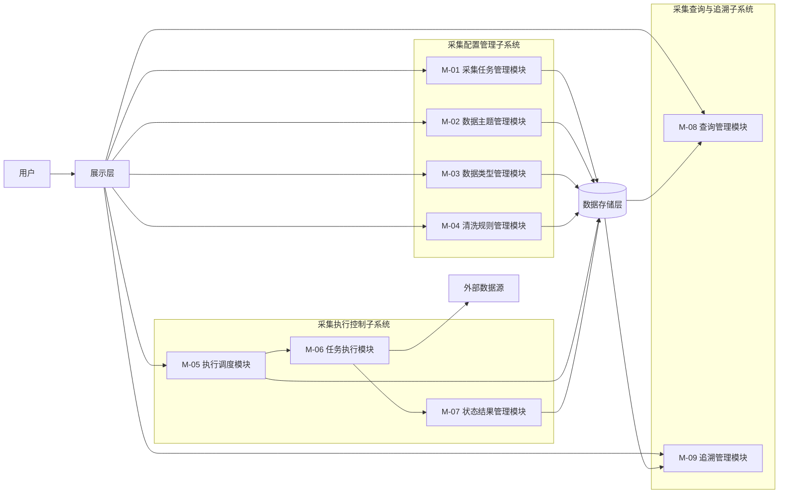
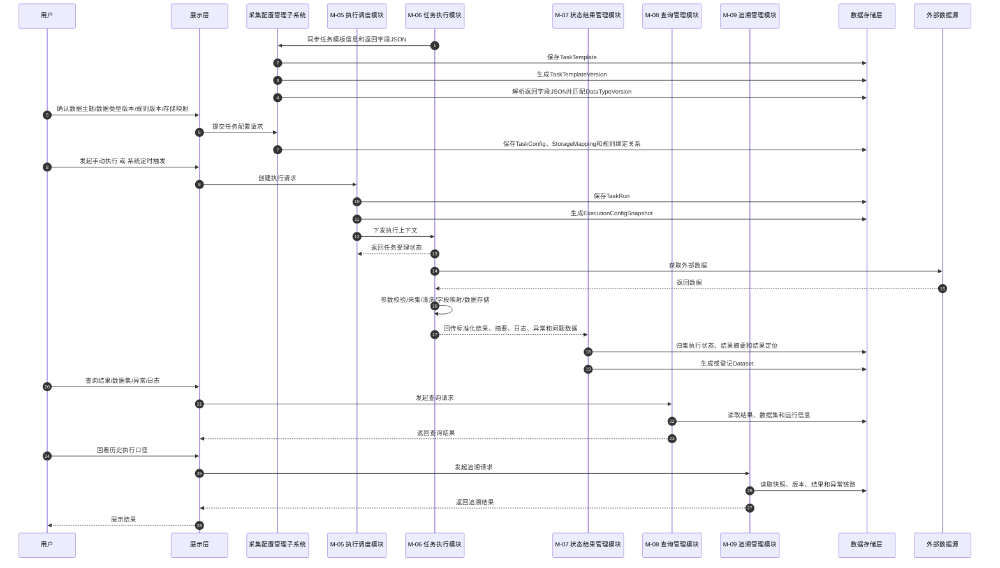
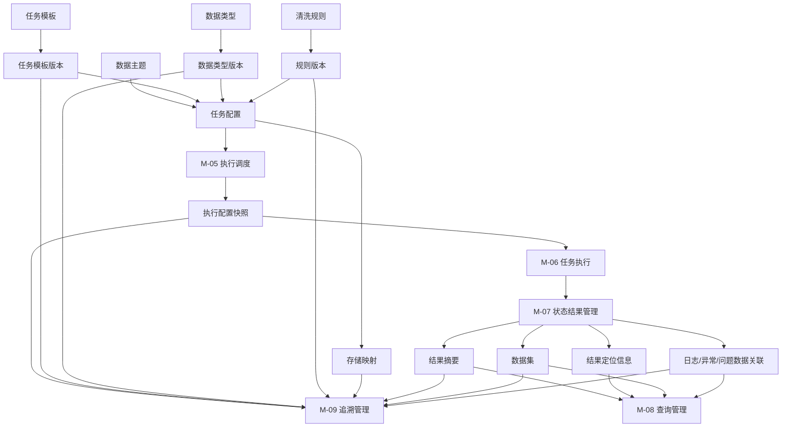
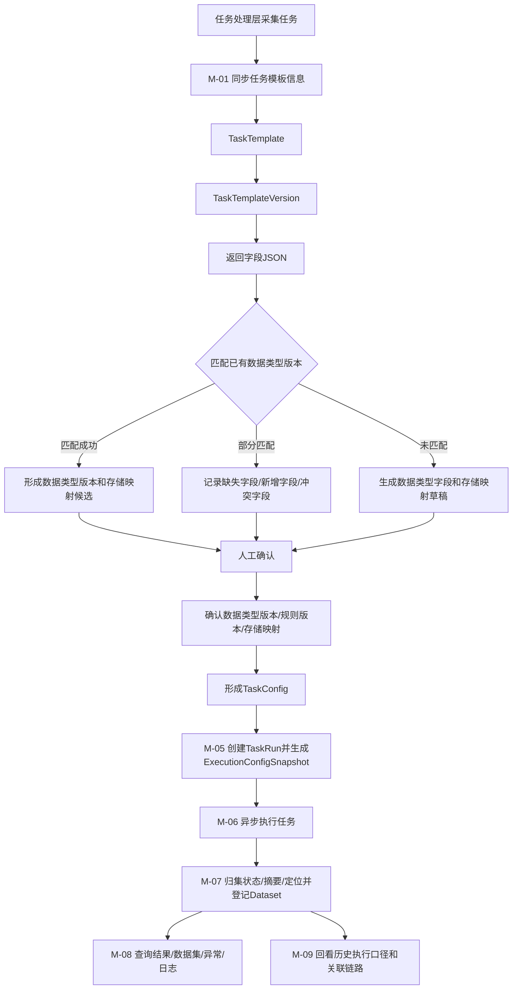
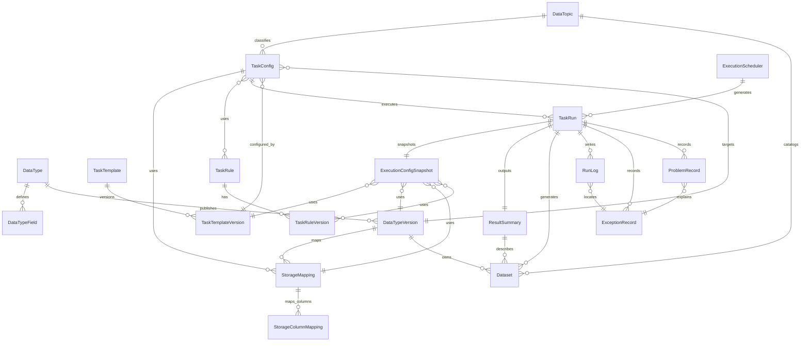

# 个人辅助交易平台一期概要设计说明

## 文档信息

| 项目 | 内容 |
|---|---|
| 项目名称 | 个人辅助交易平台 |
| 文档名称 | 一期概要设计说明 |
| 文档版本 | V1.8-review |
| 文档状态 | 修订稿 |
| 编制日期 | 2026-05-31 |

## 修订记录

| 版本 | 日期 | 修订内容 | 修订原因 |
|---|---|---|---|
| V1.0-review | 2026-04-21 | 形成初版评审稿 | 方案评审 |
| V1.1-review | 2026-04-22 | 增补范围边界、依赖、验收映射、追踪矩阵、文档引用与风险闭环 | 根据评审意见修订 |
| V1.2-review | 2026-04-22 | 按新版需求重构分类体系，补充数据主题、数据类型等设计内容，并同步更新子系统、模块、功能映射 | 根据新版需求规格说明修订 |
| V1.3-review | 2026-04-25 | 补充分类编码与映射关系设计原则，明确数据主题、数据类型编码口径及与详细设计分册的关系，并确定采集任务、数据主题、数据类型的绑定关系 | 根据分类体系专项设计内容修订 |
| V1.4-review | 2026-04-28 | 将数据类型职责并入数据类型，调整数据类型、数据集、物理表和存储映射相关设计内容 | 根据数据类型与存储体系设计修订 |
| V1.5-review | 2026-04-29 | 以第5章 M-01、M-02、M-03 新版模块职责为准，统一修订其他章节中采集任务、数据主题、数据类型、数据集和存储映射相关内容 | 根据模块职责调整同步修订 |
| V1.6-review | 2026-05-12 | 调整数据集、物理表和存储映射相关设计内容，明确其流程及功能模块范围 | 根据新版模块职责修订 |
| V1.7-review | 2026-05-25 | 根据开发的采集任务管理模块功能调整相关设计内容，调整功能、接口、数据库等内容 | 根据采集任务管理模块开发情况修订 |
| V1.8-review | 2026-05-31 | 根据开发的采集执行控制和查询和追溯功能修改 | 根据实际开发情况修订 |

---

## 1. 文档说明

### 1.1 编写目的

本文档在《个人辅助交易平台一期建设需求规格说明书》基础上，形成一期建设的概要设计方案，重点明确：

1. 一期建设范围与非范围；
2. 总体架构、系统边界与业务子系统划分；
3. 核心流程、核心对象和关键设计约束；
4. 数据主题、数据类型、任务模板、任务配置、存储映射、执行快照和数据集等关键对象的设计口径；
5. 对接口设计说明、数据库设计说明的输入与引用关系；
6. 项目实施、联调、测试和验收所需的控制信息。

### 1.2 适用范围

本文档适用于：

1. 一期总体方案评审；
2. 项目范围确认与边界控制；
3. 技术分层确认；
4. 业务子系统与模块边界确认；
5. 接口与数据库详细设计输入；
6. 开发联调、测试准备与验收映射。

### 1.3 关联文档

- 《个人辅助交易平台一期建设需求规格说明书》
- 《个人辅助交易平台一期接口设计说明》
- 《个人辅助交易平台一期数据库设计说明》

---

## 2. 建设范围与非范围

### 2.1 一期建设范围

一期纳入以下主链路能力：

1. 数据主题管理；
2. 数据类型管理；
3. 采集任务模板同步与任务模板版本管理；
4. 采集任务配置管理；
5. 任务返回字段与存储映射管理；
6. 清洗规则管理及规则版本留痕；
7. 采集任务手动与定时执行能力；
8. 执行记录、执行配置快照、结果摘要落库；
9. 执行成功后的数据集生成或登记；
10. 结果概览查询、数据集查询、日志/异常/问题数据查询；
11. 历史追溯主链路；
12. 基础审计与最小留痕能力。

### 2.2 一期非范围

本期明确不纳入或仅预留扩展点，不作为交付承诺：

1. 复杂任务编排中心；
2. 多租户与细粒度权限体系；
3. 任务处理层主动业务回调机制；
4. 高级调度策略与复杂重试编排；
5. 面向治理域的完整规则引擎能力；
6. 全量结果明细模型的完整建设；
7. 大规模归档治理与冷热分层系统化建设；
8. 复杂灰度、规则编排和高级治理能力；
9. 面向外部系统的完整数据服务开放体系；
10. 字段级血缘、字段级影响分析和字段级治理闭环。

### 2.3 后续扩展候选

- 结果明细表正式建模；
- 更细粒度的数据类型层级和归属规则；
- 数据类型与扩展存储表的多表关系模型；
- 采集任务字段明细结构化管理；
- 高级监控与告警；
- 数据归档和历史治理；
- 权限细化和多角色审批；
- 数据治理、分析应用与辅助决策能力扩展。

### 2.4 一期范围内待完善
1. 清洗规则相关功能，当前只为采集任务配置和任务处理预留相关过程，但未设计规则内容和规则版本的具体维护功能；
2. 数据集相关功能，其定位尚未明确，所以还未进行登记和查询功能设计；
3. 查询与追溯相关功能，当前只设计了结果查询，还未设计历史追溯功能，其定位尚未明确。

---

## 3. 设计原则、约束与关键假设

### 3.1 设计原则

1. 技术层与业务层分离；
2. 子系统—模块—功能口径一致；
3. 统一入口、统一执行、统一查询；
4. 为后续扩展保留空间；
5. 文档之间职责清晰、减少重复、强化引用。

### 3.2 业务约束

1. 数据主题用于任务组织、数据目录展示和统一入口呈现；
2. 数据类型用于业务数据结构定义、字段标准管理、版本管理、标准结果承载和后续治理扩展；
3. 数据类型采用树形结构组织，分类节点用于目录组织，具体节点用于数据结构定义，且应为叶子节点；
4. 采集任务模板只保存任务处理层上报的信息，不保存后台配置类信息；
5. 采集任务模板版本用于保存任务处理层每次同步形成的任务模板快照；
6. 采集任务接口可返回字段以结构化 JSON 形式保存在任务模板版本中，不单独设计其他关系对象；
7. 采集任务配置用于保存后台确认后的配置，包括数据主题、数据类型、数据类型版本、清洗规则、启停状态和存储映射等；
8. 数据集表示某一数据类型版本下实际沉淀的数据资产，于采集任务执行成功后生成或登记；
9. 数据类型不承载原始数据、中间处理结果及运行类数据；
10. 数据类型与物理落库结构解耦，真实落库通过存储映射和字段映射确定；
11. 采集任务正式执行前，任务配置、任务模板版本、数据类型版本、规则版本和存储映射必须完成确认，采集任务必须已启用；
12. 任务执行时必须向任务处理层传递执行配置快照，必须包含物理库信息、执行参数、存储映射等信息。

### 3.3 技术约束

- 展示层采用 Vue3、typescript；
- 应用服务层当前采用 Spring Boot V2.7.18、JDK 17；
- 任务处理层当前采用 Python3.11；
- 一期接口采用 HTTP/JSON；
- 时间统一采用 ISO 8601 格式；
- 枚举字段统一使用英文大写值；
- 任务模板版本中的返回字段 JSON 应采用稳定结构，字段编码应作为字段匹配和存储映射的主要依据。

### 3.4 关键假设

- 外部数据源在一期内具备可调用条件；
- 应用服务层可作为统一业务编排入口；
- 任务处理层能够明确所需要的执行参数、返回的字段信息；
- 一期内手动执行链路与定时执行链路均需具备基本闭环；
- 历史追溯以执行记录为主线即可满足一期要求；
- 标准化结果能够在一期内形成与数据类型之间的清晰归属关系；

---

## 4. 总体架构与系统边界

### 4.1 总体设计思路

系统采用“展示层 + 应用服务层 + 任务处理层 + 数据存储层”的技术分层架构。

其中：

- 展示层负责统一业务入口和结果展示；
- 应用服务层负责统一承接请求、编排业务子系统能力、维护状态并对外输出服务；
- 任务处理层负责同步采集任务模板信息、执行采集处理逻辑并返回结果摘要；
- 数据存储层负责保存业务管理数据、结果数据和运行记录。

### 4.2 系统边界说明

**系统内能力**

- 数据主题、数据类型、数据类型字段、数据类型版本、采集任务模板、采集任务模板版本、采集任务配置、存储映射、清洗规则及规则版本管理；
- 采集任务手动执行和定时执行的请求受理与状态维护；
- 任务处理层的任务处理能力调用与结果返回；
- 执行配置快照、结果摘要、日志异常留痕；
- 执行成功后的数据集生成或登记；
- 统一查询与历史追溯。

**系统外依赖**

- 外部数据源；
- 部署环境与基础设施；

### 4.3 技术分层设计

#### 4.3.1 展示层

负责：

- 采集任务、数据主题、数据类型、清洗规则、任务创建、执行结果、数据集和历史追溯的页面展示；
- 用户操作请求提交；
- 统一查询入口呈现；
- 数据主题目录树、数据类型归属信息和任务配置界面展示；
- 任务模板版本、返回字段 JSON 解析结果和存储映射关系展示。

#### 4.3.2 应用服务层

负责：

- 承接所有业务请求；
- 组织三类业务子系统能力；
- 管理核心业务对象；
- 维护执行状态；
- 聚合查询结果并统一输出；
- 对接任务处理层内部接口；
- 维护数据主题、数据类型、任务模板版本、任务配置、物理表映射与任务之间的关联关系；
- 在任务执行成功后生成或登记数据集。

#### 4.3.3 任务处理层

负责：

- 输出当前支持的采集任务模板信息，包括任务编码、任务名称、处理入口、执行参数、数据源、资产类型、业务分类和可返回字段 JSON等；
- 接收应用服务层下发的执行上下文，可以通过处理入口自动调用相应的任务处理逻辑；
- 根据执行上下文完成校验、采集、处理、清洗、映射、存储和异常识别等过程；
- 按已发布字段契约返回标准化结果、结果摘要和运行记录；
- 输出标准化结果归属和历史追溯所需的最小信息。

任务处理层不直接决定最终数据类型和物理落库结构。任务处理层上报的返回字段 JSON 由应用服务层进行解析，并由数据类型管理、存储映射管理和人工确认环节共同确定正式执行口径。

#### 4.3.4 数据存储层

负责：

- 保存数据主题、数据类型字段、数据类型版本、采集任务模板、采集任务模板版本、采集任务配置、存储映射、清洗规则、执行记录、执行配置快照等管理数据；
- 保存结果摘要、数据集与结果定位信息；
- 保存日志、异常、问题数据等运行记录；
- 保存历史追溯所需的关联信息。

### 4.5 总体架构图



---

## 5. 业务子系统与模块设计

### 5.1 业务划分总览

| 模块编号 | 子系统 | 模块 | 功能 |
|---|---|---|---|
| M-01 | 采集配置管理子系统 | 采集任务管理模块 | 任务模板管理，任务信息查看，任务配置维护  |
| M-02 | 采集配置管理子系统 | 数据主题管理模块 | 数据主题分类管理、数据主题目录 |
| M-03 | 采集配置管理子系统 | 数据类型管理模块 | 数据类型分类管理、数据类型目录、数据类型字段与版本维护 |
| M-04 | 采集配置管理子系统 | 清洗规则管理模块 | 规则定义管理、规则版本管理、规则查看追溯 |
| M-05 | 采集执行控制子系统 | 执行调度模块 | 执行参数配置、采集任务创建、配置快照生成 |
| M-06 | 采集执行控制子系统 | 任务执行模块 | 参数校验、数据采集、数据清洗、字段映射、数据存储 |
| M-07 | 采集执行控制子系统 | 状态结果管理模块 | 执行状态管理、执行结果归集、数据集登记管理 |
| M-08 | 采集查询与追溯子系统 | 查询管理模块 | 查询入口与条件筛选、结果与数据集查询、异常与运行信息查询 |
| M-09 | 采集查询与追溯子系统 | 追溯管理模块 | 历史执行查询、执行口径追溯、关联链路回看 |

### 5.2 模块依赖关系

1. 采集配置管理子系统为采集执行控制子系统提供任务模板版本、任务配置、数据主题、数据类型、数据类型版本、存储映射和规则版本等配置基础；
2. 执行调度模块基于已确认的任务配置创建执行记录，生成执行配置快照，并向任务执行模块下发执行上下文；
3. 任务执行模块根据执行上下文完成参数校验、数据采集、数据清洗、字段映射、数据存储和结果生成，并回传标准化结果、结果摘要、日志、异常和问题数据；
4. 状态结果管理模块负责承接任务执行模块回传的执行结果，维护执行状态、结果摘要、结果定位和数据集登记信息，形成执行结果沉淀；
5. 查询管理模块面向当前结果和运行信息查询，统一提供结果摘要、结果明细或定位信息、数据集、异常记录、运行日志、问题数据和运行概况等查询能力；
6. 追溯管理模块面向历史执行口径还原，以执行记录为主线聚合执行配置快照、任务模板版本、数据类型版本、规则版本、存储映射、结果摘要、数据集和异常信息；
7. 查询管理模块与追溯管理模块均基于状态结果管理模块沉淀的执行记录、结果摘要、结果定位、数据集和运行记录关联信息开展读取，不直接维护执行状态和结果资产。

### 5.3 模块详细说明

#### 5.3.1 M-01 采集任务管理模块

采集任务管理模块负责采集任务模板同步、任务模板删除、任务模板版本管理、任务信息查看、任务配置维护和物理存储映射管理。

##### 5.3.1.1 任务模板管理

任务模板管理功能主要包括任务模板同步、模板版本更新、任务模板删除三个部分。

任务模板同步负责同步任务处理层当前支持的采集任务模板信息。同步内容包括任务编码、任务名称、任务说明、处理入口、数据源、资产类型、业务分类、执行参数和接口返回字段等信息，同步后任务模板信息作为具体版本保存，且版本信息不可修改。

模板版本更新依据返回字段哈希值来生成或更新任务模板版本，并维护任务模板主档来指向最新任务模板版本，返回字段哈希值发生变化时生成新的模板版本，没有发生变化则基于已有版本更新任务模板的基础信息。

基于任务处理层同步的任务模板信息，维护相应的任务模板同步状态，包括同步成功、同步失败等状态，并在任务信息查看中进行展示。对于同步失败的任务模板，提供删除接口能力，删除后应保留历史版本信息以支持历史追溯。

##### 5.3.1.2 任务信息查看

任务信息查看功能主要包括任务信息摘要和任务信息详情两个部分。

信息摘要内容可以通过聚合任务编码、任务名称、任务说明、同步状态、当前模板版本、启停状态等信息，以任务列表的形式展示已同步的任务信息。

信息详情内容可以展示所同步的任务详细信息，包括任务名称、描述、数据源、资产类别、业务分类等、执行参数表、返回字段表、模板版本和物理存储映射状态，信息详细不涉及配置相关的内容。

##### 5.3.1.3 任务配置维护

任务配置维护功能主要包括任务分类配置、存储映射配置、清洗规则配置三个部分。

任务分类配置主要包括对任务所属的业务层面的数据主题配置、结构层面的数据类型配置以及一些基础内容的配置。数据主题用于配置任务所归属的业务主题，数据类型用于配置任务采集数据的逻辑结构，为采集数据的存储映射提供标准化能力。

存储映射配置则根据已配置的数据类型及其字段信息，结合任务模板版本中的返回字段信息，配置任务返回字段与数据类型字段、物理表字段之间的映射关系。存储映射配置是任务正式执行前的重要准备工作，直接决定了最终结果的落库结构和数据类型版本的适用范围，最终形成一条“任务返回字段->数据类型字段->物理表字段”的映射链。

清洗规则配置同时根据已配置的数据类型及其字段信息，结合任务模板版本中的返回字段信息，配置任务可选的清洗规则和规则版本。清洗规则配置是任务正式执行前的另一个重要准备工作，直接决定了最终结果的清洗口径和数据质量保障能力。

#### 5.3.2 M-02 数据主题管理模块

数据主题管理模块面向业务管理、目录组织和前端展示，负责维护数据主题分类体系，为采集任务归属、统一入口展示和查询筛选提供基础数据。

##### 5.3.2.1 数据主题分类管理

数据主题分类管理主要包括数据主题维护和层级关系维护两部分内容。

数据主题维护负责处理数据主题新增、修改、删除、查询等请求，并校验编码唯一性、被引用状态等。已被任务配置引用的数据主题应按规则限制删除或变更。

层级关系维护负责维护数据主题节点、父子关系、层级和状态等信息。数据主题节点间通过统一的编码方法进行关联，依据父子关系形成树形结构，并在前端以目录树方式展示。

##### 5.3.2.2 数据主题目录

数据主题目录主要包括目录树展示和采集任务主题展示两部分内容。

目录树展示通过数据主题的父子关系形成树形结构，并通过前端组件进行展示。支持通过目录树进行层级浏览、节点展开和节点筛选等操作。

采集任务主题展示通过采集任务所配置的数据主题，在数据主题树中进行该节点所包括的采集任务。

#### 5.3.3 M-03 数据类型管理模块

数据类型管理模块面向采集数据的逻辑结构标准化，负责维护数据类型的分类体系以及逻辑结构和版本信息，并以目录树的形式进行组织和展示。

##### 5.3.3.1 数据类型分类管理

数据类型分类管理主要包括数据类型维护和层级关系维护两部分内容。

数据类型维护负责处理数据类型新增、修改、删除、查询等请求，对编码、名称、说明、状态、节点类型等信息进行维护，并校验编码唯一性、被引用状态等。数据类型节点包含分类节点和具体节点，分类节点用于目录组织，具体节点用于标准结果归属，具体节点应为叶子节点。

层级关系维护负责维护数据类型节点、父子关系、层级和状态等信息。数据类型节点间通过统一的编码方法进行关联，依据父子关系形成树形结构，并在前端以目录树方式展示。

##### 5.3.3.2 数据类型目录

数据类型目录主要包括目录树展示和采集任务类型展示两部分内容。

目录树展示通过数据类型的父子关系形成树形结构，并通过前端组件进行展示。支持通过目录树进行层级浏览、节点展开和节点筛选等操作。

采集任务类型展示通过采集任务所配置的数据类型，在数据类型树中进行该节点所包括的采集任务。

##### 5.3.3.3 数据类型字段与版本维护

数据类型字段与版本维护主要包括逻辑表字段维护和数据类型版本管理两部分内容。

逻辑表字段维护负责维护数据类型下逻辑表的字段信息，字段信息包括字段编码、字段名称、字段类型、是否必填、是否唯一键、说明和排序等字段属性。

数据类型版本管理负责在数据类型字段维护的基础上发布版本记录并提供历史版本展示。数据类型版本记录应包含数据类型版本号、数据类型字段信息快照、版本说明和版本状态等内容。任务配置基于已发布的最新数据类型版本。

#### 5.3.4 M-04 清洗规则管理模块

清洗规则管理模块面向采集任务的数据清洗、校验和过滤口径管理，负责维护清洗规则定义、规则与数据类型的绑定关系、规则版本和追溯查看能力，并为任务配置、任务执行和历史追溯提供规则依据。

##### 5.3.4.1 规则定义管理

规则定义管理功能负责维护清洗规则的基础信息、规则内容、规则状态以及规则所属数据类型。

规则基础信息包括规则编码、规则名称、规则说明、规则分类、所属数据类型和创建来源等内容。规则编码唯一性、所属数据类型有效性和必要字段完整性作为规则定义的基础约束。规则基础信息作为任务配置选择规则和历史追溯展示规则的基础依据。

规则内容包括作用字段、规则条件、规则表达式、规则参数、处理方式和异常判定口径等内容。作用字段用于明确规则作用的数据字段范围，规则条件用于描述规则触发或适用范围，规则表达式和规则参数用于描述具体处理逻辑，处理方式和异常判定口径用于说明规则命中后的清洗、过滤、标识或提示结果。规则内容围绕所属数据类型的逻辑模型进行定义，用于支撑任务执行阶段的数据清洗、校验或过滤处理，并为后续规则版本生成提供原始依据。

规则状态包括启用、停用、草稿等状态。已被任务配置引用或已形成历史执行记录的规则，不直接删除规则口径，通过状态变更和版本留痕保证历史可追溯。

##### 5.3.4.2 规则版本管理

规则版本管理功能负责对清洗规则的版本生成、版本发布和版本留痕进行统一管理，保证规则口径变更过程可记录、可回看、可追溯。

规则版本生成负责在规则基础信息、规则内容或规则状态发生变化时形成新的规则版本记录，记录所属数据类型、规则内容快照、版本号、版本说明和生成时间等信息。规则版本生成后，历史版本内容不被覆盖修改。

规则版本发布负责将通过确认的规则版本标记为可用版本，并供任务配置和执行快照引用。任务正式执行时记录实际使用的规则版本，而不是仅记录规则当前主档，保证后续能够还原任务执行时的数据清洗口径。

规则版本留痕负责保留规则版本变更记录、发布记录和引用关系。历史追溯基于执行记录中的规则版本关联回看当时规则口径，不依赖当前规则内容反推历史执行结果。

##### 5.3.4.3 规则查看追溯

规则查看追溯功能负责展示规则当前信息、历史版本信息和引用信息，为规则核验、配置确认、影响分析和历史追溯提供支持。

规则信息查看负责展示规则基础信息、规则内容、规则状态、所属数据类型和当前可用版本等信息，用于规则核验和配置确认。

规则版本查看负责展示规则历史版本、版本说明、版本状态、版本内容快照和所属数据类型信息，用于规则变更评审和历史口径确认。

规则引用查看负责展示规则被任务配置、执行记录或执行配置快照引用的情况，并展示引用任务关联的数据类型信息，用于判断规则变更影响范围，并支撑异常排查和历史追溯。

#### 5.3.5 M-05 执行调度模块

执行调度模块负责对已启用采集任务的执行参数与周期的配置，实现手动执行和定时执行能力。在任务执行前固化任务配置、任务模板版本、数据主题、数据类型版本、存储映射和规则版本等上下文信息，并调用任务处理层完成采集处理。

##### 5.3.5.1 执行参数配置

执行参数配置包括采集任务参数配置和执行周期配置两部分内容。

采集任务参数配置负责依据采集任务版本中的执行参数信息，配置任务执行所需的参数值，并对参数格式、范围等进行校验。同时对于时间类参数，支持今日、昨日、当前时间等常用时间的快捷配置方式。

执行周期配置负责维护定时执行的cron表达式，对任务的执行频率、时间等进行配置。提供可视化的cron表达式配置工具，支持秒、分钟、时、天、财、月、工作日等不同粒度的及对应执行时间的配置方式。

##### 5.3.5.2 采集任务创建

采集任务创建包括创建手动任务和定时任务两部分内容。

手动任务创建负责接收用户的手动执行请求，并在校验通过后调用任务处理层完成采集任务的执行。

定时任务创建负责根据已配置的执行周期，定时触发采集任务的执行。

##### 5.3.5.3 配置快照生成

配置快照生成负责在采集任务正式执行前，固化任务配置、任务模板版本、数据主题、数据类型版本、存储映射和规则版本等信息形成执行配置快照，并与执行记录建立关联。执行配置快照应包含足够的信息以支持结果查询、数据集登记和历史追溯等功能。

#### 5.3.6 M-06 任务执行模块

任务执行模块实现根据执行上下文完成校验、采集、清洗、映射、存储和结果生成等过程，并记录执行过程中各个阶段的信息，最后按已发布字段契约返回标准化结果、结果摘要和运行记录。任务执行采用异步执行方式，后台发送执行请求后立即返回执行状态，后续执行结果通过回调接口获取。

##### 5.3.6.1 参数校验

参数校验负责对应用服务层传递的执行上下文中的参数进行校验，包括参数完整性、正确性等。对于校验失败的情况，返回明确的失败原因以供展示层进行友好展示。

##### 5.3.6.2 数据采集

数据采集负责根据执行上下文中的数据源信息调用外部数据源完成数据采集。对于采集失败的情况，返回明确的失败原因以供展示层进行友好展示。

##### 5.3.6.3 数据清洗

数据清洗负责依据配置的清洗规则和参数对采集到的数据进行清洗处理，并记录问题数据和问题等信息。

##### 5.3.6.4 字段映射

字段映射包括数据类型字段映射和物理表字段映射两部分内容。

数据类型字段映射负责将采集任务返回的原始字段、类型映射到标准化的数据类型字段和类型，标准化的字段和类型便于后续的数据清洗等过程。

物理表字段映射负责将标准化的数据类型字段和类型映射到实际物理表的字段和类型，物理表字段和类型直接决定了最终结果的落库结构。

##### 5.3.6.5 数据存储

数据存储负责将映射后的结果数据存储到物理表中，并记录存储结果和必要的日志信息。

#### 5.3.7 M-07 状态结果管理模块

状态结果管理模块面向采集任务执行后的结果沉淀，负责归集执行状态、结果摘要、结果定位和数据集登记信息，并为结果查询、异常定位和历史追溯提供稳定的数据基础。

##### 5.3.7.1 执行状态管理

执行状态管理功能主要包括状态流转维护、失败原因归集、状态变更留痕三个部分。

状态流转维护负责维护 CREATED、PENDING、RUNNING、SUCCESS、FAILED 等执行状态，并根据执行调度、任务执行受理结果、任务执行回传结果和异常处理结果更新执行记录状态。

失败原因归集负责接收任务执行模块返回的失败原因、异常摘要和必要定位信息，并与执行记录建立关联。失败原因应使用可理解的业务语言进行整理，避免暴露敏感认证信息或内部实现细节。

状态变更留痕负责记录状态变更时间、变更来源、变更说明和关联执行记录，保证任务执行过程可追踪，并为后续异常定位和历史追溯提供依据。

##### 5.3.7.2 执行结果归集

执行结果归集功能主要包括结果摘要归集、结果定位保存、运行记录关联三个部分。

结果摘要归集负责接收并保存任务执行模块回传的处理数量、成功数量、异常数量、结果说明和摘要生成时间等信息，形成执行结果摘要。

结果定位保存负责保存结果定位信息、物理存储位置或索引信息。对于一期未完整建模的结果明细，应以结果定位信息作为结果查询和历史回看的基础。

运行记录关联负责将执行记录、结果摘要、日志、异常记录和问题数据建立关联，使后续结果查询、异常定位和历史追溯能够基于同一执行记录组织数据。

##### 5.3.7.3 数据集登记管理

数据集登记管理功能主要包括登记条件判断、数据集信息登记、数据集关联维护三个部分。

登记条件判断负责判断任务执行是否满足数据集生成或登记条件。只有执行成功且结果定位信息、数据类型版本和实际落库情况满足要求时，才进入数据集登记流程。

数据集信息登记负责登记数据集名称、数据类型版本、来源执行记录、结果摘要、结果定位信息、生成时间和数据集状态等信息。

数据集关联维护负责维护数据集与执行记录、数据类型版本、结果摘要、数据主题和结果定位信息之间的关系，用于后续结果查询、资产展示和历史追溯。

#### 5.3.8 M-08 查询管理模块

查询管理模块面向采集任务执行后的结果、数据集和运行信息查询，负责统一提供查询入口、条件筛选、结果展示、数据集展示、异常记录、运行日志、问题数据和运行概况等查询能力。

##### 5.3.8.1 查询入口与条件筛选

查询入口与条件筛选功能主要包括查询入口整合、查询条件管理、查询结果分区三个部分。

查询入口整合负责以数据主题、数据类型、采集任务、执行记录和数据集为主要维度提供统一查询入口，减少用户在多个查询页面之间切换的成本。

查询条件管理负责支持按任务、数据主题、数据类型、数据类型版本、执行时间、执行状态、数据集状态、异常类型和处理状态等条件进行筛选。

查询结果分区负责将查询结果按结果摘要、数据集、异常记录、运行日志、问题数据和运行概况等类型进行分区展示，并提供进入详情页面的跳转入口。

##### 5.3.8.2 结果与数据集查询

结果与数据集查询功能主要包括结果摘要查询、结果明细或定位查询、数据集查询三个部分。

结果摘要查询负责按采集任务、数据主题、数据类型和执行时间查询结果摘要信息，包括处理数量、成功数量、异常数量、结果说明、最近更新时间和执行状态等内容。

结果明细或定位查询负责按照一期边界查询结果明细或结果定位信息。对于一期未完整建模的结果明细，应通过结果定位信息、物理表位置或索引信息进行说明。

数据集查询负责展示任务执行成功后生成或登记的数据集，包括数据集名称、数据类型版本、来源执行记录、结果摘要、结果定位信息、生成时间和数据集状态等内容。

##### 5.3.8.3 异常与运行信息查询

异常与运行信息查询功能主要包括异常记录查询、日志与问题数据查询、运行概况查询三个部分。

异常记录查询负责按任务、数据主题、数据类型、执行记录、执行时间、异常类型和处理状态筛选采集执行过程中的异常记录，并展示异常类型、异常摘要、异常详情和关联执行记录等信息。

日志与问题数据查询负责查询运行日志、问题数据或异常样本。运行日志展示日志级别、日志内容、发生时间和定位信息，问题数据展示异常说明、字段信息、校验规则和必要样本内容。

运行概况查询负责按任务聚合最近执行时间、最近执行状态、成功失败次数、异常数量和日志概况等信息，用于展示任务运行情况，并支持从运行概况进入异常记录、日志和问题数据详情。

#### 5.3.9 M-09 追溯管理模块

追溯管理模块面向采集任务执行后的历史口径还原，负责以执行记录为主线，关联回看执行配置快照、任务模板版本、数据类型版本、规则版本、存储映射、结果摘要、数据集和异常信息。

##### 5.3.9.1 历史执行查询

历史执行查询功能主要包括执行记录检索、执行摘要回看、追溯入口展示三个部分。

执行记录检索负责按任务、数据主题、数据类型、执行状态、触发方式和执行时间查询历史执行记录，并支持从任务详情、结果查询和异常记录进入历史执行列表。

执行摘要回看负责展示历史执行时间、执行状态、触发方式、处理数量、异常数量、失败原因摘要和结果摘要等信息。

追溯入口展示负责从历史执行记录进入执行口径追溯、结果资产回看、异常信息回看和关联链路展示等页面。

##### 5.3.9.2 执行口径追溯

执行口径追溯功能主要包括配置快照读取、版本口径展示、规则口径展示三个部分。

配置快照读取负责读取某次执行对应的执行配置快照，并以快照内容作为历史追溯的主要依据，不受当前任务配置变化影响。

版本口径展示负责展示执行时的任务模板版本、执行参数、数据主题、数据类型版本、存储映射和物理落库信息，用于还原当时执行和入库口径。

规则口径展示负责展示执行时实际使用的规则版本、规则内容、适用范围和版本说明。规则追溯应基于执行记录或执行配置快照中的规则版本关联，不依赖当前规则状态。

##### 5.3.9.3 关联链路回看

关联链路回看功能主要包括结果资产回看、异常信息回看、主链路关联展示三个部分。

结果资产回看负责根据执行记录回看历史结果摘要、结果定位信息、数据集和必要明细，用于核验历史结果和进行差异比对。

异常信息回看负责回看本次执行关联的异常记录、运行日志和问题数据，用于解释历史执行失败或结果异常原因。

主链路关联展示负责以执行记录为主线聚合任务、数据主题、数据类型版本、规则版本、存储映射、结果摘要、数据集、日志和异常信息，保证历史结果具备完整解释依据。


## 6. 核心业务流程设计

### 6.1 主流程

1. 数据主题管理模块维护数据主题；
2. 数据类型管理模块维护数据类型、数据类型字段并发布数据类型版本；
3. 采集任务管理模块同步任务处理层的采集任务模板信息，任务模板信息需包含唯一任务编码、执行参数和接口可返回字段 JSON；
4. 采集任务管理模块生成或更新采集任务模板主档，并形成任务模板版本；
5. 采集任务管理模块根据采集任务描述选择数据主题；
6. 采集任务管理模块根据任务模板版本中的返回字段选择已有数据类型版本；
8. 采集任务管理模块根据数据类型字段选择任务的返回字段并配置物理存储映射、物理库、物理表等信息；
9. 清洗规则管理模块基于数据类型维护可选的清洗规则和规则版本，并供采集任务配置绑定；
10. 执行调度模块配置执行参数、执行周期，生成手动执行任务或定时执行任务；
11. 执行调度模块固化任务任务模板版本、数据主题、数据类型版本、存储映射和清洗规则版本等信息；
12. 执行调度模块创建执行记录，生成任务执行参数并生成执行配置快照；
13. 执行调度模块向任务执行模块下发执行上下文；
14. 任务执行模块返回任务受理状态，并根据执行上下文完成采集、处理、校验和异常识别；
15. 任务执行模块按执行上下文回传标准化结果、结果摘要、日志、异常和问题数据；
16. 状态结果管理模块归集执行状态、结果摘要、结果定位和运行记录关联信息；
17. 任务执行成功后，状态结果管理模块生成或登记数据集；
18. 用户通过查询管理模块查询结果、数据集、异常、日志和问题数据，通过追溯管理模块回看历史执行口径和关联链路。

### 6.2 主流程时序图



### 6.3 分类与归属关系流程图



### 6.4 任务模板同步与数据类型确认流程



### 6.5 异常处理流程

1. 识别异常任务；
2. 查看失败原因或异常说明；
3. 查看执行日志与问题数据；
4. 判断是配置问题、规则问题还是数据源问题；
5. 修正后重新执行任务；
6. 保留异常历史记录供后续分析。

---

## 7. 核心对象与数据边界

### 7.1 核心对象清单

| 对象编号 | 对象 | 用途 |
|---|---|---|
| O-01 | DataTopic | 数据主题分类 |
| O-02 | DataType | 数据类型定义 |
| O-03 | DataTypeField | 数据类型字段定义 |
| O-04 | DataTypeVersion | 数据类型版本 |
| O-05 | TaskTemplate | 采集任务模板主档 |
| O-06 | TaskTemplateVersion | 采集任务模板版本快照 |
| O-07 | TaskConfig | 采集任务配置 |
| O-08 | StorageMapping | 任务级物理存储映射 |
| O-09 | StorageColumnMapping | 逻辑字段到物理列的字段映射 |
| O-10 | TaskRule | 清洗规则定义 |
| O-11 | TaskRuleVersion | 规则版本 |
| O-12 | TaskRun | 执行记录 |
| O-13 | ExecutionScheduler | 执行调度记录 |
| O-14 | ExecutionConfigSnapshot | 执行配置快照 |
| O-15 | ResultSummary | 执行结果摘要 |
| O-16 | Dataset | 执行后数据集资产 |
| O-17 | RunLog | 运行日志 |
| O-18 | ExceptionRecord | 异常记录 |
| O-19 | ProblemRecord | 问题数据记录 |

### 7.2 核心对象说明

#### 7.2.1 数据主题（DataTopic）

数据主题是面向业务管理、目录组织、前端展示和权限扩展的分类体系，用于回答“任务或数据资产在业务上属于哪个目录”。

#### 7.2.2 数据类型（DataType）

数据类型是面向标准化业务数据结构、字段契约、结果承载和治理扩展的逻辑模型，用于回答“标准化后的业务数据长什么样、属于什么类型、应按什么字段版本解释”。

数据类型可按树结构组织，分类节点用于目录组织，具体节点用于标准结果归属，具体节点应为叶子节点。数据类型不与数据主题编码混用，也不直接等同于物理表。

#### 7.2.3 数据类型字段（DataTypeField）

数据类型字段用于描述某一数据类型下的标准字段，包括所属数据类型编码、字段编码、字段名称、字段类型、默认值、是否必填、是否唯一键、排序和描述等信息。

#### 7.2.4 数据类型版本（DataTypeVersion）

数据类型版本用于固化某一数据类型在特定时间点发布的完整字段结构。任务配置、任务执行、字段校验、结果入库和历史追溯均以已发布的数据类型版本为准。

#### 7.2.5 采集任务模板（TaskTemplate）

采集任务模板用于保存 Python 任务处理层上报的采集任务稳定身份信息，包括任务编码、任务名称、当前模板版本、同步状态和启停状态等。该对象只保存从采集端同步过来的任务模板主档信息，不包含后台配置类信息。

#### 7.2.6 采集任务模板版本（TaskTemplateVersion）

采集任务模板版本用于保存 Python 任务处理层某次同步形成的完整任务模板快照，包括任务说明、处理入口、数据源、资产类型、业务分类、执行参数 JSON、返回字段 JSON、原始同步报文、字段哈希、同步时间和当前版本标识等信息。

返回字段 JSON 作为任务可返回字段的结构化描述，用于数据类型版本匹配、字段差异识别和存储映射草稿生成。

#### 7.2.7 采集任务配置（TaskConfig）

采集任务配置用于将采集任务模板、采集任务模板版本、数据主题、数据类型版本、清洗规则和存储映射进行绑定，形成可执行的任务配置。

TaskConfig 保存后台确认后的当前有效配置，不作为 Python 同步信息的保存对象。

#### 7.2.8 存储映射（StorageMapping）

存储映射用于维护特定任务配置下，任务模板版本返回字段、数据类型版本和物理表之间的整体映射关系。存储映射应绑定任务配置、任务模板版本、数据类型版本和物理表信息。

#### 7.2.9 存储字段映射（StorageColumnMapping）

存储字段映射用于维护任务模板版本中的来源字段与数据类型字段、物理表字段之间的字段级映射关系，包括来源字段编码、来源字段路径、目标数据类型字段编码、物理字段名、字段转换说明和映射状态等信息。应用服务层根据该映射完成标准化结果入库。

#### 7.2.10 清洗规则（TaskRule）

清洗规则用于描述采集任务执行过程中的数据清洗、校验或过滤规则，包含规则名称、规则内容、规则说明、状态和适用范围等信息。

#### 7.2.11 清洗规则版本（TaskRuleVersion）

清洗规则版本用于固化某一清洗规则在特定时间点的规则内容。任务执行时应记录实际使用的规则版本，以支撑历史追溯。

#### 7.2.12 执行记录（TaskRun）

执行记录用于记录一次任务执行过程，包括任务配置、触发方式、执行状态、开始时间、结束时间、失败原因和结果摘要关联等信息。

#### 7.2.13 执行调度记录（ExecutionScheduler）

执行调度记录用于记录定时执行的调度信息，包括任务配置、cron表达式、参数模板、下次执行时间和调度状态等信息。

#### 7.2.14 执行配置快照（ExecutionConfigSnapshot）

执行配置快照用于保存某次任务执行时实际使用的配置上下文，包括任务模板版本、任务配置、数据主题、数据类型版本、清洗规则版本、存储映射、执行参数和物理落库信息。该对象由执行调度模块在创建执行记录时生成，不作为 TaskConfig 配置变更历史表。

#### 7.2.15 执行结果摘要（ResultSummary）

执行结果摘要用于保存一次任务执行后的最小结果摘要，包括处理数量、成功数量、异常数量、结果说明、结果定位信息和摘要生成时间等信息。

#### 7.2.16 数据集（Dataset）

数据集表示某一数据类型版本下实际沉淀的数据资产。数据集在采集任务执行成功后由应用服务层生成或登记，并与执行记录、数据类型版本、结果摘要和结果定位信息建立关联。

#### 7.2.17 运行日志（RunLog）

运行日志用于记录任务执行过程中的关键日志信息，包括执行记录、日志级别、日志内容、发生时间和定位信息等。

#### 7.2.18 异常记录（ExceptionRecord）

异常记录用于保存任务执行过程中的异常信息，包括异常类型、异常摘要、异常详情、关联执行记录和处理状态等。

#### 7.2.19 问题数据记录（ProblemRecord）

问题数据记录用于保存采集处理过程中识别的问题数据或异常样本，并关联任务、执行记录、数据类型和异常说明。

### 7.3 对象关系说明

1. 一个数据主题可关联多个采集任务配置，也可作为数据集的业务目录归属；
2. 一个采集任务模板可包含多个采集任务模板版本；
3. 一个采集任务模板版本保存一次 Python 同步形成的执行参数 JSON 和返回字段 JSON；
4. 一个采集任务配置应绑定一个明确的采集任务模板版本；
5. 一个采集任务配置应归属一个数据主题；
6. 一个采集任务配置应绑定一个明确的数据类型版本；
7. 一个数据类型可包含多个逻辑表字段，并可发布多个数据类型版本；
8. 一个数据类型版本可通过存储映射关联物理表；
9. 一个存储映射应包含多个存储字段映射；
10. 一个采集任务配置可绑定多个规则；
11. 一个规则可具有多个版本；
12. 一个采集任务配置可产生多次执行记录；
13. 一次执行记录应关联一个执行配置快照、一个结果摘要和若干运行记录；
14. 一个执行调用记录可以关联多次执行记录；
15. 一次成功执行可生成或登记一个或多个数据集；
16. 数据集应关联执行记录、数据类型版本、结果摘要和结果定位信息；
17. 追溯管理以执行记录为主视角进行聚合，同时关联任务模板版本、任务配置、数据主题、数据类型版本、存储映射、规则版本、数据集和结果摘要。

### 7.4 对象关系图



### 7.5 数据边界原则

1. 业务管理类数据、标准业务结果类数据与运行记录类数据分离；
2. 数据主题与数据类型分离建模，不混用分类职责；
3. 采集任务模板与采集任务配置分离建模，Python 同步信息与后台确认配置分离保存；
4. 采集任务模板版本保存任务处理层同步快照，执行配置快照保存某次执行时的配置上下文；
5. 数据类型字段、数据类型版本和存储映射独立保存，以支撑标准结果归属、字段契约和物理落库解耦；
6. 配置快照与规则版本独立保存，以支撑历史追溯；
7. 查询和追溯以执行记录为主线组织；
8. 一期结果明细以“结果定位信息/索引信息”为主，不承诺完整明细建模；
9. 数据类型仅描述标准业务结果结构和承载边界，不承载日志、异常、问题数据和统计结果等运行类数据；
10. 数据集仅作为执行成功后形成的结果资产，不作为采集任务配置阶段的前置配置对象；
11. 物理表结构不由任务处理层直接决定，正式落库目标由数据类型版本、任务模板版本和存储映射共同确定。

### 7.6 分类体系设计说明

#### 7.6.1 数据主题设计口径

数据主题主要用于：

1. 面向业务的内容组织；
2. 统一业务入口和前端目录树展示；
3. 采集任务的业务归类；
4. 数据集的业务目录归属；
5. 后续权限扩展的分类基础。

#### 7.6.2 数据类型设计口径

数据类型主要用于：

1. 标准化业务数据归类；
2. 相同结构数据的统一表达；
3. 数据类型字段和字段版本管理；
4. 标准化业务结果的结构定义和承载边界；
5. 数据集归属和结果统计；
6. 后续治理扩展。

#### 7.6.3 两类概念的差异

数据主题回答“从业务目录看，这个任务或数据资产属于哪里”；数据类型回答“从标准化结果看，这类数据属于什么类型、具有什么字段结构、按哪个版本解释、如何承载标准结果”。两者在一期中均为核心对象，但承担的职责不同，不得在设计中混用。

### 7.7 分类编码与映射关系设计原则

#### 7.7.1 编码设计目标

数据主题、数据类型作为一期分类体系和标准结果归属设计中的关键对象，采用统一、稳定、可扩展的编码管理方式。

分类编码设计满足目标：

1. 支持数据主题和数据类型的树形层级表达；
2. 支持通过父级编码快速构造前端目录树；
3. 支持通过层级字段、父子关系和路径字段进行分类检索；
4. 支持后续新增同级节点和下级节点，不因新增分类而重构既有编码；
5. 支持接口、数据库、任务配置、结果查询和历史追溯中的稳定引用；
6. 保持编码长度适中，便于数据库索引、接口传输和页面展示。

#### 7.7.2 编码总体原则

分类编码遵循原则：

1. 唯一性：同一分类体系内编码必须唯一，不同对象不得复用同一编码；
2. 稳定性：编码一经启用并被任务、规则、结果、快照或历史追溯引用后，不得直接修改；
3. 可扩展性：编码规则应支持后续新增数据主题、数据类型和标准业务结果归属；
4. 可读性：编码应能够辅助识别所属分类体系和大致层级，但不得承载过多业务含义；
5. 分离性：数据主题编码和数据类型编码分别维护，不通过编码前缀、编码截取或编码拼接进行隐式推导；
6. 可追溯性：涉及历史执行、结果归属绑定的编码信息，应在执行记录或执行配置快照中保留当时口径。

#### 7.7.3 编码形式

数据主题和数据类型采用统一的树形编码形式，采用“1 位字母前缀 + 每层 2 位数字”的编码方式。

示例：

```text
A
A01
A0102
A010201
A01020101
```

其中：

1. 字母前缀用于区分分类体系；
2. 每 2 位数字表示一层子节点；
3. 同一层级节点编码长度保持一致；
4. 同一父节点下最多支持 99 个子节点；
5. 可通过编码长度、父级编码和层级字段辅助识别节点层级。

一期采用以下前缀口径：

| 分类对象 | 编码前缀 | 示例 | 说明 |
|---|---|---|---|
| 数据主题 | A | A01、A0102、A010201 | 用于业务目录组织、任务归属和前端展示 |
| 数据类型 | D | D01、D0201、D020101 | 用于标准化结果归类、统计绑定 |

#### 7.7.4 数据主题编码口径

数据主题编码用于标识面向业务管理、目录组织和前端展示的数据主题节点。

数据主题编码主要服务于：

1. 前端目录树展示；
2. 采集任务业务归属；
3. 结果查询和异常查询筛选；
4. 数据集目录归属；
5. 历史追溯中的业务目录还原；
6. 后续权限扩展和菜单组织。

数据主题编码不直接决定标准化结果落表，也不直接推导数据类型编码。

#### 7.7.5 数据类型编码口径

数据类型编码用于标识面向标准业务数据语义组织、结果归类、统计和治理扩展的数据类型节点。

数据类型编码主要服务于：

1. 标准化结果归属；
2. 数据类型字段和字段版本管理；
3. 物理表、存储映射绑定；
4. 采集任务目标结果类型配置；
5. 数据集归属；
6. 结果统计和查询筛选；
7. 历史追溯中的标准结果口径还原；
8. 后续规则复用、治理扩展和数据服务扩展。

数据类型编码不得依赖数据主题编码生成，也不通过数据主题编码反推。

#### 7.7.6 叶子节点绑定原则

数据主题和数据类型均采用树形结构进行组织。为避免中间节点承担过多业务含义，一期设计中遵循叶子节点优先绑定原则：

1. 中间节点主要用于目录组织、分类聚合和页面展示；
2. 叶子节点优先用于任务、规则、数据类型等对象的绑定；
3. 采集任务原则上归属到明确的数据主题节点；
4. 标准化结果原则上归属到明确的数据类型节点；
5. 采集任务配置和存储映射原则上绑定到具体数据类型节点，不绑定分类节点，且具体数据类型节点必须为叶子节点。

#### 7.7.7 数据主题与数据类型映射关系

数据主题与数据类型是两个独立分类体系，不得混合，也不通过编码规则相互替代。

两者之间的关系遵循以下口径：

1. 数据主题用于回答“任务在业务目录中属于哪里”；
2. 数据类型用于回答“标准化后的业务数据属于什么类型”；
3. 一个数据主题下可以配置多个采集任务；
4. 一个采集任务配置应明确所属数据主题；
5. 一个采集任务配置应明确目标数据类型版本；
6. 一个任务配置应通过存储映射明确目标物理表；
7. 一个数据类型可以被多个任务配置和多个物理表复用；
8. 数据类型、物理表与存储映射关系通过存储映射体现；
9. 数据主题与数据类型之间的对应关系，可通过任务配置和执行结果间接体现，不通过编码规则直接推导。

### 7.8 采集任务同步与数据类型确认机制

#### 7.8.1 设计口径

采集任务开发与元数据配置之间采用“任务模板同步、版本快照、后台匹配确认、发布后执行”的设计机制。任务处理层负责上报采集任务模板和返回字段 JSON；应用服务层负责生成或更新任务模板主档、形成任务模板版本、执行数据类型匹配和维护任务配置状态；数据类型管理模块负责确认数据类型字段和数据类型版本；存储映射管理负责确认物理表和字段列映射；任务执行阶段以已确认配置和执行配置快照为准。

该机制用于解决采集任务开发阶段需要描述输出字段，而正式落库结构又由数据类型版本和存储映射确认结果决定的顺序关系。Python 端上报的返回字段 JSON 仅作为识别、比对和草稿生成依据，不直接形成正式落库结构。

#### 7.8.2 任务同步内容

任务处理层在新增或更新采集任务时，同步以下任务模板信息：

1. 任务编码；
2. 任务名称；
3. 任务说明；
4. 处理入口；
5. 数据源；
6. 资产类型；
7. 业务分类；
8. 执行参数；
9. 接口可返回字段 JSON；
10. 原始同步报文；
11. 字段哈希或模板内容哈希。

#### 7.8.3 返回字段 JSON 结构

任务模板版本中的返回字段 JSON 应采用结构化数组或对象格式。字段描述至少包含：

1. 字段编码；
2. 字段名称；
3. 字段类型；
4. 是否必填；
5. 是否业务唯一键；
6. 字段路径；
7. 字段说明；
8. 排序信息。

字段编码和字段路径作为来源字段识别依据。字段名称用于页面展示，不作为存储映射的唯一依据。

#### 7.8.4 数据类型匹配与确认

应用服务层根据任务模板版本中的返回字段 JSON 与已发布数据类型版本和数据类型字段进行比对。比对内容包括字段编码、字段名称、字段类型、唯一键、字段集合完整性和业务语义一致性。

匹配结果分为以下类型：

1. 已匹配已有数据类型版本：返回字段与某一已发布数据类型版本字段基本一致，系统形成数据类型版本和存储映射绑定候选关系；
2. 部分匹配已有数据类型版本：返回字段与已有数据类型版本存在差异，系统记录缺失字段、新增字段和冲突字段；
3. 未匹配已有数据类型版本：系统生成数据类型字段草稿、数据类型版本草稿和存储映射草稿。

数据类型字段、数据类型版本和存储映射经人工确认后进入发布或启用状态。未发布的数据类型版本、未确认的存储映射不得用于正式任务执行。

#### 7.8.5 执行上下文与正式落库

任务执行时，应用服务层根据已确认的任务配置、任务模板版本、数据类型版本、物理表和存储映射生成执行上下文。执行上下文包含任务编码、执行参数、数据主题编码、数据类型编码、数据类型版本、任务模板版本、字段清单、字段版本、存储映射和规则版本等信息。

任务处理层按照执行上下文完成采集、处理、校验和标准化输出。应用服务层根据执行上下文和执行配置快照完成字段校验、存储映射转换、结果入库、执行状态更新、数据集生成或登记和历史追溯信息保存。

任务处理层不得绕过应用服务层直接修改数据类型版本、字段版本和存储映射。任务处理层直接落库的扩展场景中，目标表、字段清单、字段版本和存储映射仍由应用服务层下发的执行上下文确定。

#### 7.8.6 职责边界

| 环节 | 主要职责 | 是否决定最终落库结构 |
|---|---|---|
| 任务处理层 | 上报任务模板、执行参数和返回字段 JSON | 否 |
| 应用服务层 | 生成任务模板主档和版本，执行字段匹配，组织执行上下文 | 否 |
| 数据类型管理模块 | 确认数据类型定义、字段结构、版本 | 是 |
| 存储映射管理 | 确认物理表、字段列映射和写入方式 | 是 |
| 人工确认环节 | 确认绑定关系、字段治理结果和存储映射结果 | 是 |
| 任务执行环节 | 按已确认配置和执行配置快照执行 | 否 |
| 数据集生成环节 | 根据执行成功后的结果生成或登记数据集资产 | 否 |
| 历史追溯环节 | 回看执行时的任务模板版本、数据类型版本、存储映射、规则版本和执行配置快照 | 否 |

---

## 8. 详细设计分册引用说明

### 8.1 接口设计引用

- M-01 对应 I-01、I-02、I-03、I-04；
- M-02 对应 I-05、I-06；
- M-03 对应 I-07、I-08、I-09；
- M-04 对应 I-10、I-11、I-12、I-13；
- M-05 对应 I-14、I-15、I-16；
- M-06 对应 I-17、I-23、I-24；
- M-07 对应 I-18；
- M-08 对应 I-19、I-20；
- M-09 对应 I-21、I-22。

### 8.2 数据库设计引用

| 对象 | 对应表 |
|---|---|
| O-01 DataTopic | data_topic |
| O-02 DataType | data_type |
| O-03 DataTypeField | data_type_field |
| O-04 DataTypeVersion | data_type_version |
| O-05 TaskTemplate | task_template |
| O-06 TaskTemplateVersion | task_template_version |
| O-07 TaskConfig | task_config |
| O-08 StorageMapping | storage_mapping |
| O-09 StorageColumnMapping | storage_column_mapping |
| O-10 TaskRule | task_rule |
| O-11 TaskRuleVersion | task_rule_version |
| O-12 TaskRun | task_run |
| O-13 ExecutionConfigSnapshot | execution_config_snapshot |
| O-14 ExecutionScheduler | execution_scheduler |
| O-15 ResultSummary | result_summary |
| O-16 Dataset | dataset |
| O-17 RunLog | run_log |
| O-18 ExceptionRecord | exception_record |
| O-19 ProblemRecord | problem_record |

---

## 9. 状态设计

### 9.1 执行状态枚举

- CREATED：已创建；
- PENDING：待执行；
- RUNNING：执行中；
- SUCCESS：执行成功；
- FAILED：执行失败。

### 9.2 状态流转规则

1. 创建执行记录后进入 CREATED；
2. 满足执行条件后进入 PENDING；
3. 发起执行后进入 RUNNING；
4. 执行完成后进入 SUCCESS 或 FAILED；
5. SUCCESS 状态下可生成或登记数据集；
6. FAILED 状态在满足条件时可重新进入 PENDING 进行重试。

### 9.3 任务配置状态枚举

- DRAFT：草稿；
- CONFIRMED：已确认；
- ENABLED：已启用；
- DISABLED：已停用；
- EXPIRED：已失效。

### 9.4 任务模板版本状态枚举

- SYNCED：已同步；
- CURRENT：当前版本；
- SUPERSEDED：已被新版本替代；
- INVALID：无效。

### 9.5 存储映射状态枚举

- DRAFT：草稿；
- CONFIRMED：已确认；
- ENABLED：已启用；
- DISABLED：已停用。

### 9.6 数据集状态枚举

- GENERATED：已生成；
- AVAILABLE：可查询；
- INVALID：无效；
- ARCHIVED：已归档。

---

## 10. 页面与交互概要设计

### 10.1 页面清单

| 页面 | 主要用途 |
|---|---|
| 采集任务列表页 | 查看任务和筛选条件 |
| 采集任务详情页 | 查看任务详情、任务模板版本、数据主题、数据类型和适用规则 |
| 任务配置页 | 维护数据主题、数据类型版本、规则、启停状态和存储映射 |
| 数据主题管理页 | 维护数据主题分类和目录树 |
| 数据类型管理页 | 维护数据类型字段结构和版本 |
| 规则管理页 | 维护规则和版本 |
| 采集任务创建页 | 创建手动执行任务、定时执行任务、触发手动执行任务、执行详情、删除 |
| 执行调度页| 创建定时执行任务、查看调度列表和调度详情 |
| 执行监控页 | 查看执行状态、结果摘要和运行概况 |
| 数据集查询页 | 查看执行成功后生成或登记的数据集 |
| 结果查询页 | 查看结果概览、结果明细或定位信息 |
| 异常与运行查询页 | 查看异常记录、运行日志、问题数据和运行概况 |
| 历史追溯页 | 查看历史执行、执行配置快照、规则版本、结果资产和异常链路 |

### 10.2 页面设计要点

1. 前端统一入口按数据主题组织目录；
2. 采集任务详情页需同时展示任务模板版本、所属数据主题、目标数据类型版本和适用规则；
3. 任务模板版本页需展示返回字段 JSON、字段解析结果、字段哈希和同步时间；
4. 任务配置页需展示数据主题、数据类型版本、规则和存储映射关系；
5. 数据类型管理页需展示数据类型字段、版本和逻辑表结构；
6. 结果查询页、数据集查询页和异常与运行查询页需支持按数据主题、数据类型、任务、状态、时间等维度筛选；
7. 数据集查询页需展示数据集、来源执行记录、数据类型版本、结果摘要和结果定位信息；
8. 异常与运行查询页需展示异常记录、运行日志、问题数据和运行概况，并支持从执行记录进入问题定位；
9. 历史追溯页需支持查看某次执行对应的执行配置快照、规则版本、任务模板版本、数据类型版本、存储映射、数据集、结果归属和异常链路信息。

### 10.3 说明

页面与交互仅保留概要级描述，详细 UI 交互、字段交互和异常提示不在本文件展开。

---

## 11. 非功能、安全与运维要求

### 11.1 安全要求

- 用户请求统一由应用服务层承接；
- 任务处理能力不直接暴露给用户；
- 敏感参数和认证信息不得在页面明文展示；
- 历史记录和关键配置留痕需满足最小审计要求；
- 执行配置快照中涉及敏感参数的内容应进行脱敏或加密存储。

### 11.2 非功能要求

- 可追溯性：保证任务模板版本、执行配置快照、规则版本、执行结果、数据集和异常信息可追溯；
- 可扩展性：支持后续新增数据主题、数据类型、任务类型、字段明细结构化管理和治理能力；
- 可维护性：保持对象命名、状态枚举和业务口径统一；
- 可测试性：关键链路能够形成明确验收点与联调点；
- 可理解性：页面展示和异常说明应尽量使用可理解的业务语言。

### 11.3 运维与审计要求

- 明确核心日志最小字段；
- 预留数据保留周期和归档策略；
- 统一审计字段命名与口径；
- 异常信息不得暴露内部敏感认证信息；
- 任务模板同步、任务配置确认、执行触发和执行结果生成应保留必要操作留痕。

---

## 12. 依赖、风险与开放问题

### 12.1 项目依赖与前置条件

| 编号 | 依赖项 | 说明 | 影响 |
|---|---|---|---|
| D-01 | 外部数据源可用性 | 需保证一期主数据源可调用 | 影响主链路执行 |
| D-02 | 任务处理层接口就绪 | 需提供任务模板同步与执行能力 | 影响联调 |
| D-03 | 部署与环境准备 | 应用服务、数据库、网络连通需就绪 | 影响测试与发布 |
| D-04 | 规则口径确认 | 需明确最小规则模型与版本策略 | 影响配置与追溯 |
| D-05 | 分类体系确认 | 需明确数据主题、数据类型和存储映射的设计口径 | 影响配置、查询、落库与数据库设计 |
| D-06 | 返回字段 JSON 结构确认 | 需明确字段编码、字段类型、字段路径等结构要求 | 影响字段匹配和存储映射 |

### 12.2 风险项

| 风险编号 | 风险 | 影响 | 控制措施 |
|---|---|---|---|
| R-01 | 数据主题与数据类型口径混用 | 易造成分类混乱和页面展示不一致 | 明确两类对象职责边界并分离建模 |
| R-02 | 数据类型边界不清 | 易扩展到原始数据或运行类数据承载 | 明确仅承载标准化业务结果，物理落库通过存储映射管理 |
| R-03 | 历史追溯设计不完整 | 结果不可解释 | 优先保证执行配置快照和版本留痕 |
| R-04 | 查询维度过多 | 实现复杂度上升 | 一期先覆盖核心维度 |
| R-05 | 结果明细边界不清 | 查询范围与验收口径模糊 | 以摘要和定位信息为主 |
| R-06 | 数据类型版本和存储映射后续变化 | 影响历史解释口径 | 在执行时留存执行配置快照和存储映射快照 |
| R-07 | Python 返回字段 JSON 与已发布标准字段不一致 | 影响数据类型确认和任务执行 | 通过字段匹配、人工确认、字段版本发布和执行配置快照控制 |
| R-08 | 返回字段仅以 JSON 存储导致字段级查询能力不足 | 后续字段级治理能力受限 | 一期由应用服务层解析 JSON，后续可扩展字段明细结构化对象 |

### 12.3 开放问题

| 编号 | 问题 | 计划确认时间 | 关闭条件 |
|---|---|---|---|
| Q-01 | 结果明细表是否一期展开 | 数据设计冻结前 | 明确仅定位信息或正式建表 |
| Q-02 | 历史数据保留周期 | 测试前 | 明确保留口径并补入数据库设计 |
| Q-03 | 数据类型层级、字段继承和版本发布策略 | 开发前 | 明确层级策略并同步接口与页面 |
| Q-04 | 数据集是否需要维护额外业务说明字段 | 数据设计前 | 明确字段范围并同步数据库设计 |
| Q-05 | 分类编码生成方式和初始化编码清单 | 详细设计冻结前 | 明确手工维护、系统生成或初始化导入方式，并同步分类编码设计说明 |
| Q-06 | 返回字段 JSON 标准结构 | 联调前 | 明确字段编码、字段路径、字段类型和唯一键等结构要求 |

---

## 13. 验收范围与追踪矩阵

### 13.1 验收范围

- 配置、执行、结果、异常、追溯五条链路能形成完整闭环；
- 一期范围内的页面、接口、表设计能够形成基本一致性；
- 历史追溯能够定位到执行记录、执行配置快照、任务模板版本、规则版本、数据主题、数据类型版本、存储映射、数据集和结果摘要；
- 数据主题、数据类型、任务模板版本、任务配置、存储映射和数据集之间的关系清晰可维护；
- 数据集能够在任务执行成功后生成或登记，并可查询和追溯来源。

### 13.2 需求—模块—接口—表追踪矩阵

| 需求主题 | 模块 | 接口 | 表/对象 | 验收点 |
|---|---|---|---|---|
| 数据主题管理 | M-02 | I-05, I-06 | business_topic / O-01 | 可维护数据主题并用于目录展示 |
| 数据类型管理 | M-03 | I-07, I-08, I-09 | data_type, data_type_field, data_type_version / O-02, O-03, O-04 | 可维护数据类型字段并发布版本 |
| 任务模板同步 | M-01 | I-01, I-02 | task_template, task_template_version / O-05, O-06 | 可同步任务模板并生成模板版本 |
| 任务配置管理 | M-01 | I-03, I-04 | task_config, storage_mapping, storage_column_mapping / O-07, O-08, O-09 | 可维护任务配置和存储映射 |
| 规则管理 | M-04 | I-10, I-11, I-12 | task_rule, task_rule_version / O-10, O-11 | 可维护规则并查看版本 |
| 执行创建与触发 | M-05, M-06, M-07 | I-13, I-14, I-15, I-16, I-17, I-18 | task_run, execution_config_snapshot, result_summary / O-12, O-13, O-14 | 可创建执行、固化执行配置快照、异步执行并归集执行结果 |
| 数据集生成与查询 | M-07, M-08 | I-18, I-19 | dataset, result_summary / O-15, O-14 | 执行成功后可登记数据集，并按条件查询数据集和来源信息 |
| 结果与运行查询 | M-08 | I-19, I-20 | result_summary, dataset, run_log, exception_record, problem_record / O-14, O-15, O-16, O-17, O-18 | 可查询结果、数据集、日志、异常记录和问题数据，并支撑运行定位 |
| 历史追溯 | M-09 | I-21, I-22 | task_run, execution_config_snapshot, task_template_version, task_rule_version, result_summary, dataset | 能按执行记录追溯历史配置口径、结果资产和异常链路 |

### 13.3 验收映射表

| 验收项 | 对应模块 | 对应接口 | 对应表/数据 | 验证方式 | 通过标准 |
|---|---|---|---|---|---|
| 采集配置管理 | M-01, M-02, M-03, M-04 | I-01~I-12 | business_topic, data_type, data_type_field, data_type_version, task_template, task_template_version, task_config, storage_mapping, task_rule, task_rule_version | 页面操作 + 接口验证 | 可新增、修改、查询、启停和确认 |
| 采集执行控制 | M-05, M-06, M-07 | I-13~I-18 | task_run, execution_config_snapshot, result_summary | 接口联调 + 数据核验 | 可创建执行、触发执行、生成执行配置快照、异步执行并归集状态和结果 |
| 数据集生成与登记 | M-07, M-08 | I-18, I-19 | dataset, result_summary | 执行验证 + 查询验证 | 执行成功后可登记数据集并支持来源查询 |
| 采集查询与追溯 | M-08, M-09 | I-19~I-22 | result_summary, dataset, run_log, exception_record, problem_record | 查询验证 + 历史追溯验证 | 可按主维度查询结果、定位运行问题并回看历史执行口径 |
| 分类体系完整性 | M-01, M-02, M-03, M-09 | I-02, I-05~I-09, I-21 | 数据主题、数据类型、任务配置、存储映射、数据集、任务归属关系 | 页面验证 + 数据核验 | 目录组织、结果归属、物理落库和追溯口径一致 |
| 任务模板版本与字段匹配 | M-01, M-03, M-05, M-09 | 内部任务处理接口、任务管理接口、数据类型管理接口 | task_template、task_template_version、data_type、data_type_field、data_type_version、storage_mapping | 接口联调 + 页面确认 + 数据核验 | 任务模板可同步，返回字段 JSON 可解析、匹配和形成存储映射 |
| 主链路完整性 | 全模块 | I-03, I-13, I-14, I-17, I-21 | 配置、执行、结果、数据集、追溯全链路 | 端到端测试 | 主链路闭环成功 |
| 表述一致性 | 全模块 | 全量 | 文档包 | 文档评审 | 目录、术语、命名一致 |

---

## 14. 角色职责（RACI简版）

| 工作项 | 产品/需求 | 架构/后端 | 任务处理 | 前端 | 测试 | 运维/实施 |
|---|---|---|---|---|---|---|
| 范围边界确认 | R | A | C | C | C | C |
| 概要设计维护 | C | A/R | C | C | C | C |
| 接口设计维护 | C | A/R | C | C | C | I |
| 数据库设计维护 | C | A/R | C | I | C | C |
| 任务模板同步联调 | C | A/R | R | C | C | C |
| 执行链路联调 | I | A/R | R | R | C | C |
| 测试验收 | C | C | C | C | A/R | I |
| 部署发布 | I | C | C | I | I | A/R |

说明：

- A：最终负责；
- R：直接执行；
- C：协作参与；
- I：知会。

---

## 15. 结论

本概要设计围绕一期“采集配置管理、采集执行控制、采集查询与追溯”三类业务子系统展开，明确了数据主题、数据类型、采集任务模板、任务模板版本、任务配置、存储映射、执行配置快照和数据集等核心对象的职责边界。

其中，数据主题主要面向业务管理、目录组织和前端展示；数据类型主要面向标准业务数据结构、字段契约、版本管理和标准结果承载；采集任务模板和任务模板版本用于承接 Python 任务处理层同步的任务能力信息；任务配置用于承接后台确认后的执行前配置；存储映射用于解耦任务返回字段、数据类型字段和物理落库结构；执行配置快照用于固化某次任务执行时的实际上下文；数据集用于表示任务执行成功后沉淀形成的结果资产。

本文档可作为后续接口设计、数据库设计和研发实施的概要输入。
